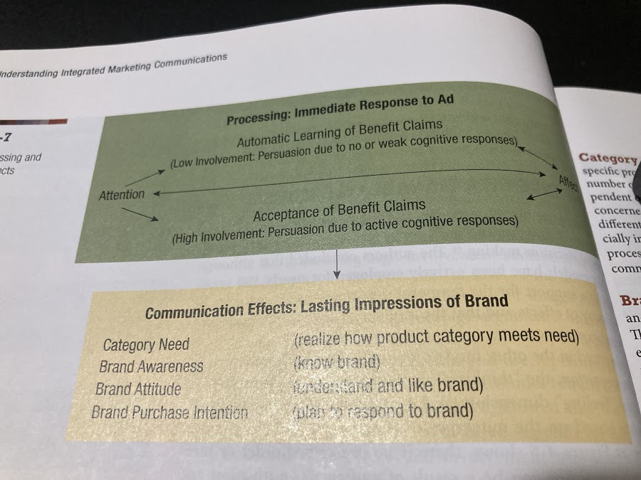

# Chapter 1: Integrated Marketing Commmunications
* As the opening vignette illustrates, companies use advertising, websites, direct marketing, sales, promotion, public relations, and social media to communicat something about their products, prices, or availability. In fact, finding the right combination of marketing communication tools is a critical decision for small and large firms, private and public organizations, and those that market goods, services, or ideas. In response, many companies use integrated marketing communications to link or connect their promotional tools and communicate with their current and prospective customers. Companies develop their marketing communication plans such that each promotional tool retains its unique communication effect and that the combination of promotional tools contributes to the overall communication effect of the brand or organization.
* This opening chapter sets the direction for the entire book as it highlights the marketing context for advertising and promotion. First, it describes the importance of marketing communication. It then briefly defines the different promotional or marketing communication tools available for marketers. Next, it illustrates the idea of integrated marketing communications and indicates why it is so important. Finally, it explains the content of an integrated marketing communication (IMC) plan as a way of orienting the perspective and organization of this text.

## Marketing Communication
* In this opening section we describe the importance of marketing communication within an organization's overall marketing effort. We begin by reviewing the definition of marketing to understand the importance of marketing communication to deliver value to consumers. We then explore examples of the content of marketing communication plans to illustrate their many different purposes.

### Marketing
* Historically, the American Marketing Association (AMA), the organization that represents marketing professionals in the United States and Canada, defined marketing as **the process of planning and executing the conception, pricing, promotion, and distribution of ideas, goods, and services to create exchanges that satisfy individual and organizational objectives.** This definition focused on exchange as a central concept in marketing and the use of key marketing activities to create and sustain relationships with customers. **For exchange to occur there must be two or more parties with something of value to one another, a desire and ability to give up that something to the other party, and a way to communicate with each other. Marketing communication plays an important role in the exchange process by informing consumers of an organization's product and convinging them of its ability to satisfy their needs or wants. 
* The marketing function in an organization facilitates the exchange process by examining the needs and wants of consumers, developing a product or service that satisfy these needs, offering it at a certain price, making it available at a particular place or through a channel of distribution, and developing a program of promotion or marketing communication. These four P--product, price, place (distribution), and promotion (marketing communication)--are elements of the **marketing mix**. The main purpose of the marketing function is to combine these four elements into a marketing program that facilitates the potential for exchange with consumers in the marketplace. The remainder of this section describes how the marketing mix decisions of product, price, and distribution (Figure 1-1) are often the primary content of marketing communication messages.

        Product Decision: Product Type, Features and Attributes/Benefits, Corporate Name/Identification, Brand name, Identification, Package Design

        Price Decision: Price Level, Price Policy, Discount, Allowance, Flexibility

        Distribution Decision: Channel Type, Channel Policy, Type of Intermeediary or Reseller, Type of Location/Store, Service Level

### Communication Product
* Each of the product facets listed in Figure 1-1 can be the focus of marketing communication. This section shows **how marketing messages can communicate the value of the product type, the importance of salient attributes or benefits, and the identity of the brand or organization, in order to assist with brand equity development.**

* **Product Value** An organization exists because it offers a product to consumers, generally in exchange for money. This offering may come in the form of a physical good (such as a soft drink, pair of jeans, or car), a service (banking, air travel, or legal assistance), a cause (United Way, March of Dimes), and idea (don't think and drive), or even a person (political candidate). **The product is anything that can be marketed and that, when consumed or supported, gives satisfaction to the individual.** And these different product types are not always independent. When eating at a restaurant, consuemrs enjoy the food itself but also value the service of not having to prepare the meal, or the opportunity to eat food they may not have the culinary skill to make. Thus, whatever the product type, marketing communication attempts to show how consuemrs can receive value through the product offering.

* **Product Attributes/Benefits** Every product has fairly obvious features or attributes that characterize what it is. A chocolate bar can have varying types of chocolate (e.g., milk, dark) and different kinds of ingredients (e.g., nuts, wafers). Thus, marketing commmunication can take the simple role of identifying the ingredients or composition of a good. For example, ads for Rice krispies cereal reminded consumers that each "krisp contained a single grain of rice, while ads for Shreddies cereal highlighted its unique diamond shape. Notice how the ESQ ad in Exhibit 1-2 highlighted attributes of the watch regarding the watch face and functions. Moreover, organizations often use marketing commmunication to educate consumers on how the services are delivered. For instance, WestJet ads demonstrate the personal attentiveness the airline's staff provide to customers, while Keg Steakhouse ads focus on the ambiance of the restaurant as well as the food.
* Consumers typically view a product as a bundle of benefits signifying what the attributes can do. Benefits can be functional (the performance of the product), experimental (what it feels like to use the product), and/or psychological (self-esteem or status that result from owning a particular brand). Advertising and other marketing communication tools draw attention toward these benfits. Managers often have to decide which benefits to emphasize or how to portray the benefits in a message, and the best way to deliver that message. BMW's latest advertising emphasizes t he joy of driving a BMW vehicle (i.e., experiential benefit) by showing an "expression of joy". One print ad did not show th product, but rather depcited the car's tire marks in colour as if they were painted unpon canvas.
* *Product symbolism* refers to what a product or brand means to consumers and what they experience in purchasing and using it. For products with strong symbolic features, the social meaning of the experiential or psychological benefits may be more important that function utility. For example, designer clothing such as Versace, Gucci, and Prada is often purchased on the basis of its symbolic meaning. Marketing communication plays an important role in developing and maintaining the symoblism of these brands.
* **Brand Identity** A brand or corporate name and its identification through its logo, symbol, or trademark represent critical product decisions. Marketers use brand names that can communicate product concepts clearly, such as Air Canada and Seadoo (water craft). The importance of selecting an appropriate visual representation of the brand is clear by noticing the symbol of any automobile brand or company. **One primary purpose of marketing communication is to present the brand and its identification in favourable locations, situations, or time frames that allow consumers to think or feel more positively toward the brand. The identification of a logo in an ad is critical, as evidenced by a legal challenge Molson-Coors filed against Labatt in which the company suggested the stylized mountaintop shown in a Kokanee ad appeared too similar to the logo used by Coors Light.
* Brand identification and the symbolism of teh brand are often reinforced by the tagline or slogan appearing in any form of marketing communication. IKEA's latest slogan encapsulates the essence of the brand magnificently with "Any space can be beautiful". Some executives suggest that the tagline is still very relevant since it "communicates a brand position or brand benefit". For example, Swiss Chalet returned to a previously successful tagline, "Always so good for so little", after making many changes the past few years. Harvey's has reminded us often over the years of the beauty of its hamburgers. Firms that offer many types of goods and services use an audio logo as one way of connecting brand messages across multiple media and IMC tools, much like a visual logo. For example, the Rogers audio logo can be heard for many of its services, including wireless and cable. Continuity and consistency in the promotional message across IMC tools--television, radio, wireless, interactive displays, Internet, podcasts--makes simple reminders of brand identification a key part of the brand experience.
* Packaging provides functional benefits such as economy, protection, and storage, which can be the main purpose of a marketing communication message. However, since the package is associated so closely with the brand by giving it a distinctive look, its symbolism and identity foten become the focal point of a marketing communication message. For example, the main point of an ad can be to show the packaging of the product, since this influences consumer choice as in the case of perfume. Other characteristics of packaging, like it being fully biodegradable, are a concern for marketers and have become the focal message for marekting communication.
* **Brand Equity** Finally, the culmination of marketing communication messages of product value, product attributes/benefits, and brand identification assists in creating and maintaingin brand equity. **Brand equity** is an intangible asset of added value or goodwill that results from the favourable image, impressions of differentiation, and/or strength of consumer attachment to a company name, brand name, or trademark. **Brand equity allows a brand to earn greater sales volume and/or higher margins than it could without the name, providing the comapny with a competitive advantage.** Conceptually, IMC planning and resulting decisiosn are expected to strongly generate brand equity. Figure 102 highlights the top 10 most valuable Canadian brands as determined by Brand Finance, while Figure 1-3 identifies the best Canadian brands as complied by Interbrand. From a related point of view, Ipsos Reid undertook research to uncover the most influential brand in Canada. President Choice attained the highest rand at number three with consumers saying the brand is relevant (38%), dependable (53%), and likeable in social media (24%).

        Figure 1-2: The Top 10 most valuable Canadian brands
        1: RBC
        2. TD
        3. Scotiabank
        4. BMO
        5. Bell
        6. Eribridge
        7. CIBC
        8. Bombardier
        9. Roger
        10. BlackBerry

        Figure 1-3: Best Canadian Brands
        1. TD
        2. Thomson Reuters
        3. RBC Financial Group
        4. Blackberry
        5. Scotiabank
        6. Tim Hortons
        7. Lululemon
        8. Shoppers Drug Mart
        9. Bell
        10. Rogers

### COMMUNICATION PRICE
* The price refers to what the consumer msut give up to purchase a product. Price is usually expressed in dollar amount exchanged for an item; however, **the true cost of a product to the consumer include time, mental activity, and behavioural effort. Price planning involves decisions concerning the level, policy, adjustments through discounts or allowances, and flexibility when facing competition. Moreover, it also signals the economic cost to consumers for all product benefits conmbined. Communicating price information is so critical that the federal government regulated airlines to advertise their full price that would include all fees and taxes.
* **Marketing communication plays a role in reinforcing a consumer's belief that the product's benfit or quality accurately reflects the price. One historical study regarding price, product quality, and advertising expenditures concluded that pricing and advertising strategies go together. High relative ad expenditures should accompany premium prices, and low relative ad expenditures should be tailored to low prices.
* Price is often a key message conveyed. For example, car dealership focus on price and discounts and allowances offered in many aspects of their marketing communication. **Internet ads focus on price or offers that attempt to influence consumer price beliefs. The information on websites offering deals is predominantly price related (e.g., redtag.ca). A main purpose of the price comparison adveritsing plays a key role in consumers' reference price for products when determining the value of a product. Other research finds that communicating price information is critical for influencing cconsumers who are in the process of deciding to buy a product.

### COMMUNICATING DISTRIBUTION
* Marketing channels, the "place" element of the marketing mix, are "sets of interdependent organizations involved in the process of making a product or service available for use or consumption". Most consumer product companies distribute through **indirect channels**, usually using a network of wholesalers and/or retailers. A company can choose not to use any channel intermediaries and sell to its customers through **direct channels** such as the Internet.
* In either case, marketing communication often provides information as to where a product can be purchased. For example, since most sporting goods comapnies have different quality and price levels, they might be inclined to communicat which brands and models are at different types of retailers. Alternatively, different kinds or levels of service might be available in various locations of the distrbituion network and this could be the focus of marketing communication. For instanc,e particular locations for cosmetics products offer customized beautifying services, while others can be close to self-serve. Extensive marketing communication occurs in order to direct consumers to organizational websites for online purchases.

## The Promotional Mix
* **Promotion** is the coordination of all seller-initiated efforts to set up channels of information and persuasion to sell goods and services or promote the idea. While implicit communication occurs throught the other elements of the marketing mix, most of an organization's communication with the marketplace occurs as part of a carefully planned and controlled promotional program. The tools an organization uses in a promotional program are referred to as the **prmotional mix**. While either term is suitable, promotion or marketing communication, many marketers use the latter since the tools are often connected. For example, a television commercial can direct vieweres to a website. Or a brand may use the same type of message in its radio and print ads. We now define of each of the tools and summarize their purpose.

### ADVERTISING
* **Advertising** is defined as any paid form of nonpersonal communication about an organization, product, service, or idea by an identified sponsor. The paid aspect of this definition reflects the fact that the space or time for an advertising message generally must be bought. An occsaional exception to this is the public service announcement (PSA), whose advertising space or time is donated by the media.
* The *nonpersonal* component means advertising involves mass media (e.g., TV, radio, magazines, newspapers) that can transmit a message to large groups of individuals, often at the same time. The nonpersonal nature of advertising means there is generally no opportunity for immediate feedback from the message recipent (except in direct-response advertising). Therefore, before the message is sent, the advertiser must consider how the audience will interpret and respond to it.
* Canadian advertisers spend more than $14 billion annually to reach their audiences, and there are several reasons why advertising is such an important part of many marketers' prmotional mix.

**The Promotional Mix: Advertising, Direct marketing, Internet Marketing, Sales promotion, Public relation, Personal Selling**

* **Cost-Efficient** Advertising can be a very cost-efficient method for communicating with alrge audiences. For example, during a television season, prime-time network television reached 85 eprcent of Canadian on a daily basis. The most-watched TV show each week attracts an audience of about 3 million English-speaking viewers. The average top-10 show audience is about 2.4 million viewers, while the average audience for the top 11 to 20 shows is about 1.7 million viewers. One study quotes media experts who estimate the cost per thousand reached at $25 for a top show and $20 for a top 11-20 show. To reach an audience for Canadian-produced television shows cost $16 per thousand; specialty channel audiences cost $8 per thousand.
* **Cost-Effective** Assuming that a majority of the viewers actually watched a TV ad, paid attention during the airing, and remember something about the message, then advertising can be seen as a very cost-effective form of marketing communication for many brands. In general, advertising can be cost-effective method for allowing potential customers to know something about a brand and have a positive attitude toward the brand prior to, during, or after purchasing a product.
* **Brand Effects** Advertising is also a valuable tool for building company or brand equity as it is a powerful way to provide consumers with information as well as to influence their attitudes. **Advertising can be used to create favourable and unique images and association for a brand, which can be very important for companies selling products or services that are difficult to differentiate on the basis of functional attributes. Brand image and brand reputation play an important role in the purchase of many goods and services, and advertising remains a recommended approach to build a brand.
* **Brand Interaction** Increasingly, advertising in media such as television, print, and outdoor is employed to encourage consuemrs to interact with the brand online. For example, a Boil King campaign created the fictitious journalist Rob Liking, who interviewed people grilling on their barbeques. Executives identified research showing that consumers researched their purchase online prior to a store visit, thus leading to a primary objective of influencing consumers' behaviour in teh form of visiting the company's website.
* **Flexible Tool** Advertising is a flexible tool that can be used for many industries (e.g., cars or soft drinks), market situations (e.g., new product launch or market development for established product), channel members (e.g., consumers or retailers), and target audiences (e.g., new customers or loyal customers). For example, the new campaign for American Express tries to attract customers of other credit cards with its message, "Impossible? Nah. Does that sound like the service you get from your card?"
* **Multiple Domain** Different types of advertising occur in many domains. Canadian marketers of goods and services advertising to consumer markets with national or regional brand messages, and in some cases with messages to particular international consuemr markets. Alternatively, local retailers and other goods and services providers use advertising for many communication purposes in order to achieve sales objectives. Also, industry associations, like the Dairy Farmers of Canada, advertise extensively to consumer markets as do all levels of government and non-governmental organizations like Canadian Blood Services. Shoppers Drug Mart used advertising to celebrate its fiftieth anniversary with its largest media buy ever to support all of its marketing communication.
* Business-to-business advertising is directed to those who buy or influence the purchase of goods or services for their organization. Exhibit 1-7 shows an example of how General Electric communicates to other organizations that it competes in the solar energy market. Professional advertising directed to those with specific designations is found in many industries such as health, management, government, and technology. Finally, advertising directed to channel members like wholesaleers, distributors, and retailers is found in all industry sectors around the world.

### SALES PROMOTION
* **Sales promotion** is defined as marketing activities that provide extra value or incentives to the sales force, distributors, or the ultimate consumer and can influence their behaviour to stimulate sales. Sales promotion is generally broken into two major categories: consumer-oriented and trade-oriented activities.
* Consumer sales promotion is targeted to the ultimate user of a product or service and includes tools like coupons, samples, premiums, rebates, contests, events, and point-of-purchase materials. These promotional tools encourage consumers to make an immediate purchase, participate in a brand activity by attending the Red Bull Crashed Ice competition in Quebec City, or be more involved with the organization's marketing communication by uploading a video to a social media site celebrating one's consumption of a brand. Exhibit 1-8 is an example of a coupon offer within an ad that encourage parents to switch to a healthier snack for their children. Shoppers Drug Mart celebrates its anniversary with a contest offering 50 grand prices and attracted more than 900,000 entrants.
* Trade sales promotion is targeted toward marketing intermediaries such as wholesalers, distributors, and retailers. Promotional and merchandising allowances, price deals, sales contests, and trade shows are examples of teh promotional tools used to encourage the trade to stock and promote  a company's products. Some trade promotions benefit consumers since they receive information contained in display or receive discounted prices that are passed along to them from the retailer. Retail personnel at Shoppers Drug Mart liked the specialized point-of-purchase material so much they avoided dismantling it even after the party was over.

### PUBLIC RELATIONS
* Public relations (PR) occurs when an organization systematically plans and distribute information in an attempt to control and manage its image. **Public relations** is defined as "the management function which evaluates public attitudes, identifies the policies and procedures of an individual or organization with the public interest, and executes a program of action **to earn public understanding and acceptance**. Public relations uses a variety of tools--including special publications, participation in community activities, fundraising, sponsorship of special events, and public affair activities--to enhance an organization's image. **Many organizations make PR an integral part of their predetermined marketing and promotional strategies.** Exhibit 1-9 shows how sponsorship activities are part of a PR strategy. PR is now recognized as a communications tool that uses and supports adveritsing and sales promotion. For example, Cisco and the CBC, two key drivers of teh "One Million Acts of Green" program, recruited Time Hortons to their cause through the promotion of a 10-cent discount for each hot drink purchased and consumed with a reusable travel mug. Shoppers Drug Mart sponsored the Toronto Internation Film Festival and featured its imagery with the red carpet entry of the celebrities.
* **Publicity** refers to nonpersonal communications regarding an organization, product, service, or idea not directly paid for or run under identified sponsorship. The message reaches the public in the form of a news story, editoral or announcement. Like advertising, publicity invoels nonpersonal communication to a mass audience, but unlike advertising, publicity is not directly paid for by the organization. The organization encourages the media to cover or run a favourable story by using tools like news releases, press conferences, feature articles, and audio-visual media.
* An advantage of publicity over other forms of promotion is its credibility. Consumers generally tend to be less skeptical toward favourable information about a product or service example, the succes (or failure) of a new movie is often determine by the reviews it receives from film critics, who are viewed by many moviegoers as objective avaluators. Another advantage of publicity is its low cost, since the company is not paying for time or space in a mass medium. While an organization may incur costs in developing publicity items or maintaining a staff to do so, these expenses will be far less  than those for the other promotional programs.

### DIRECT MARKETING
* **Direct marketing** occurs when organizations communicate directly with target audiences to generate a response and/or a transaction. Direct marketing includes telemarketing and call centres, direct mail, mail-order catagues, and direct-response ads in broadcast and print media. Traditionallhy, direct marketing has not been considered a part of the promotional mix since it had distinct objectives, strategies, and tactics. However, we view direct marketing as an important component of a firm's marketing communication program since it is connected to many other communication tools. Extensive direct marekting activies also occur iwth the administration of loyalty programs designed to keep in touch with frequent purchase customers. Shoppers Drug Mart revamped its Optimum points program while celebrating its fiftieth anniversary, which translated into 20 percent growth in its membership.
* Direct-marketing tools are used by companies that distribute their products to consumers directly and by companies that distribute their products through traditional distribution channels  or their own sales force. In order to communicate directly, companies develop and maintain database containing contact information (e.g., address, phone number, email) of present and prospective customers. They use telemarketing to call customers directly and attempt to sell products and services or qualify them as sales leads. Call centres are used to respond to customer inquiries or concerns. Marketers also sent out direct-mail pieces ranging from simple letters and flyers to detailed brochures, catalogues, and DVDs to give potential customers information about their products or services. Direct-marketing techniques are also used to distribute product samples and other promotional items. In addition, marketers use **direct-response advertising**, wherebhy a product is promoted through an ad (e.g., television or print) that encourages the consumer to purchase directly from the manufacturer.

### INTERNET MARKETING
* We are currently experiencing a dynamic change in marketing through interactive media, delivered via the Internet. **Interactive media allow for a back-and-forth flow of information whereby users can participate in and modify the form and content of the information they receive instantly. Unlike traditional forms of marketing communication such as advertising, which are one-way in nature, these new media allow users to perform a variety of functions such as receiving and altering information and images, making inquiries, responding to questions, and, of course, making purchases. Shoppers Drug Mart attracted many new fans in social media and further developed its online luxury boutique Murale.
* Many website provide current and potential customers with informatio nabout the company's activities and products. Other firms develop websites to entertain or communicate more emotionally with their clientele. In fact, as part of a complete IMC program that included advertising, sales promotion, events, and public relations. BMW's Smart Car used Internet media with a dedicated microsite, a customized Facebook page, and Youtube to demonstrate the car's big interior despite it being small on the outside.
* As this example illustrate, the Internet is a medium that can be used t oexecute all the elements of the promotional mix. Inaddition to advertising on the Web, marketers offer sales promotion incentives such as coupons, contests, and sweepstakes online, and they use the Internet to conduct direct marketing, personal selling, and public relations activies more effectively and efficiently. For example, Exhibit 1-11 shows how consumers can interact with the naked juice brand on the Internet.
* Social media avenues like Facebook and Youtube are ways for marketers to reach consumers with print and video  ads, respectivel. Each also allows brand to establish groups (Facebook) or channels (Youtube) for all kinds of marketing commmunication activities such as simple ads and sophisticated sales promotions. With imagination and creativity, all aspects of marketing communication are adapted in these new opportunities. Moreover, the interactive features of new media allow for extended commmunication among members, thereby providing a powerful means of additional communication.
* Access to websites, social media, and other interactive experiences and their resulting marketing communication sponsorship (i.e., ads) has been made easier and more prevalent with the development of wireless mobile media devices. In essence, these smart portable devcies and their accompanying applications are opening the door for marketers to adapt and invent ways of implementing marketing communication. For example, while walking down the street a person could receive a message with an incentive to turn back and eat at a restaurant he jstu passed by.

### PERSONAL SELLING
* The final promotional mix element is **personal selling**,  aform of persona-to-person communication in which a seller assist and/or persuades prospective buyers to purchase the company's product or service or to act on an idea. Personal selling involves direct contact between buyer and seller, either face-to-face or through telecommunications. This interaction gives the marketer communication flexibility; the seller can see or hear the potential buyer's reactions and tailor the message to their specific needs or situation. We do not cover personal selling in this book as many decisions pertaining to this topic are the responsibiltiy of a sales manager.

### PARTICIPANTS IN THE PROMOTIONAL PROCESS
* Thus far we have identified the major promotional tools that marketers use. To understand the context in which promotional decisions are made, we identify the participants of the promotional process (Figure 1-5). Overall, there are five major groups: advertisers, advertising agencies, media organizations, specialized marketing communication services, and collateral services. Each group has specific roles in the promotional process.

                Figure 1-5: participants in the promotional process
                Advertiser (client)
                Advertising agency
                Media organization
                Specialized marketing, communication Service (Direct-response services, sales promotion agencies, interactive agencies, public relations firms, media buying agencies)
                Collateral services

* **Advertisers** have the products, services, or causes to be marketed, and they provide the funds that pay for advertising and promotions. Advertisers assume major responsibility for developing the marketing program and making the final decision regarding the advertising and promotional program. An organization may perform most of these efforts itself, either through its own advertising department or by setting up an in-house agency.
* **Advertising agencies** are outside firms that specialize in the creation, production, and/or placement of promotional messages. An agency may also provide other services like research to facilitate the promotional process. Advertisers are referred to as **clients** if they retain the services of advertising agencies. many large advertisers retain the services of a number of agencies, particularly when they have multiple products. Often, an ad agency will act as a partner with an advertiser and assume more responsibility for developing the marketing and promotional programs.
* **Media organizations** provide information or entertainment to their subscribers, vieweres, or readers. From the perspective of the promotional planner, media provides an environment for the firm to deliver its marketing communication message. The media must have editorial or program content that attracts consumers so advertisers and their agencies will want to buy time or space with them. **While the media perform many other functions that help advertisers understand their markets and their customers, a medium's primary objective is to sell itself as a way for companies to effectively reach their target audiences with their messages (Exhibit 1--12). Media companies in Canada have grown significantly over the past decade through acquisition of different formats, thus allowing considerable integration options for advertisers. For example, Rogers offers customers virtually all media opportunities and its staff has a strong integration orientation when selling packages to its clients.

                Exhibit 1-12: National Geographic promotes its value to advertisers
                What is so cool about National Geographic? It's checking out National Geographic Interactive magazine editions on your new Ipad. It's going to the redesigned NationalGeographic.com and finding an awe-inspiring photo from the other side of the world. it's tuning in to the new Nat Geo Wild Channel to see Casey Anderson and meet his best friend, Brutus, an 800-pound grizzly bear. It's joining a conversation with one million other people on National Geographic's Facebook page. It's getting a Nat Geo tweet while you're out with friends. It's checking in on Gowalla to complete a National Geographic trip. It's all the different ways you can interact with the best content in the world through award-winning magazines, websites and TV networks, books, films and DVDs, games and apps, photos and maps expeditions and events.

* **Specialized marketing communication services** include direct marketing agencies, sales promotion agencies, interactive agencies, public relations firms, and media buying agencies. These organizations provide services in their areas or expertise. A direct-response agency develops and implements direct-marketing programs, while sales promotion agencies develop contests and sweepstakes, premium offers, or sampling programs. Interactive agencies develop websites, social media activities, or other types of Internet ads. Public relations firms generate and manage publicity and its products and services as well as to focus on its relationship with its relevant publics. Media buying agencies work with clients and the media organizations for optimal placement of advertiser's messages.
* **Collateral services** include **marketing research companies, package design firms, consultants, photographers, printers, video production houses, and event marketing services.** These individuals and comapnies perform specialized functions the other participants (advertisers, agencies, media organizations, and specialized marketing communication services) use in planning and executing the IMC plan.

## Intergrated Marketing Communications
* Most large companies understand that the wide range of promotional tools must be coordinated to communicate effectively and present a consistent image to target audiences. In turn, even smaller-scall marketers have followed suit and are moving to a more comprehensive perspective of marketing communication. We now illustrate the topic of integrated marketing communications by distinguishing its evolution, renewed perspective, and importance.

### THE EVOLUTION OF IMC
* During the 1980s, many companies moved toward **integrated marketing communication (IMC)** as the need for strategic planning and integration of their promotional tools intensified. Marketers subsequently asked their agencies to coordinate the use of more promotional tools rather than reply primarily on media advertising. Comapnies also looked beyong traditional advertising agencies and employed other promotional specialists to develop and implement other components withiin the promotional plans. At this point in time, a task force from the American Association of Advertising Agencies defined integrated marketing communications as:

                a concept of marketing communications planning that recognizes the added value of a comprehensive plan that evaluates the strategic roles of a variety of communication disciplines--for example, general advertising, direct response, sales promotion, and public relations--and combines these disciplines to provide clarity, consistency, and maximum communicaitons impact.

* In the 1990s, companies saw IMC as a way to coordinate and manage their marketing communication programs to ensure customers received a consistent message. IMC represented an improvement over the traditional method of treating the promotional tools as virtually separate activities as all agencies contributed to the IMC planning for their clients. IMC became one of the "new-generation" marketing approaches used by companies to better focus their efforts in acquiring, retaining, and developing relationships with customers and other stakeholders. **With this change, IMC faced criticism that it primarily relied on the tactical coordination of communication tols with the goal of making them look and sound alike.** Others criticized it as an "inside-out" marketing approach that simply bundled promotional mix elements together so they have one look and speak with one voice. As IMC evolved, both academics as well as practitioners suggested a renewed perspective that viewed the discipline from a strategic perspective, IMC Perspective 1-1 describes how successful marketers are making IMC decisions.

### A RENEWED PERSPECTIVE OF IMC
* A renewed understanding of IMC viewed it as a business process that identifies the most appropriate and effective methods for communicating and building relationships as shown in the following definition:

                Integrated marketing communication is a strategic business process used to plan, develop, execute and evaluate coordinated, measurable, persuasive brand communications programs over time with consumers, customers, prospects, employees, associates and other targeted relevant external and internal audiences. The goal is to generate both short-term financial returns and build long-term brand and shareholder value.

* IMC is now seen as an ongoing strategic business process rather than jsut tactical integration of communication activities. It also recognizes that there are a number of relevant audiences that require specific communication programs. Finally, this definition reflects the increasing emphasis placed on the demand for accountability and measurement of the outcomes of marketing communication programs as well as marketing in general. A renewed perspective suggests that IMC has four general characteristics:

**
1. Unified communication for consistent message and image.
2. Differentiated communication to multiple customer groups.
3. Database-centered communication for tangible results.
4. Relationships fostering communication with existing customers
**

* Many companies are realize that communicating effectively with customers and other stakehodlers involves more than jsut the tactical use of the traditional marketing communication tools. These firms, along with many advertising agencies, are embracing IMC and incorporating it into their marketing and business practices. In fact, it is hypothesized that IMC is now critically connected to a firm's market and brand orientation. Research reports higher use of IMC leading to higher levels of sales, market share, and profits. Academics and practitioners have questioned whether IMC is just another "management fashion" whose influence will be transitory. Critics of IMC argue that it merely reinvents and renames existing ideas and concepts and that it questions its significance for marketing and advertising thought and practice.
* Despite these concerns, one major marketing organizeion significantly moved toward IMC.  Procter & Gamble (P&G) overhauled its marketing and organizational operations, which had enormous implications for how P&G makes its promotional decisions with an IMC perspective. The change originate when managers decided to focus on when the consumer chooses to buy and use the product as the central driver for all decisions. Marketers in Canada work on multi-functional teams to customeize worldwide product launches for local success. This has resulted in P&G Canada typically using the original TV creative, but augmenting the campaign of agencies and employed multiple parties to execute new brand initiatives. Furthermore, P&G expected strategic communication planning from its agencies, which were immersed in their client's newfound customer-centric direction. Innovative communication practices resulted from these internal and external development. The Canadian campaign for Cover Girl Outlast Lipstick featured motion-sensitve ads in bars and restaurants in Toronto. Old Spice dance events, known as "Red Zone after hours" occurred at Canadian bars and included an online contest, out-of-home media, and a televised competition.
* While the debate over teh value and relevance of IMC is likely to continue, proponents of the conept far outnumber the critics as IMC is proving to be a permanent change that offers significant value to marketers. We will now discuss reasons regarding the importance of IMC.

### IMPORTANCE OF IMC
* A successful IMC program requries that a firm find the right combination of promotional tools, define their role and the extent to which they can or should be used, and coordinate their use. This perspective becomes important for the organization because of the many audience it communicates with, the vast number of messages consumers receive from many brands, the emergence of strong marketing relationships, consumer adoption of technology and media, and improved managerial planning.
* **Audience Contacts** Marketers use the promotional mix elements to communicate with current and/or prospective customers as well as other relevant audience such as employees, suppliers, community, and government. Companies take an audience contact perspective whereby they consider all the potential ways of reaching their target audience and presenting the message of the company or brand in a favourable manner. In terms of customers, for example, marketers identify how their loyal buyers interact with a company or brand. This contact can range from seeing or hearing an ad to actually using or experiencing a brand at a company-sponsored event. Moreover, this idea can be extended to non-customers and all other potential audiences the company or brand many choose to target its marketing communication.
* Figure 1-6 shows how target audiences can come into contact with a company or brand. Marketers must determine how valuable each contact tool is for communicating with their target audience and how they can be combined to form an effective IMC program. This is generally done by starting with the target audience and determining which IMC tools will be most effective in reaching, informing, and persuading them and ultimately influencing their behaviour. Nissan took a multiple audience approach with its advertising. To address  the problem of the brand languishing in the Quebec market, Nissan launched the "Gros Bon Sens" (Big Common Sense) campaign to counter the belief that Nissan sole more expeensive cars. This message fit well with the Quebec market since consumers purchase a higher percentage of small, less expensive cars. The Gros Bons Sens concept manifested with an approachable, every day kind of guy who represented the average consumer Nissan targeted. In the TV ads the character moved on to other aspects of buying and enjoying Nissan Sentra and Versa. In other parts of Canada, Nissan highlighted the enjoyment consumers experience with their vehicles with the message, "Best part of your day". Ads showed people struggling with day-to-day activies only to find their day brighten once they began to use or drive their Rogue, Versa, or Sentra. Consumers found comfort, convenience, and excitement depending upon the situation represented.
* **Consumer's Point of View** It is important for marketers to keep concepts distinct to communicate with collegues within the organization or other organizations when making decisions. For example, when planning a sales promotion, it is useful  to refer to it as a sales promotion so that everyone involved can discuss its merits appropriate and allocate the sales promotion expenditure within the correct budget. What is the right sales promotion (e.g., coupon versus bonus pack)? Is the incentive strong enough to encourage the target audience to switch to our brand? Consumers, on the other hand, receive many exposures from many different brands, each using many different promotional tools. In fact, consumers receive so many exposures  that they have the habit of often referring to any promotional tool as "advertising". Given this situation, the need for planning with an IMC perspective becomes imperative. All the elements of the promotional campaign have to be carefully linked so taht the message is clear and the brand is represented well as seen in this example.

                Figure 1-6: IMC audience contact tools
                Target audience <--> Broadcast media (TV/radio), Print media (newspaper, magazine), Public relation/publicity, Internet/interactive, Direct marketing, sales promotion, product placements (TV and movies), Events and sponsorship, Word-of-mouth, Point-of-purchase (displays, packaging), Personal selling, Out-of-home media

* The "Become a Dorito Guru" contest, promoted on TV, social media, MuchMusic, and Doritos packaging, invited Canadians to develop their own vision of the brand with the chance to receive a financial prize of $25,000 and 1 percent of sales, see the ad on national TV, and experience the thrill of having their ad disseminated throughout the digital worl. Doritos worked with a variety of marketing communication agencies including BBDO Toronto (creative), Capital C (packaging and point-of-purchase display), Proximity (digintal media), Fleishman-Hillard (public relations), and OMD Canada (media placement). Together, these experts conceived a concept where contestants would post their entry to DoritosGuru.ca, Facebook, or Youtube, allowing viewers to vote on the one they liked best to identify the five semi-finalists. The contest obtained 30,000 Facebook fans, 1.5 million visitors to the Youtube channel, 2,100 video submission (surpassing the number received in a similar campaign conducted in teh United States a year previously), and 589,000 votes. A judging panel selected as the winner a team headed by Ryan Coopersmith, which branded the new chip "Scream Cheese". The ad showed a number of people screaming while doing everyday activities (e.g., work, movie, dinnertime) and ended with "What are you screaming about" Coopersmith's team planned to use the winnings to finance their own feature film.
* **Relationship Marketing** Many marketers seek more than a one-time exchagne or transaction with customers and concentrate on developing and sustaining relationship with their customers. This has led to a new emphasis on **relationship marketing**, which involves creating, maintaining, and enhancing long-term relationships with individual customers as well as other stakeholders for mutual benefit. The banking industry has been very successful with building relatinships, the extensive personal and financial information banks have access to allows them to offer products and services in a timely manner as people's financial needs change. This is enhanced through services provided by financial advisers and wealth managers.
* This relationship focus is generally more profitable since it is often more cost-effective to retain cujstomers than to acquire new ones. Furthermore, these retained customers tend to buy more products or expand their purchases to other products that an organization offers. marketers are giving more strategic importance in their plans to the lifetime value of a customer because studies have shown that reducing customer defections by just 5 percent can increase future profit by as much as 30 to 90 percent. The AMA adopted a revised and more strategic definition of marketing, which is as follows:

                Marketing is an organizational function and a set of processes for creating, communicating and delivering value to customers and for managing customer relationships in ways that benefit the organization and its stakeholders.

* In order to facilitate the relationship, comapnies build database containing customer names; geographic, demographic, and psychographic profiles; purchase patterns; media preferences; credit ratings; and other characteristics. Marketers use this information to target consumers through a variety of IMC tools thereby enhancing the relationship. With so many tools, and since their customers are involved so closely with the firm, the need for consistency and coordination becomes even more critical.
* **Consumer Adoption of Technology and Media** the expanded use of integrated marketing communication is more critical due to consuemr adoption of technology and media. For example, technology has vastly expanded the number of channels available to viewers. As a result, audiences are more fragmented and television advertising reaches smaller and more selective audiences. This requires brands to ensure their messages are attended to in other media or other IMC tools. Thus, the more selective television ad might direct the viewer to seek out the brand's website for a coupon or sample, or to read about its charitable sponsorship activities. **TV ads also direct vieweres to the brand's social media like Facebook for similar reasons with thee goal of encouraging them to become "fans".**
* Online services provide information and entertainment as well as the opportunity to shop and order a vast array of products. Marketers are responding by developing websites where they can advertise their products and services interactively as well as transact sales. New applications for advertising on the Internet are invented each year, allowing marketers greater opportunity to reach particular audiences. For instance, brands have initiated "sponsored groups" on Facebook where consumers can join and receive brand messages and promotional offerings like contests and samples. Toyota created the FI Canada group and offered desktop wallpapers and ringtones for its 3,000 members. Other applications included targeted banner ads based on consumer profile variables like demographics, psychographics, and media consumption preferences. Telus experimented with a virtual-reality world that 120,000 of its 1.2 million customers experienced; word of the new venture spread through blogs and newspaper articles. With essentially no monetary investment in the venture, the media exposure Telus received helped convey it as a technologically advanced company. More importantly, Telus ultimately planned promotions to customers based on the behaviours exemplified in the simulated game.
* **Planning Efficiency and Effectiveness** A final reason for IMC importance is that marketers understand the value of strategically integrating the communication functions rather than having them operate autonomously. By coordinating their marketing communications efforts, companies can avoid duplication, take advantage of synergy among promotional tools, and develop more efficient and effective marketing communication programs. Advocates of IMC argue that it is one of the easiest ways for a company to maximize the return on its investment in marketing and promotion. Empirical research supports this contention as strong IMC performance leads to strong market performance. Exhibit 1-13 shows a marketing effort where planning is paramount. Much of Shoppers Drug Mart's success in their "Fabulous 50" campaign hinged on a dedicated 30-person cross-funcitonal team in charge of the IMC plan who ensured consistency across all audience contact points.

## Integrated Marketing Communication Planning
* In developing an IMC strategy, a company combines the promotional mix elements to produce an effective program for marketing communication. **IMC planning** involves the process of conceiving, executing, evaluating, and controlling the use of promotional mix elements to communicate effectively with target audiences. The marketer decide which promotional tools to use and how to combine them to achieve IMC objectives. Furthermore,  the marketer decides on the role and function of the specific elements of the promotional mix, develops strategies for each element, and implements the plan. The resulting **IMC plan** provides the framework for developing, implementing, and controlling the organization's IMC program. A model of the IMC planning process is shown in Figure 1-7. The remainder of this chapter explains the model and expresses the steps in developing a marketing communication program. IMC Perspective 1-2 shows these ideas in action with Maple Leaf Foods.

                Figure 1-7: An integrated marketing communications planning model

                Reivew the Marketing plan

                ->

                Assess the marketing communication situation

                ->

                Determine IMC plan objectives

                ->

                Develop IMC programs

                ->

                (
                Advertising<->Advertising objectives<->Advertising strategy<->Advertising message and media strategy and tactic
                
                Direct marketing<->Direct marketing objectives<->Direct marketing strategy<->Direct marketing message and media strategy and tactics

                Interactive/Internet marketing<->Interactive/Internet marketing objectives<->Interactive Internet marketing strategy<->Interactive/Internet message and media strategy and tactics

                Sales promotion<->Sales promotion objectives<->Sales promotion strategy<->Sales promotion message and media strategy and tactics

                PR/publicity<->PR/publicity objectives<->PR/publicity strategy<->Public relations message and media strategy and media strategy and tactics
                )

                ->

                Implement and control the IMC plan 

        
                Figure 1-7: An integrated marketing communications planning model

                * Review the Marketing Plan: 
                        Focus on market, comapny, consumer, competitive, and environmental information; examine marketing objectives, strategy, and programs; 
                        understand role of promotion within marketing plan
                * Asses the Marketing Communications Situation: 
                        Internal analysis 
                                Relative strengths and weaknesses of products/services; Previous promotional programs; 
                                brand image; 
                                promotional organization and capabilities, 
                        external analysis      
                                Customer behaviour analysis, 
                                competitive analysis, 
                                environmental analysis
                * Determine IMC Plan Objectives: 
                        Establish IMC communication objectives; 
                        establish IMMC behavioural objectives
                * Develop IMC Programs: 
                        For advertising, sales, promotion, public relations, direct marketing, and Internet marketing 
                                Set specific communication and behavioural objectives for each IMC tool; 
                                Determine budget requirements; 
                                Develop relevant message strategy and tactics; 
                                Select suitable media strategy and tactics; 
                        Investigate integration options acrss all five programs
                * Implement and Control the IMC Plan:
                        Design all promotional materials inernally or with agencies and buy media space/time
                        Measure promotional program results/effectiveness and make adjustments

### REVIEW THE MARKETING PLAN
* Before developing an IMC plan, promotional planners must understand where the company (or the brand) has been, its current position in the market, where it intends to go, and how it plans to get there. Most of this information should be contained in the **marketing plan**, a written document that describes the overall marketing strategy and programs developed for an organization, a particular product line, or a brand. Marketing plans can take several forms but generally include five basic parts:

                * A detailed situation analysis that consists of an internal marketing review and an external analysis of the market, company, consumer, competition, and macro-environment
                * Specific marketing objectives that provide direction, a time frame for marketing activities, and a mechanism for measuring performance
                * A marketing strategy and program that includes selection of target market(s) and decisions and plans for the four marketing mix elements.
                * A program for implementing the marketing strategy, including determining specific tasks to be performed and responsibilities
                * A process for monitoring and evaluating performance and providing feedback to permit proper control and allow for strategic or tactical revisions

* The promotional plan is developed similarly to the marketing plan and often uses its detailed information. However, some IMC strategy decisiosn require more comprehensive or specific information, or more detailed analysis and specific consideration of existing information, therefore requiring a situation analysis for marketing communication.

### ASSESS THE MARKETING COMMUNICATIONS SITUATION
* In the IMC program, the situation analysis focuses on relevant internal and external factors for developing a promotional stratey much like the marketing situation analysis.
* **Internal Analysis** The **internal analysis** assess four relevant areas: product, previous promotional programs, firms or brand image, and organizational capabilities (Figure 1-8).
* The internal analysis assess the relative strengths and limitations of the product; the product's unique selling points, attributes, or benefits; and its packaging, price, and design. This information is important to the creative personnel who must develop the brand's advertising message and ocmmunicate aspects of the brand.
* Since the firm is planning a new promotional plan, it is imperative that a review of previous promotional objectives, budgets, strategies, and tactics of all elements should occur to understand the strengths and limitations. Furthermore, if the firm has utilized marketing research to track the results of previous programs, the information needs to be examined  closely. This step helps determine what promotional decisiosn should be retained, revised, or withdrawn.
* The strengths and limitations of the firm or the brand from an image perspective will have a significant impact on the way it can advertise and promote itself as well as its products and services. Comapnies or brands that are new to the market or those for whom perceptions are negative may have to concentrate on their images. Firms with a strong image need to understand how to maintain their image.
* For example, Starbucks has an outstanding image that is a result of the quality of its coffee and other products as well as its reputation as a socially responsible company. The company is recognized as a good citizen in its dealings with commmunities, employees, suppliers, and the environment. Starbucks understands that being identified as a socially responsible company is an important part of its success, which guides the selection of its promotional decisions. For example, Starbucks publishes a Corporate Social Responsibility Annual Report each year that describes the commpany's social, environmental, and economic effects in the communities it serves.
* Reviewing the capabilities of the firm and its ability to develop and implement a successful promotional program, and the organization of the promotional department, the analysis may indicate the firm is not fully capable of planning and implementing the promotional program. If this is the case, it would be wise to look for assitance from an advertising agency or other promotional facilitator. If the organization is already using an ad agency, the focus wil lbe on the quality of the agency's work and the result achieved by past and/or current campaigns.

                Figure 1-8: Areas covered in the situation analysis

                Internal Factors:
                * Assessment of firm's promotinal capabilities
                        Organization of promotional department
                        Capability to develop and execute promotional programs
                        Role and function of all agencies
                * Assessment of firm's previous promotional programs
                        Promotional objectives
                        Promotional budgets and allocations
                        Promotional mix strategies and programs
                        Results of promotional programs
                * Assessment of firm or brand image
                        What are customers' attitudes toward our product/service?
                * Assessment product/service strengths and weaknesses
                        What are its key attributes and benefits
                        Does it have any unique selling points
                        Are the package and label consistent with the brand image?
                
                External Factors
                * Customer behaviour analysis:
                        Who buys our product or service?
                        Who makes the decision to buy the product?
                        Who influences the decision to buy the product?
                        How is the purchase decision made? Who assumes what role?
                        What does the customer buy? What needs must be satisfied?
                        Why do customers buy a particular brand?
                        Where do they go or look to buy the product or service?
                        When do they buy? Any seasonality factors?
                        What social, lifestyle, or demographic factors influence the purchase decision?
                * Competitive analysis
                        Who are our direct and indirect competitors?
                        What key benefits and positioning are used by our competitors?
                        What is our position relative to the competition?
                        How big are competitors' promotion budgets
                        What promotion strategies are competitors using?
                *Environmental analysis
                        What current trends or developments affect the promotional program?

#### External Analysis
* The **external analysis** focuses on factors such as characteristics of the firm's customers, market segments, competitors, and environment, as shown in Figure 1-8. A detailed consideration of customers' characteristics (e.g., demographics, psychographics) and buying patterns, their decision processes, and factors influencing their purchase decisions are all relevant for promotional planners to make effective decisions. Often, marketing studies are needed to answer these questions. A key element of the external analysis is an assessment of the market. The attractiveness of different market segments must be evaluated and the segments to target identified. Exhibit 1-15 shows ads from a campaign for Tourism Kelowna, where a good consumer understanding is important.
* The external phase of the promotional program situation analysis also includes an in-depth examination of both direct and indirect competitors. Focus in on the firm's primary competitors: their specific strengths and limitations; their segmentation, targeting, and positioning strategies; and the promotional strategies they employ. The size and allocation of their promotional budgets, their media strategies and the messages they are sending to the marketplace should all be considered.

### DETERMINE IMC PLAN OBJECTIVES
* An important part of this stage of the promotional planning process is establishing relevant and appropriate objectives. In this text, we stress the importance of distinguishing among different types of objectives that are generally decided during the planning of different strategies.
* **Marketing objectives** refer to what is to be accomplished by the overall marketing program. They are often stated in terms of sales, market share, or profitability and are determined when the marketing plan is constructed. **Precise definition of marketing objectives is important to give guidance on what is to be accomplished in the marketing communication plan. With the re-launch of Tourism BC, the government looked to increase tourism revenue by 5 percent over a five-year time period.**
* **Communication objectives** refers to what the firm seeks to accomplish with its IMC program. They are often stated in terms of the nature of the message to be communicated or what specific think about the process consumers will go through in responding to marketing communications. Tourism BC needed to improve its image as visits declined while  tourism gained in other provinces. **Behavioural objectives** in terms of trial purchase or repeat purchase, among others, may be defined along with the communication objectives. Tourism BC sought to increase the number of visitors from Ontario, presumably many for the first time, to achieve impressive revenue growth. Commmunication and behavioural objectives should be the guiding force for the IMC strategy and for each promotional tool.
* While determining these objectives, two questions are asked to tentatively set the budget: What will the promotional program cost? How will these monies be allocated? Ideally, the amount a firm spends on promotion should be determined by what must be accomplished to achieve communication and behavioural objectives. Tourism BC decided to spend $52 million for 2012 down from the $65 million it spent in 2009.

### DEVELOP IMC PROGRAMS
* As Figure 1-7 shows, each promotional mix element has its own set of objectives, overall strategy, message and media strategy and tactics, and a budget. For example, the advertising program will have its own set of objectives, usually involving the communication of a message or appeal to a target audience. A budget will be determined, providing the advertising manager and the agency with an idea of how much money is available for developing the ad campaign and purchasing media to disseminate the ad message.
* Two importan aspects of the advertising program are development of the message and the media strategy. Message development, often referred to as creative strategy, involves determining the basic message the advertiser wishes to convey to the target audience. This process, along with the ads that result, is to many students the most fascinating aspect of promotion. The Heart & Stroke ad shown in Exhibit 1-16 conveys an important message regarding the value of the Health Check logo.
* *Media strategy* involves determining which communication channels will be used to deliver the advertising message to the target audience. Decisions must be made regarding which types of media will be used (e.g., newspapers, magazines, radio, TV, billboards) as well as specific media selections (e.g., a particular magazine or TV program). This task requires careful evaluation of the media options' strengths and limitations, costs, and ability to deliver the message effectively to the target audiences.
* A similar process and set of decisions occur for ALL other elements of the IMC program as objectives are set, an overall strategy is developed, and message and media strategies are determined. If a firm decidesto include a sales promotion, it might decide to use a specific message nad media strategy and tactics to communicate information about the sales promotion, in addition to whatever advertising decisions that have been recommended.
* Furthermore, if a firm considers using multiple tools for its commplete plan it must decide which ones best fit together to solve a particular marketing communication problem. For example, Hellmann's mayonnaise communicate its natural ingredients of eggs, oil, and vinegar to challenge consumers' attitude that the product contained unhealthy contents. The campaign evolved over three years with multiple IMC  tools and media resulting in substantial improvement in brand measures and profitability (Figure 1-9). Finally, an IMC plan might evolve from an initial plan from one tool used, especially advertising. For example, Visa's "Win what you buy" sales promotion built upon the same message of "disappearing debt" conveyed in the television and print ads.

### IMPLEMENT AND CONTROL THE IMC PLAN
* Once the message and media strategies have been determined for each tool, steps must be taken to implement them. Most large companies hire advertising agencies to plan and produce their messages and to evaluate and purchase the media that will carry their ads. however, most agencies work very closely with their clients as they develop the ads and select media, because it is the advertiser that ultimately approves (and pays for) the creative work and media plan. While the marketer's advertising agencies may be used to perform other IMC functions, they may also hire other communication specialist.

                Figure 1-9: Hellman's mayonnaise
                Budget: $3 milllion to $4 million
                Time Frame: January 2007 to December 2009
                Target: Women 18-50
                Strategy Message: Real Food Movement
                Annual Message: Eat Real. Eat Local (2009), Evergreen Partnership (2008), Urban Garden (2007)
                Events: Communty Gardens
                Advertising Media: Television, Newspaper, Magazines
                Sales Promotion: Coupon, Contest, In-store display, Gift/Premium, Discounts
                Internet: Garden widget, forums, eatrealeatlocal.ca, mini-documentary, digital influencers, e-mail;
                public relation: news coverage with Canadian Living and CanWest media partnerships

* It is important to determine how well the promotional program is meeting commmunication and behavioural objectives and helping the firm accomplish its overall marketing objectives. **The promotional planner wants to know not only how well the promotional program is doing but also why. For example, problems with the advertising program may lie in the nature of the message or in a media plan that does not reach the target audience effectively. The manager must know the reasons for the results in order to take the right steps to correct the program.**
* This final stage of  the process is designed to provide managers with continual feedback concerning the effectiveness of the promotional program, which in turn can be used as input into the planning process. As Figure 1-7 shows, information on the results achieved by the promotional program is used in subsequent promotional planning and strategy development.

## IMC Planning: Organization of Text
* This book provides a thorought understanding of advertising and other elements of a firm's promotional mix and shows how they are combined to form a comprehensive marketing communications program with an IMC planning perspective. To implement this idea, we conclude each chapter of the book with an IMC planning section. Its purpose is to relate the chapter material to the content of an IMC plan and illustrateg how to make IMC decisions. The final section of this chatper establishes this approach by illustrating how the entire book is organized around the IMC planning perspective. The book is organized around five major parts to facilitate this goal.

### UNDERSTANDING INTEGRATED MARKETING COMMUNICATION
* Part I comprises four chatpers that define the topic of the book and provide the context for marketing communication decisions. This initial introduces the IMC tools and how they relate to marketing. The chapter also gives a brief description of IMC and the content of a promotional plan.
* We discuss how advertisers work with ad agencies and other firms that provide marketing and promotional services in Chapter 2. Agencies are an important part of the IMC planning process as they assist in the decision making with promotional planners and execute many of the decisions by creating promotional messages.
* To plan, develop, and implement an effective IMC program, those involved must understand consuemr behaviour and the communication process. We focus on consuemr behaviour and the target audience decision, and summarize many communication response models in Chapter 3 and 4, respectively. Combined, these two chatpers establish a conceptual foundation for developing the subsequent decision of an IMC plan.

### ARTICULATE THE MESSAGE
* Part II concerns a number of decisions that firms make to put together a persuasive marketing communication message and comprises five chatpers. The ideas developed here are applicable advertising and all other IMC tools. Sales promotion offers include a brand message, as do public relations activities. All brand-initiated communication in Internet media provides a clear message about the brand.
* Chapter 5 explains how to set IMC objectives to achieve the desired effects. A general model is explained for setting behavioural and communication objectives that are universally applicable to all IMC tools.
* Chapter 6 reviews the important decisions to construct a brand positioning strategy. This is the heart of marketing communication, where decision regarding how brands compete with marketing commmunication messages are determined.
* The most exciting aspects of IMC are presented in Chatper 7 and 8, where we illustrate creative strategy and creative tactics decisions that are reflected in the vibrand and exciting ads we all experience in every part of our daily living. Creative illustration of a brand is the pinnacle task of creative specialists and their work is central for building a brand.
* Chapter 9 examines how to measure promotional message effectiveness. The research ideas presented in this chatper also set the stage for understanding how to assess the effects of all IMC tools found in later chapters.

### DELIVER THE MESSAGE
* Part III comprises four chapters and explores the key media strategy, media tactics decisions and budgeting for IMC, along with the use of six different media.
* Chapter 10 provides the technical information for media planning. Media planning is an important advertising decision and this information is also used to plan media for the implementation of other IMC tools. Scheduling and determining how many consumers should receive a message and how often is critical with Internet media like all other media. Similarly, the timing and media presentation of promotional offers assist in the success of their execution. The chapter also explores how to construct a budget and allocate the budget for advertising and all IMC tools.
* Chatper 11, 12, and 13 describe the use and strengths and limitations of media choices that have been historically labelled as mass media (i.e., television, radio, magazines, newspapers, out-of-home, and support). Once again, background on these topics is useful for implementing advertising and for using these media in executing other IMC tools. Much of these mass media are used to direct consumers to different aspects of Internet media. There are QR codes on outdoor ads. TV and radio messages say "Facebook us" to carry on further communication. These mediaare also used for presentation of community activities designed to "give back" and foster good willamong citizens.

### STRENGTHEN THE MESSAGE
* Our interest turns to the other areas of the promotional mix--sales promotion, public relations, direct marketing, and Internet marketing--in Part IV, "Strengthen the Message". Each tool is explored in its own chapter and related to communication objectives as done in Part III.
* Chapter 14 investigates consumer and trade sales promotions that are often combined with advertising to influence behaviourally and from a communication standpoint. A multitude of options are available for planners to both stimulate sales and enhance brand equity.
* Chapter 15 presents the topic of public relations and related topics of publicity through media and corporate advertising. Using other tools or building a corporate brand through IMC are important topics to fully understand how to put together a complete IMC plan.
* Chapter 16 covers direct marketing and direct-response media used to communicate to this particular IMC yool. Improved technology allows brands to communicate to individuals and vice versa. Methods for advertising and promoting directly are described in this chapter.
* Chapter 17 examines the considerable options for interactive commmunication via the Internet. While continued growth makes this challenge to remain current, the available options and how brands are built with electronic communication are developed to fulfill the need for a comprehensive IMC plan.

### ADVERTISING AND SOCIETY
* Part V concludes the book with one chatper that examines advertising regulation and the ethical, social, and economic effects of an organization's advertising and promotional program. Advertising is a very public and controversial part of any organization's activities and this chatper explores the complexities of these points. Each topic is relevant at varying points of the earlier chatpers and may be read when desired.

## REVIEW
Review Questions
1. Why is marketing communication important for communicating value to consumers?
2. How do smartphone brands use each marketing communication tool for communicating messages?
3. Illustrateg how integrated marekting communications differ from traditional advertsing and promotion. What are the reasons why more marketers are taking an IMC perspective to their advertising and promotion programs?
4. What parts of the IMC planning model are similar to and different from a marketing planning model?
5. How is the structure of the book consiste with the content of an IMC plan?

Applied Questions
1. Consider how a university or college communicate value in its marketing communication to its prospective students and current students. In what ways are the two approaches similar or different? 
2. identify all the possible marketing communication tools that a favourable brand or performing artist is using. Try to explain why these tools were selected. In what ways did the tools support one another? How did they not support one another? Was each tool effective or ineffective?
3. Find examples where all promotional tools have the same "look and feel", and others where there is a different look and feel. Why did these decisions occur based on relevant situation analysis variables?
4. Why is it important for those who work in the field of advertising and promotion to understand and appreciate all IMC tools, not just the area in which they specialize?
5. How does one of your favourite brands link or integrate its different IMC communication tools? Is it done effectively?

# Chapter 2: Organizing for IMC: Role of Agencies
* Developing and implementing an IMC program is usually a commplex process involving the efforts of individuals from the marketing firm, the advertising agency, and often other types of agencies. Strong relationships with these agencies are important as their expertise in creative planning, media placement, new digital executions, and other activities contributes to successful brand development. Alternatively, brands also work with a full-service marketing commmunication agency capable of providing all services. This chatper explores how these agencies function for those who may want to work in the marketing communication agency industry.
* This chapter first identfies the characteristics of a full-service agency and its client relationship. It then describes how agencies are compensated and evaluated. next, the chapter contrasts the role of specialized marketing communication organizations such as creative boutiques, media buying services, direct-response, sales promotion and interactive agencies, and public relations firms. These organizations are increasingly invovled in IMC planning and some are owned by large agencies which they work with considerably. Finally, the chapter evaluates whether marketers are best served by using the integrated services of one large agency or the separate services of multiple marketing communication specialists.

## Advertising Agencies
* Many different types of advertising agencies make the selection a unique decision for each advertiser. in this section we provide a general overview of advertising agencies; we review the agency decision, highlight the agency industry, and describe the activities of a full-service agency.

### ADVERTISING AGENCY DECISION
* Marketing organizations have a fundamental choice of whether a firm will have its own in-house agency or whether it will employ an external advertising agency. We now briefly discuss the relative merits and concerns of both options.

#### In-House Agency
* An **in-house agency** is an advertising agency that is set up, owned, and operated by the advertiser. Some in-house agencies are essentially advertising departments, but in other companies they are given a separate identity and are responsible for the expenditure of large sumes of advertising dollars. Research finds that about half of all companies use an in-house agency and that the likelihood of this occurring decreases with larger advertising budgets but increases with advertising intensity (i.e., advertising/sales ratio), technological intensity, and for creative industries. Many companies use in-house agencies exclusively; others combine in-house efforts with those of outside agencies. For example, Target has an internal creative department that handles the design of its weekly circulars, direct-mail pieces, in-store displays, promotions, and other marketing materials. However, the retailer uses outside agencies to develop most of its branding and image-oriented ads and for specific TV and print assignments. Joe Fresh, a key brand for Loblaw, moved its creativity in-house from an agency to get "our staff thinking about our brand" as it opened up stores in the United States. Coincidentally, that staff of 14 includes a couple of creatives from Target.
* A major reason for using an in-house agency is to reduce advertising and promotion costs. Companies with very large advertising budget pay a substantial amount to outside agencies. An in-house agency can also provide related work--such as sales presentations and sales force materials, package design, and public relations--at a lower cost than outside agencies. A study by M. Louise Ripley found that **creative and media services were the most likely functions to be performed outside, while merchandising and sales promotion were the most likely to be performed in-house.** CL: never knew that, I thought the opposite
* A study by Forrester Research concluded that in-house agencies are preferred because they provide stronger connection to senior managers and stablity for the marketing communication function. They found that nearly 60 percent of in-house agencies report directly to the company's CEO or chief marketing officer (CMO). Furthermore, external agencies yielded much higher turnover levels, which can take a toll on the client-agency relationship.
* Time saving, bad experience with outside agencies, and **the increased knowledge and understanding of the market that come from working on advertising and promotion for the product or service day by day also support in-house agency use**. Companies can also **maintain tighter control over the process more easily coordinate promotions with the firm's overall marketing program.**
* A limitation of an in-house agency is that personnel may grow stale while working on the same product line in comparison to an outside agency where creative specialist design campaigns for a variety of products. Furthermore, **changes in an in-house agency could be slow or disruptive compared to the flexibility of hiring a new outside agency**

#### Advertising Agency
* Many major companies use an advertising agency to assist them in developing, preparing, and executing their promotional programs. An ad agency is a service organization that specializes in planning and executing advertising programs for its clients. Probably the main reason why outside agencies are used in that they provide the client with the services of highly skilled specialists. An advertising agency's staff may include **artists, writers, media analysts, researchers, and other with specific skills, knowledge, and experiecne who can help market the client's products or services** Many agencies specializes in a particular type of business and use their knowledge of the industry to assist their client. For example, Mentus Inc. is an agency that speiclizes in the high-technology, e-commerce, and bioscience industries.
* An outside agency's objective viewpoint of the market and the client's business is not subject to internal company policies, biases, or other limitations. The agency can draw on the broad range of experience it has gained while working on a diverse set of marketing problems for assorted clients. For example, an ad agency handling travel-related account may employ individuals with travel-related industry experience (e.g., airlines, cruise ships, travel agencies, hotels). This industry knowledge may be combined with experience of having previously worked on the advertising account of one of the client's competitors.
* **The Institute of Communications and Advertising offers a comprehensive document that acts as a guide for selecting the most appropriate agency.** using a "best practices" approach, the steps in the search process are carefully diagrammed and explained so that both clients and agencies could benefit. If all the steps are adhered, selecting the right agency could range from 8 to 16 weeks. In the end, the client and agency form a partnership where the responsbilities of each are recorded and agreed upon with the intention of a positive working relationship.

### ADVERTISING AGENCY INDUSTRY
* The Canadian advertising agency industry is similar to that in other industries--there is a combination of small and mid-size domestic firms and large international organizations with domestic service providers. The strong presence of international ad agencies in Canada reflects a global trend of large agencies merged with or acquired by other agencies and support organizations. These **superagencies** now provide clients with integrated marketing communications services worldwide. Many mid-size agencies were acquired by or forged alliances with larger agencies because clients wanted an agency with international marketing communication capabilities, and their alignment with larger organizations permitted access to a network of agencies around the world. Currently, most major agencies offer specialized services in areas of interactive communications, direct marketing, and sales promotion so that they can offer their clients an ever-broader range of IMC services. In fact, a larger multiservice firm is a **marketing communication agency**, making the term "advertising agency" sommewhat obsolete for these situations. Global advertising campaigns are facilitated by using larger international agencies.
* Figure 2-1 summarizes the "agency family tree" produced by Marketing Magazine. The tree identifies all the major players on the Canadian advertising scene. (Note that the original tree spanned eight pages; we retained the scope of the diagram and acknowledge missing information or lack of detail to fit this broad array of information in a single table.) The diea of the superagency is readily observed--we see two major Canadian firms, Vision 7 International and MDC, along with their full agency and other businesses that cater to all marketing communication services. As expected, two major players exist based on new York, Omnicom and Interpublic; each one includes famous advertising agencies recognized for their creative talent.
* Canadian affiliates of these large agencies are responsible for country-based marketing communication activities that are part of the worldwide campaigns. For example, BBDO Proximity of Toronto  developed an Internet application to promote the Gillette Fusion brand in Canada. Additionally, the table includes two major European conglomerates that own established American advertising greats like Ogilvy & Mather, JWT, and Leo Burnett. IMC Perspective 2-1 highlights the accomplishmtns of Canadian agencies.
* Two agencies with strong Canadian roots developed internationally. Over the past decade, Taxi won about 1,200 national and international awards and Strategy named them agency of the year five times. Taxi expanded to the United States and Europe and the prestigious One Club recognized it as one of the top advertising agencies in the world. Acquired by WPP, the agency continue to set new standards of excellence for its clients like Mini. Sid Lee expanded to the United States and Europe as well and developed an international presence for Adidas in 100 countries with its ambitious digital delivery. individual Canadians who achieved success are also in demand internationally, finding top-level positions paying seven figures.
* Many small and mid-sized agencies handle local and regional work throughout Canada. Marketing Magazine featured up-and-coming new agencies in western Canada like Giant Ant Media (Creative Agency/Production Studio) with MEC as a key client, FCV (Interactive Agency) with Telus, Nike, and Scotiabank as key clients, and Smak (Experiential/Media Agency) with Fugure Shop as a key client. Across the country, these independent agencies offer opportunity for students to get their "foot in the door" to pursue a career in the advertising industry. One small agency, Acart in Ottawa, continues to outbid other more dominant players as it secures many government advertising assignments. And in the oldest city in North America, Target of St.John's continues to innovate as it listens to the "beat of a different drum" while enjoying the view of teh Atlantic Ocean. Check out its creative "Weiner News network" on Youtube!

### FULL-SERVICE AGENCY
* The services offered and functions performed vary depending upon the size of the agency. A **full-service agency** offers its clients a complete range of **marketing, communication, and promotion services including planning, performing research, creating the message of the ad campaign, producing the advertising and selecting media.** A full-service agency may also offer nonadvertising services, such as strategic market planning, sales promotions, direct marketing, interactive services, public relations and publicity, and package design. The full-service agency has departments led by a director that provide the activities needed to perform the advertising functions and serve the client, as shown in Figure 2-2. In this section we summarize these main characteristics.

#### Account/Client Service
 Account services, or client services, is the link between the ad agency and its clients. Depending on the size of the client and its advertising budget, one or more account executives serve as liaison. The **account executive** is responsible for understanding the advertiser's marketing and promotions needs and interpreting them to agency personnel. he or she coordinates agency efforts in planning, creating, and producing ads. The account executive also presents agency recommendations and obtain client approval. As the focal point of agency-client relationships, the account executive must know a great deal about the client's business and be able to communicate this to specialists in the agency working on the account. The ideal account executive has a strong marketing background as well as a thorough understanding of all phases of the advertising process.

 #### Planning/Research Services
 * Most full-service agencies maintain a research department whose function is to gather, analyze, and interpret information as input for advertising decisions. Both primary research--where a study is designed, executed, and interpreted by the research department--or secondary (previously published) sources of information are relied upon. The research department also acquires studies conducted by independent syndicated research firms or consultants, inteprets the finding, and disseminates the information to agency personnel working on that account. The research department may also design and conduct research to pretest the effectiveness of advertising the agency is considering. For example, copy testing is conducted to determine how messages developed by the creative specialists are likely to be interpreted by the receiving audience.
 * Research services may be augmented with services performed by account planners, who gather relevant information that can be used to develop the creative strategy and other aspects of the IMC campaign. Account planners work with the client and other agency personnel including the account exeuctives, creative team members, media specialists, and research department personnel to collect information to better understand the client's target audience and the best ways to communicate with them. They gather and organize information about consumers, competitors, and the market to prepare the **creative brief**, which is a document that the agency's creative department uses to guide the development of advertising ideas and concepts.

 page 40

                Figure 2-2: Full Service agency organization chart

                President
                Chief Operations Officer/Chief Financial Officer
                Director, Client Service--Account Director--Account Supervisor--Account Executives
                Director, Planning Research--Account Planner--Market Research
                Creative Services Director--Art Director--Copywriter--Graphic Designer--Studio Artist
                Interactive/Digital Creative Director--Interative Producer--Interactive Developer--Interactive Graphic Designer
                Production Director--Print Production Manager--Broadcast Production Manager--Traffic Manager
                Specialized Services Director--Direct Marketing--Sales Promotion--Public Relation--Event and Support Service
                Media Director--Media Planner--Media Buyer
                Management and Finance Department--Accountant--Financial Manager--Office Manager--Human Resource

* Account planners may also be involved in assessing consumers' reactions to the advertising and other elements of the IMC program and providing the creative staff and other agency personnel with feedback regarding perfomrnace. Account planning is a very important function in many agencies because it provides the creative team, and other agency personnel, with more insight into consumers and how to use advertising and other IMC tools to communicate with them. However, the account planning function is demanding with the increased number of marketing communication channels. Account planners interact with individuals from all marketing communication disciplines and require expertise in each area.

#### Creative Services
* The creative services department is responsible for the creation and execution of advertisements. The individuals who conceive the ideas for the ads and write the headlines, subheads, and boy copy (the words constituting the message) are known as copywriters. They may also be involved in determining the message appeal and/or theme of the ad campaign and often prepare a rough initial visual layout of the print ad or television commercial.
* **While copywriters are responsible for what the message says, the art director, graphic designers, and studio artist are responsible for how the ad look.** For a print ad, they prepare a layout, which is drawing that shows what the ad will look like and from which the final artwork will be produced. For a TV commercial, the layout is known as a storyboard, a sequence of frames or panels that depict the commmercial in still form.
* Marketers of the creative department work together to develop ads that will communicate the key points determined to be the basis of the creative strategy for the client's product or service. Writers and artists generally work under the direction of the agency's creative director, who oversees all the advertiseing produced by the organization. The director sets the creative philosophy of the department and may even become directly involved in creating ads for the agency's largest clients. The creative director's job is all the more demanding with the growth of digital media and client demands to be part of the decision making earlier in the creative process

#### Digital Creative Services
* Digital creative shares similarity with established creative departments with respect to copywriters and specialists with graphic skills. However, other personnel with computer technology sills are required for programming various interactive features of creative ads found in Internet media vehicles. Moreover, this newer genre of creativity includes an interactive producer to oversee all operations and to coordinate with creative work done in mass media. In order to grow this side of the business, full-service agencies purchase small or mid-sized independent interactive agencies.

#### Production Services
* The ad is turned over to the production department once the copy, layout, illustrations, and mechanical specifications are commpleted and approved. Most agencies do not actually produce finished ads; they hire printers, engravers, photographers, typographers, and other suppliers. For broadcast production, the storyboard must be turned into a finished commercial. **The production department may supervise the casting of people to appear in the ad, the setting for the scenes, and choose an independent production studio. The department may hire an outside director to turn the creative concept into a commercial. Specialists from all departments and client representatives may all participate in production decisions, particularly when large sums of money are involved.**
* Creating an advertisement often **involves many people and takes several months**. In large agencies with many clients, coordinating the creative and production processes is a major task. A **traffic department**, or traffic manager, coordinate all phases of production to see that the ads are completed on time and that all deadlines for submitting the ads to the media are met. The traffic department can be in production or may be a separate department or located in other service departments.

#### Media Services
* The media department of an agency analyzes, selects, and contracts for space or time in the media that will be used to deliver the client's advertising message. **The media department in expected to develop a media plan that will reach the target audience and effectively communicate the message.** Since most of the client's ad budget is spent on media time and/or space, this department must develop a plan that both communicates with the right audience and is cost-effective and cost-efficient.
* Media specialists must know what audiences the media reach, their rates, and how well they match the client's target audience. The media department reviews information on demographics, magazine and newspaper readership, radio listenership, and consumers' TV and Internet viewing patterns to develop an effective media plan. The media buyer implements the media plan by purchasing the actual time and space. The media department is an important part of the agency business as many large advertisers conslidate their media buying with one or a few agencies to improve media efficiency. An agency's strategic ability to negotiate prices and effectively use the vast array of media vehicles available is as important as its ability to create ads. Many full-service agencies see value in offering this service since media companies are competing against agencies by offering creative services. For example, Metro newspaper has a creative department that helps advertisers, like an agency does, to put together a print campaign.

#### Specialized Services
* Large, full-service agencies offer additional marketing services to their clients to assist in other promotional areas. **An agency may have a sales promotion department, or merchandising department, that specializes in developing contests, premiums, promotions, point-of-sale materials, and other sales materials**. It may have direct-marketing specialists and package designers, as well as a PR/publicity department. Many agencies have developed interactive media departments to create website or develop social media and email campaigns for their clients. This media growth initiated the opportunity for creative experssion of brands and required agencies to organize additional creative departments. In a completely new direction, Rethink and Sid Lee moved toward design services. Rethink inovled themselves tremendously with the new look in Freshco grocery stores. Sid Lee opened up its own architecture services as part of its design offering so that a consistent look is presented from both retail and marketing communication perspectives.

#### Organizational Structure
* To provide superior service for its accounts, agencies use the **group system**, in which individuals from each department work together in groups to service particular acocunts. In contrast to the **department system** we have been discussing thus far, each group is headed by an account executive or supervisor and includes media planners and buyers; a creative team, which includes copywriters, art directors, artists, and production personnel; and one or more account executives. The group may also include individuals from other departments such as marketing research, direct marketing, and sales promotion. The size and composition of the group varies depending on the client's billings and the importance of the account to the agency. For very important accounts, the group members may be assigned exclusively to one client. A group system is preferred because employees become very knowledgeable about the client's business and there is continuity in servicing the account.

## Agency Compensation and Evaluation
* Agencies use a variety of compensation methods depending on the type and amount of service they provide to their clients. We review a number of methods, because there is no one method of compensation to which everyone subscribes. We also examine the related topic of performance evaluation and explore reasons why clients switch agencies.

### COMMISSIONS FROM MEDIA
* The historical method of compensating agencies is through a **commission system**, where the agency receives a specific communication **(usually 15 percent)** from the media on any advertising time and space it purchases from its client. The system provides a simple method of deteriming payments, as shown in the following example.
* Assume an agency prepares a full-page magazine ad and arrages to place the ad on the back cover of a magazine at a cost of $100,000. The agency places the order for the space and delivers the ad to the magazine. Once the ad is run, the magazine will bill the agency for $100,000, less the 15 percent ($15,000) commission. The media will also offer a 2 percent cash discount for early payment, which the agency may pass along to the client. The agency will bill the client $100,000 less the 2 percent cash discount on the net amount, or a total of 98,300, as shown in Figure 2-3. The $150,000 commission represents the agency's compensation for its services.
* The commission system has been quite controversial despite its prevalent use for decades. Critics argue that it encourages agencies to recommend high-priced media to increase their commission level. Another concern regarding the commission system is that it ties agency compensation to media costs, allowing the agency to be disproportionately rewarded. Critics have argued that it provides an incentive for agencies to recommend mass-media advertising when other forms of communication such as direct marketing or public relations might do a better job.
* Defenders of the commission system argue that it is easy to administer and it keeps the emphasis in agency competition on non-price factors like advertising quality. Proponents argue that agency services are proportional to the size of the commission, since more time and effort are devoted to the large accounts that generate high revenu for the agency. They also say the system is more flexible than it appears because agencies often perform other services for large clients at no extra charge, justifying such actions by the large commission they receive.
* A study of agency compensation conducted by the Association of Canadian Advertisers (ACA) indicates that agency compensation based on the traditional 15 percent commission is becoming rare. The survey found that the commission model was one of many approaches used and that no one model stood out as being the very best. Instead, advertisers use a **negotiated commission** system where commission average 8 or 10 percent and are based on a sliding scale that becomes lower as clients' media expenditures increase. Agencies rely less on media commissions for their income as their clients expand their integrated marketing communications programs to include other forms of promotion and cut back on mass-media advertising. As the percentage of agency income from media commissions declines a greater percentage is coming through other methods such as fees and performance incentives.

### FEE ARRANGEMENT
There are two types of fee arrangement systems. In the straight or **fixed-fee method**, the agency charges a monthly fee for all of its services and credits to the client any media commissions earned. Agency and client agree on the specific work to be done and the amount the agency will be paid for it. Sometimes agencies are compensated through a **fee-commission combination**, in which the media comissions received by the agency are credited against the fee. If the commissions are less than the agreed-on fee, the client must make up the difference. If the agency does much work for the client in noncommissionable media, the fee may be charged over and above the commissions received.
* Both types of fee arrangements require that the agency carefully assess its costs of serving the client for the specific period, or for the project, plus its desired profit margin. To avoid any later disagreement, a fee arrangement should specify exactly what servcies the agency is expected to perform for the client. An interview of four agency executives suggests that the fee arrangement is becoming the more accepted method of compensation in Canada.

### COST-PLUS AGREEMENT
* Under a **cost-plus system**, the client agrees to pay the agency a fee based on the costs of its work plus an agreed-on profit margin (often a percentage of total costs). This system requires that the agency keep detailed records of  the costs it incurs in working onthe client's account. Direct costs (personnel time and out-of-pocket expenses) plus an allocation for overhead and a markup for profits determines the amount the agency bills the client. An agency can add a markup of percentage charges to various services the agency purchases from outside providers (e.g., market research, artwork, printing, photography).
* Fee agreement and cost-plus systems are commonly used in conjunction with a commission system. The fee-based system can be advantageous to both the client and the agency, depending on the size of the client, advertising budget, media used, and services required. Many clients prefer fee or cost-plus system because they receive a detailed breakdown of where and how their advertising and promotion dollars are being spent. However, these arrangement can be challenging for the agency, as they require careful cost accounting and may be difficult to estimate when bidding for an advertiser's business. Agencies are also relutant to let clients see their internal cost figures.

### INCENTIVE-BASED COMPENSATION
* Clients expect accountability from their agencies and link agency compensation to performance through an **incentive-based system**. The idea is that the agency's ultimate compensation level will depend on how well it meets predetermined performance goals. In Canada, the **Performance by Result (PBR) system**, initiated by the Institute of Communications and Advertising, highlights the importance of clearly identifying the objectives of the promotional plan and measuring the performance of the plan based on these objectives. PBR defines an advertising remuneration process where the basic advertising agency fee is adjusted by a reward based on the degree of achieving mutually agreed upon objectives between the client and the agency. Overall, the remuneration is a part of a system of linking performance, its measurement, and reward within the client-agency relationship. The benefits of the PBR system are:

                * Greater efficiency and accountability
                * Achievement of cost efficiencies
                * Higher productivity
                * Fewer barriers of self-interest
                * Stronger mutual understanding
                * Improved retention of creative talent
                * Increased agency strategic input
                * Improved client-agency communication

* Three general groups of performance measures are critical in the PBR system: overall business performance, marketing communication effectiveness, and agency process evaluation. **Business measures include sales, market share, profitability, and margins. Marketing communication effectiveness measures include brand awareness, brand image ratings, and likability of advertising. This group also includes four objectives that are more behavioural: intent to purchase, trial, repeat purchase, and brand loyalty. The final group concerns the services the agency provides and its overall management process.**
* The PBR system claism that there is no standard formula in applying these measures. The relative importance of each measure needs to be investigated for each brand and its marketing situation. Furthermore, the measures should take into account the role of promotion in the marketing mix and how promotion contributes to business results for the brand and within the product category or industry. In addition, the PBR system provides the following suggestions. Objectives can be short term and long term. An appropriate number of objectives should be used to focus the organization. The objectives should be consistent with other performance measures used in the organization. Objectives should periodically re-evaluated by the client and the agency. Although these recommendations may be intuitive, the Canadian PBR is the most thorough published examination of the PBR system in the world. Another remarkable achievement for our marketing communication industry!
* Data show that about one-third of all Canadian marketers compensated their agencies with a form of payment by results. However, this overall figure varies depending upon the size of the communication budget. A total of 58 percent of firms spending more than $100 million use incentives, compared to only 18 percent of firms spending less than $15 million. Moreover, about two-thirds of clients compensating their agencies in this manner report improved performance. Large firms, like Unilever, for example, employ this compensation method for all of their service agencies including sales promotion and public relations.

### EVALUATION OF AGENCIES
* Regular reviews of the agency's performance are necessary. The agency evaluation process usually involves two types of assessments, **one financial and operational and the other more qualitative**. The **financial audit** focuses on how the agency conducts its business. It is designed to verify costs and expenses, the number of personnel hours charged to an account, and payments to media and outside suppliers. The **qualitative audit** focuses on the agency's efforts in planning, developing, and implementing the client's advertising programs and considers the results achieved.
* **The agency evaluation can be done on a subjective, informal basis, particularly in smaller companies where ad budgets are low or advertising is not seen as the most critical factor in the firm's marketing performance. Companies have developed formal, systematic evaluation systems, particularly when budgets are large and the advertising function receives much emphasis. As advertising costs continue to rise, the top management of these commpanies wants to be sure money is being spent efficiently and effectively
* As part of its mandate as an industry resource, the Institute of Communications and Advertising provides a Guide to Best Practice that includes information to facilitate agency evaluation (the Guide and PBR information identified earlier in the chapter are available at **www.icacanada.ca**). The document provides guidelines on the client-agency relationship and includes many forms that can be used as a basis for **evaluating an agency in all areas of performance such as account management, creative, planning and research, production, media planning and buying, budget and financial, agency management, direct marketing, interactive marketing, and public relations.**
* One example of a formal agency evaluation system is that used by Whirlpool, which markets a variety of consumer products. Whirlpool management meets once a year with the company's agencies to review their performance. Whirlpool managers complete an advertising agency performance evaluation. These reports are compiled and reviewed with the agency at each annual meeting. Whirlpool's evaluation process covers six areas of performance. The comapny and the agency develop an action plan to correct areas of deficiency.

### REASONS FOR AGENCIES LOSING CLIENTS
* The evaluation process described above provides valuable feedback to both the agency and the client, such as indicating changes that need to be made by the agency and/or the client to improve performance and make the relationship more productive. Many agencies have had very long-lasting relationships with their clients; however, long-term relationships are less common.
* **Agency-of-record (AOR)** is the term used to describe **those situations where a client works with a primary agency for a number of years.** It is the very foundation on which the advertising agency business exists--a service provider whose foremost interest is in building the client's brand. In some instances, the AOR will subcontract work to other specialized agencies; however, the AOR will have considerable responsibility given its designation with the client. A trend is that advertisers do not have a specific AOR, but work with different agencies at once, or in succession, depending upon their communicaiton needs. In essence, agencies perform project-like work for a client by developing a short campaign or performing creative work only. For example, a client can contract the creative work to an agency but rely on its own market research resources. Advertisers believe they are saving money, finding the best ideas for an assignements to gravitate away from advertising and limit brand development, minimizes consistency across multiple campaigns, or constrain creativity to position the brand effectively.
* While the debate continutes, many Canadian campaigns such as Coors, Shoppers Drug Mart, Mr. Sub, Budget, Apple, and WestJet are the result of project work. In certain cases, the brand had an AOR status but the client decided to use a smaller or different agency for a particular assignment. Advertisers cite the need to remain flexible and the desire to test out new agencies for future relationships. In fact, a considerable amount of the project work went to smaller independent agencies or creative boutiques, which opens the possibility for future long-term relationships.
* Figure 2-5 summarizes reasons why clients switch agencies. If the agency recognizes these warning signs, it can adapt to make sure the client is satisfied. Some of the situations discussed here are unavoidable, and others are beyond the agency's control. One study reports that a decline of market share in the immediate two quarters precedes an agency firing. So despite doing everything in its power, an agency could feel the brunt of weak performance in other marketing mix variables of the client's brand. Losing a major client can have a disastrous effect on a smaller agency, such that it could in fact go under as many of the staff leave for greener pastures. However, in the case of Grip Limited, the loss of Bell--accounting for one-quarter of revenue--allowed the upstart agency established with teh help of Labatt to forge on and reinvent itself with a stronger focus toward interactive media and a more diversified client base.

                Figure 2-5 Common reasons for agencies to lose clients
                * Performance Quality: Client dissatisfied with advertising and/or service
                * Declining Sales: Advertising is blamed when client's sales decline
                * Communication: Poor working relationship with weak personal communication
                * Demands: Client expects service beyond compensation paid
                * Conflict: A lack of rapport among those working together
                * Conflicts of Interest: Change in either business creates unworkable situation
                * Conflicting View: Disagreement with level or method of compensation
                * Size Change: Agency or client outgrows one another
                * Strategy Change: Client strategy change requires new agency
                * Personnel Change: New personnel prefer to work with established colleagues
                * Policy Change: Either party evaluates the importance of the relationship

## Specialized Services
* Many companies assign the development and implementation of their promotional programs to an advertising agency. But several other types of organizations provide specialized services that complement the efforts of ad agencies. **Creative boutiques, media buying services, sales promotion agencies, public relations firms, direct-response agencies, and interactive agencies are important to marketers in developing and executing IMC programs. One survey found that PR firms and digital agencies posed as the strongest threat to supplanting full-service agencies. Let us examine the functions these specialized marketing communication organizations perform.

### CREATIVE BOUTIQUES
* A **creative boutique** is an agency that provides only creative services. These specialized agencies have creative personnel but do not have media, research, or account planning capabilities. Creative boutiques have developed in response to companies' desires to use only the creative services of an outside agency while managing the other funcitons internally. While most creative boutiques work directly for companies, full-service agencies often subcontract work to creative boutiques when they are very busy or want to avoid adding full-time employees to their payrolls. Many creative boutiques have been formed by members of the creative departments of full-service agencies who leave the firm and take with them clients who want to retain their creative talents. 
* One area where Canadian agencies have worked with specialized creative firms is in the development of messages targeted to specific ethnic markets. It is very expensive and difficult for large agencies to be set up for each ethnic community that it may try to reach in a campaign, so they rely on specialists who have the expertise. With tremendous growth in the number of Chinese immigrants in Toronto and Vancouver, firms such as Ford have used tailored messages and ethnic media to influence the attitudes of this target audience, which has very different beliefs than other consumers because of its heritage. Ford could not succeed in establishing a unique brand position with this target audience without the assistance of those more familiar with it. One trade-off that advertisers need in order to make this work is to put the media saving from lower-cost publications or TV programming into the production of appropriate creative messages.

### MEDIA BUYING SERVICES
* **Media buying services** are independent commpanies that specialize in the buying of media, particularly radio and television time. The task of purchasing advertising media has grown more commplex as specialized media proliferate, so media buying services have found a niche by specializing in the analysis and purchase of advertising time and space. Agencies and clients usually develop their own media strategies and hire the buying service to execute them. Media buying services do help advertisers plan their media strategies. Because media buying services purchase such large amounts of time and space, they receive large discounts and can save the small agency or client money on media purchases. 
* Media buying services have been experiencing strong growth as clients seek alternatives to full-service agency relationships. Many companies have been unbundling agency services and consolidating media buying to get more clout from their advertising budgets. As noted earlier, many of the major agencies have formed independent media services companies that handle the media planning and buying for their clients and also offer their services separately to commapnies interested in a more specialized or consolidated approach to media planning, research, and/or bujying. **The rise of the independent media-buying services, operating outside the structure of the traditional ad agency media department, and the divestment of these department from the agency system are two of the most significant developments that have occured in the advertising industry.**

### SALES PROMOTION AGENCIES
* Developing and managing sales promotion programs such as **contests, sweepstakes, refunds and rebates, premium and incentive offers, and sampling programs** is a complex task. Most companies use a **sales promotion agency** to develop and administer these programs. Some large ad agencies have created their own sales promotion department or acquired a sales promotion firm (refer to Figure 2-1). However, most sales promotion agencies are independent companies that specialized in providing the services needed to plan, develop, and execute a variety of sales promotion programs.
* Sales promotion agencies often work in conjunction with the client's advertising and/or direct-response agencies to coordinate their efforts with the advertising and direct-marketing programs. **Services provided by large sales promotion agencies include promotional planning, creative, research, tie-in coordination, fulfillment, premium design and manufacturing, catalogue production and contest/sweepstakes management**. Many sales promotion agencies are also developing direct/database marketing to expand their integrated marketing services capabilities. **Sales promotion agencies are generally compensated on a fee basis.**

### PUBLIC RELATIONS FIRMS
* Large companies use both an advertising agency and a PR firm. The **public relations firm** develops and implements programs to manage the organization's publicity, image, and affairs with consumers and other relevant publics, including employees, suppliers, shareholders, government, labour groups, citizen action groups, and the general public. The PR firm analyzes the relationships between the client and these diffuse publics, determines how the client's policies and actions relate to and affect these publics, develops PR strategies and programs, implements these programs using public relations tools, and evaluates their effectiveness.
* The activities of a public relations firm include planning the PR strategy and program, generating publicity, conducting lobbying and public affairs efforts, becoming involved in community activities and events, preparing news releases and other communications, conducting research, promoting and managing special events, and managing crises. As companies adopt an IMC approach to promotional planning, they are coordinating their PR activities with advertising and other promotional areas. Many companies are integrating public relations and publicity into the marketing communications mix to increase message credibility and save media costs.

### DIRECT-RESPONSE AGENCIES
* Direct marketing is where companies communicate with consumer through telemarketing, direct mail, television, the Internet, and other forms of direct-response advertising. As this industry has grown, numerous direct-response agencies have evolved that offer companies their specialized skills in both consumer and business markets. Many of the top direct-marketing agencies are subsidiaries of large agency holding companies. However, there are also a number of independent direct-marketing agencies including those that serve large companies as well as smaller agencies that handle the needs of local companies.
* **Direct-response agencies** provide a variety of services, including database management, direct mail, research, media services, and creative and production capabilities. A typical direct-response agency is divided into three main departments: account management, creative, and media. Agencies can also have a department whose function is to develop and manage database for their clients. Database development and management is an important service as many comapnies use database marketing to pinpoint new customers and build relationships and loyalty among existing customers. The account managers work with their clients to plan direct-marketing programs and determine their role in the overall integrated marketing commujnications process. The creative department consists of copywriters, artists, and producers and is responsible for developing the direct-response message. The media department is concerned with its placement in the most appropriate direct-response media.

### INTERACTIVE AGENCIES
* Many marketers are using **interactive agencies** that specialize in the development and strategic use of interactive marketing tools such as **websites for the Internet, banner ads, text messages, search engines, social media applications, email campaigns, and kiosks**. The development of successful interactive marketing programs requires expertise in technology and areas such as creative website design, database marketing, digital media, and customer relationship management. Many traditional advertising agencies have established interactive capabilities, ranging from a few specialists within the agency to an entire interactive division.
* While many agencies have developed or are developing interactive capabilities, a number of marketers are turning to more specialized interactive agencies to develop websites and interactive media. They feel these commpanies have more expertise in designing and developing websites as well as managing and supporting them. Interactive agencies range from smaller companies that specialize in website design and creation of full-service interactive agencies that provide all the elements needed for a successful Internet/interactive marketing program. These services include strategic consulting regarding the use of the Internet and online branding, technical knowledge, systems integration, and the development of electronic commerce capabilities. For example, Agency.com developed the website and online promotions that support the global brand positioning strategy for British Airways.

## IMC Planning Agency Relationships
* Currently, marketers can choose from a variety of organizations to assist them in planning, developing, and implementing an integrated marketing communications program. Companies must decide whether to use specialized organizations for each marketing communcations function or consolidate them with a large advertising agency that offers all of these services. In this final section, we discuss whether an advertiser would want to use an integrated services agency, assess the agency-client responsibilities for IMC, and summarize the current situation regarding the agency-client relationship in the context of an IMC environment.

### INTEGRATED IMC SERVICES
* Historically, marketing communication services were run as separate profit centres with each motivated to push its own expertise and pursue its own goals rather than develop truly integrated marketing programs. For example, **creative specialists resisted becoming involved in sales promotion or direct marketing and preferred to concentrate on developing magazine ads or television commercials rather than designing coupons or direct-mail pieces.** While agencies transitioned to full-service providers, proponents of the "one-stop shop" contend that these past problems are resolved and the individuals in the agencies and subsidiaries are working together.
* Integrated services offer clients three benefits. First, clients maintain control of the entire promotional process and achieve greater synergy among each of the communications program elements. Second, it is more convenient for the client to coordinate all of its marketing efforts--media advertising, direct mail, special events, sales promotions, and public relations--through one agency. Finally, an agency with integrated marketing capabilities can create a single image for the client's brand and address everyone, from wholesalers to consumers, with one voice.
* Concern regarding an advertising agency offering full services is the opinion that it is neither sufficiently staff to ensure complete integration, nor fully cognizant of multiple target audiences. Advertising agency personnel are trained in particular aspects of the process and are less inclined to consider many marketing variables in their decisions. **Furthermore, they tend to consider only the end user or consumer rather than all the parties in the marketing process who are connected to the results of the communications plan. It is recommended that marketers ensure the agencies consider the need of all (e.g., customer service staff, sales representatives, distributors and retailers) in their communication plan.**
* A study by Forrester Research notes that major agencies continue to bundle traditional and nontraditional services together and position themselves as being able to offer all of them. However, the more likely scenario is that marketers will have a number of agencies from different areas working on their business and they must decide who is going to be in charge of managing and coordinating the IMC program. Experimentation along these lines occurs on the agency side with a virtual ad agency that links creative specialists fromm many locations to produce work for a variety of clients. Giant Hydra and Cloud are two examples of "agencies" that have started to create uncertainty in the industry.

### AGENCY-CLIENT RESPONSIBILITY
* Survey of advertisers and agency executives have shown that both groups believe integrated marketing communication is important to their organizations' success. However, marketers and agency executives have very different opinions regarding who should be in charge of the integrated marketing communications process. Many advertisers prefer to set strategy for and coordinate their own IMC campaigns, but most agency executives see this as their domain.
* **While agency executives believe their shops are capable of handling the elements an integrated campaign requires, marketers historically preferred to allocated creative services to their advertising agency and use specialized service agencies or in-house departments for other IMC tools.** Another study of advertising and marketing communication executives of global companies and agency executives found that "the traditional, static model of a single ad agency or a fixed roster of agencies working on a brand is being supplanted by an open-source model for some marketers. Under this model, marketers hire numerous marketing partners--sometimes on a project basis--to leverage their special talents and expertise as needed". The report notes that clients will increasingly be relegating their lead agencies to be brand stewards and coordinators of a network of specialists in different IMC areas.
* On the one hand, agencies still view themselves as strategic and executional partners and are offering their clients a full line of services (e.g., interactive and multimedia advertising, database management, direct marketing, public relations, and sales promotion). On the other hand, marketers still want to set the strategy for their IMC, campaigns and seek specialized expertise, more quality and creativity, and greater control and cost efficiency by using multiple providers. Steven Center, the chief marketing offer for Honda of America, takes a position that is probably shared by most top marketing executives. He notes that **"Agencies are exposed to much more than us, and they have to bring in raw ideas, market reconnaissance, and intelligence. But they will not tell us how to organize our company to accomplish our marketing mission. That responsibility should always fall entirely with the owner of the brand."**

### AGENCY-CLIENT PARTNERSHIP
* In a series of interviews, executives from major Canadian marketers answered questions surrounding agency-client relations. Are agencies meeting clients' needs? What can marketers do to forge stronger relations with agency partners? Agencies are performing very well, but there is room for improvement, as shown in Figure 2-6. **Marketers believe they can help agencies by being better clients through good personnel, clear decision making, sufficient budgets and lead times, and solid market research.** In addition, clients should provide clear direction of their needs at the start of the creative process and involve the agency commpletely. This also includes sharing sensitive and confidential information so the agency understands the client's business, marketing, and market positioning objectives. In the end, the agency and client must be viewed as one team, not two organizations.

                Figure 2-6

                Performance Trend:
                        Growth in IMC integration
                        Improved creative planning
                        Breadth in services offered
                        Communication effects measurement
                        Fantastic creative ideas

                Concern for Improvement
                        Bias to a particular IMC tool
                        Full accountability of performance
                        Unclear client benefit
                        Need for ROI measurement
                        Desire for more strategic thinking

* These and other findings emerged from a survey of agencies and clients conducted in both Canada and the United States. In partnership, Marketing Magazine and Brandweek administered more than 10,000 addressed e-mail questionnaires (Figure 2-7). In addition, clients valued creativity, strategic insights, and excellence in execution fairly equally, but believed agencies performed poorly in multidisciplined thinking (31 percent), strategic depth (30 percent), creative breadth (26 percent), and resource availability (26 percent).

                Figure 2-7: Perspectives on partnership

                Client's Partnership View
                        45% maintain a primary agency relationship
                        Prefer project work or multiple specialty agencies
                        Advertising agency use (79%)
                        Specialty agency use (50% avg)

                Agency partnership View
                        50% focus on multiple IMC tools, 50% on one IMC tool
                        AOR and project work split evenly
                        One or two primary clients
                        60% of client relationships longer than three years

* In conclusion, there is divergence of views on the agency-client partnership. A different belief regarding performance-based remuneration is a challenge for agreement. Long-term relationships appear to be more difficult to maintain. The degree to which claimed and actual integration across disciplines occurs in at odds. The ability of agencies to deliver independent marketing ideas and focus on ROI may be a limitation that clients will desire improvement with increased frequency. Despite these concerns, both sides know and understand their dependence on one another for success.

## Review Questions
1. How are the characteristics of a full-service agency contrasted with the characteristics of specialized marketing communication agencies?
2. Why is compensating with the performance by results approach optimal in comparison with other methods?
3. What are the similar and dissimilar functions of each of the specialized marketing communication agencies?
4. What are the issues of using one full-service agency versus multiple specialized agencies?

## Applied Questions
1. The chapter distinguished between full-service and specialized agencies. Using Figure 2-1 as a guide for different agency names based in Canada, examine the websites of different full-service marketing communication agencies. Identify which tpye of services each type offers. Using the websites as the main source of information, which agency would be best suited to be hired?
2. Which type of compensation system that an agency faced most often from its clients is an environment where a young advertising graduate would most like to work?
3. Again, using Figure 2-1 as a guide for different agency names based in Canada, examine the websites of different specialized marketing communication agencies. Identify which type of services each type offers. using the webiste as the main source of information, which agency would be best suited to be hired?
4. Given the evaluation of different agencies in the above questions, which approach is recommended for smartphone brands? for breakfast cereal brands? for energy drink brands?

# Chapter 3: Consumer Behaviour and Target Audience Decisions
*  The opening vignette reveals that effective marketing commmunication programs require knowledge of consumer behaviour. The resulting insight helps marketers to see how to encourage consumers to buy a product, what to emphasize in communication to specific audiences, whom to target the marketing communication toward, and which types of IMC tools might be used. It is beyond the scope of this text to examine consumer behaviour in depth. However, promotional planners need an understanding of consumer decision making, factors that influence it, and how this knowledge assists in developing promotional strategies and programs.
* This chapter describes the consumer decision-making process to demonstrate how marketers use this information for marketing communication decisions. In doing so, it distinguishes relevant psychological processes for each stage. Next, the chapter contrasts how the process varies for different types of consumer decision making. It then identifies the target audience options for marketing communication plans, and expresses the importance of identifying a detailed profile of the target audience.

## Consumer Decision-Making Process
* **Consumer behaviour** is the process and activities people experience when searching for, selecting, purchasing, using, evaluating, and disposing of products and services so as to satisfy their needs and desires. The conceptual model in Figure 3-1 is a framework for understanding the consumer decision-making process. It views the consumer as a problem solver and information processor who evaluates alternative brands and determines the degree to which they might satisfy needs or purchase motives, which is a form of cognitive learning. Other perspectives exist; however, this model is widely accepted and managerially useful. We will describe what occurs at each of the five stages and demostrate how advertising and promotion can be used to influence decision making. We also distinguish internal psychological processes that are prevalent at each stage, their influence on consumer decision making, and implications for marketing communication.

                Figure 3-1: A basic model of consumer decision making

                A. Stages in the Consumer Decision-Making Process
                Need recognition->Information search->Alternative evaluation-> Purchase decision->Postpurchase evaluation

                B. Relevant Internal Psychological Processes
                Motivation->Perception->Attitude formation->Integration->Satisfaction

### NEED RECOGNITION
* The first stage in the consumer decision process is **need recognition**, which occurs when **the consumer perceives a need and becomes motivated to enter a decision-making process to resolve the felt need. Marketers are required to know the specific needs consumers are attempting to satisfy and how they translate into purchase criteria since it allows them to accurately portray the need in promotional messages or place messages in an appropriate location.**
* Need recognition is caused by a difference between the consumer's ideal state and actual state. A discrepancy exists between what the consumer desires the situation to be like and what the situation is really like. A goal exists for the consumer, and this goal may be the attainment of a more positive situation from a neutral state. Or, the goal could be a shift fromm a negative situation, and the consumer wishes to be at a neutral state. A **want** has been defined as a felt need that is shaped by a person's knowledge, culture, and personality. Many advertised products satisfy consumer wants rather than their basic needs. Notice how the ad shown in Exhibit 3-1 associates its clothing product to those who desire t he atmosphere of the beach.
* The sources of need recognition can be internal or external, may be very simple or very complex, and arise from changes in the consumer's current and/or desired state. Advertising (i.e., external) may be used to **help consumers crystalize their dissatisfaction with a currently used product.** For example, the Oral B ad helps users realize that its toothbrushes are superior. New needs arise quite simply with changes in one's financial situation, employment status, or lifestyle. For example, graduates from college or university may need a wardrobe change when starting a new professional career. Finally, the Moen ad explains the product's improved features which **highlight the desired state one may have when remodelling their home.**

### CONSUMER MOTIVATION
* The way a consumer perceives a purchase situation and becomes driven to resolve it will influence the remainder of the decision process. For example, one consumer may perceive the need to purchase a new watch fromm a functional perspective and focus on reliable, low-priced alternatives. Another consumer may see the purchase of a watch as part of their fashion wardrobe and accessories and focus on the design and image. To better understand the reasons underlying consumer purchases, marketers extensively consider **motives**--that is, those factors that compel a consumer to take a particular action.
* One approach for understanding consumer motivations is based on the classic theory of human motivation popularized by psychologist Abraham Maslow. His hierarchy of needs theory postulates five levels of human needs, arranged in a hierarchy based on their importance. The five needs are 1) physiological--the basic level of primary needs for things required to sustain life, such as food, shelter, clothing, and sex; 2) safety--the need for security and safety from physical harm; 3) social/love and belonging--the desire to have satisfying relationships with others and feel a sense of love, affection, belonging, and acceptance; 4) esteem--the need to feel a sense of accomplishment and gain recognition, status, and respect from others; and 5) self-actualization--the need for self-fulfillment and a desire to realize one's own potential. For example, Columbia Sportwear Company focuses on the importance of personal protection when marketing its clothing and equipment.
* Maslow's needs hierarchy offers a framwork for marketers to sue in determining what needs their products and services satisfy. Advertising campaigns can be designed to show how a brand fulfills these needs for one or multiple segments of consumers. For example, a young single person may be attempting to satisfy social or self-esteem needs in purchasing a car, while a family with children will focus more on safety needs. The Porsche ad appears to address self-actualization. We will revisit **the importance and an alternate view of motivation for marketing communication purposes** in Chapter 6 when we present the topic of positioning.

### INFORMATION SEARCH
* The second stage in the consuemr decision-making process is information search. Once consumers perceive a need that can be satisfied by the purchase of a product, they begin to search for information needed to make a purchase decision. The initial search effort often consists of an attempt to scan information stored in memory to recall past experiences and/or knowledge regarding purchase alternatives. This information retrieval is referred to as **internal search**. For many routine, repetitive purchases, previous acquired information that is stored in memory (such as past performance or outcomes from using a brand) is sufficient for comparing alternatives and making a choice.
* If the internal search does not yield enough information, the consumer will seek additional information by an **external search**. External sources of information include:

                * Personal sources (e.g., friends, relatives, or co-workers, face-to-face or via social media)
                * Marketer-controlled sources (e.g., advertising, salespeople, display, Internet)
                * Public sources (e.g., articles in print media, reports on TV, Internet discussion boards)
                * Personal experience (e.g., past use, actually handling, examining or testing the product)

* Determining how much and which sources of external information to use involves several factors, including the importance of the purchase decision, the effort needed to acquire information, the amount of relevant past experience, the degree of perceived risk associated with the purchase, and the time available. For example, the selection of a movie to see on a Friday night might entail simply talking to a friend (digitally or in person), checking the movie guide in the newspaper, or using a mobile app. A more complex purchase such as a new car might use a number of information sources--perhaps a review of Road & Track, Motor Trend, or Consumer Reports; discussion with family members and friends; and test-driving of cars. **At this point in the purchase decision, the information-providing aspects of advertising are extremely important.**
* The Internet influences consumers' external search patterns for many products. For the travel industry, 60 percent indicated in 2006 that the Internet is very or extremely important for making travel plans, compared to one-third in 2002. TNS Canadian Facts research also noted that website satisfaction reached 36 percent, compared with 27 percent previously. The type of information sought involved significantly moves fromm simple things like researching the weather or the destination to more complex comparison of travel costs and accommodations. The growth of mobile devices allows consumers to search for any information at any time while shopping; 21 percent of all Canadians use a smartphone. While this is lower than other countries, and Canadians are reluctant to spend more for their devices, clearly consumers are relying on the mobile tools for product information purposes.

### PERCEPTION
* Knowledge of how consumers acquire and use information from external sources is **important in formulating communication strategies**. **Message and media decisions are dependent on 1) how consumers sense external information, 2) how they attend to different sources of information, 3) how this informatio nis interpreted and given meaning, and 4) how the information is retained.** These four processes are all part of **perception**, **the process by which an individual receives, attends to, interprets, and stores information to create a meaningful picture of the world.** **Perception depends on internal factors such as a person's beliefs, experiences, needs, moods, and expectations.** The perceptual process is also influenced by the characteristics of a stimulus (such as its size, colour, and intensity) and the context in which it is seen or heard. Selectivity occurs throughout the four stages of the consumer's perceptual process. Perception may be viewed as a filtering process in which internal and external factors influence what is received and how it is processed and interpreted. The sheer number and complexity of the marketing stimuli a person is exposed to in any given day requires that thisi filtering occur. **Selective perception** may occur within all four stages of the perceptual process, as shown in Figure 3-3.

                Figure 3-3: The selective perception process
                Selective exposure->Selective attention->Selective comprehension->Selective retention

#### Sensation
* **Sensation** is the immediate, direct response of the senses (taste, smell, sight, touch, and hearing) to a stimulus such as an ad, package, brand name, point-of-purchase display, or mobile alert. Perception uses these senses to create a representation of the stimulus. Marketers plan certain marketing stimuli to achieve consumers' physiological reactions. For example, the visual elements of an ad must be designed so that consumers sense their existence. This is one reason why many TV ads start with a particular sound effect or visual movement. The ping of an email message from a favourite brand of shoes is also now used for sensation purposes.
* Marketers **try to increase the level of sensory input so that their advertising messages will get noticed.** For example, marketers of colognes and perfumes often use strong visuals as well as scent strips to appeal to multiple senses and attract the attention of magazine readers. **Selective exposure** occurs as consumers choose whether or not to make themselves available to information. For example, a viewer of a television show may change channels or leave the room during commercial breaks. A non-user of perfume might decide to not open the scented strip to sample the aroma. Or, the smartphone user can decide to simply delete an unwanted email message from an unfamiliar brand.

#### Selecting Information
* An individual's perceptual processes usually focus on elements of the environment that are relevant to his or her needs and tune out irrelevant stimuli. In a marketing communication context, two people may perceive the same stimuli (e.g., Internet banner ad, sample offer) in very different ways because they select and attend to messages differently. Determinants of whether marketing communication stimuli will be attended to and how they will be interpreted include internal psychological factors such as the consumer's personality, needs, motives, expectations, and experiences.
* **Selective attention** occurs when the consumer chooses to focus attention on certain stimuli while excluding others. One study of selective attention estimates the typical consumer is exposed to nearly 1,500 ads per day yet perceives only 76 of these messages. Other estimates range as high as 3,000 exposures per day. This means advertisers must make considerable effort to get their messages noticed. Advertisers often use the creative aspects of their ads to gain consumers' attention. For example, advertisers set their ads off from others by showing their products with vibrant colours. Marketers also place ads in certain times or locations so taht consumers will notice them more easily. For example, a consumer may pay more attention to a commercial that is heard while alone at home than to one heard in the presence of friends, at work, or anywhere distractions may be present. If advertisers can isolate a particular time when the listener is likely to be attentive, they will probably earn his or her undivided attention.

#### Interpreting the Information
* Once a consumer selects and attends to a stimulus, the perceptual process focuses on organizing, categorizing and interpreting the incoming information. This stage of the perceptual process is very individualized and is influenced by internal psychological factors. The interpretation and meaning an individual assigns to an incoming stimulus also depend in part on the nature of the stimulus. For example, many ads are objective, and their message is clear and straightforward. Other ads are more ambiguous, and their meaning is strongly influenced by the consumer's individual interpretation.
* Even if the consumer does notice the advertiser's message, there is no guarantee it will be interpreted in the intended manner. Consumers may have **selective comprehension**, interpreting information on the basis of their own attitudes, beliefs, motives, and experiences. They often interpret information in a manner that supports their own position. For example, an ad that disparages a consumer's favourite brand may be seen as biased or untruthful, and its claims may not be accepted.

#### Retaining the Information
* The final stage of the perceptual process involves the storage of the information in short-term or long-term memory. Consumers may make mental notes or focus on part of an advertising message to ensure that they will not forget, thus permitting easy retrieval during the information search stage. **Selective retention** means consumers do not remember all the information they see, hear, or read even after attending to and commprehending it. Advertisers attempt to make sure information will be retained in the consumer's memory so that it will be available when it is time to make a purchase. Mnemonics such as symbols, rhymes, associations, and images that assist in the learning and memory process are helpful. Energizer put pictures of its pink bunny on packages to remind consumers at the point of purchase of its creative advertising.

### ALERTNATIVE EVALUATION
* After acquiring information, the consumer moves to the **alternative evaluation** stage, where he or she compares the brands identified as being capable of satisfying the needs or motives that initiated the decision process. The brands identified as purchase options are referred to as the consumer's evoked set.
* The evoked set is generally only a subset of all the brands of which the consumer is aware. The consumer reduces the number of brands to be reviewed during the alternative evaluation stage to a manageable level. The exact size of the evoked set varies from one consumer to another and depends on such factors as the importance of the purchase and the amount of time and energy the consumer wants to spend comparing alternatives.
* The goal of most advertising and promotional strategies is to increase the likelihood that a brand will be included in the consumer's evoked set and considered during alternative evaluation. Marketers of strong or existing brands use advertising as a reminder to maintain awareness among consumers so that their brands are part of the evoked set of their target audiences. The Olay ad is an example of a brand with this objective. Marketers of new brands of those with a low market share need to gain awareness among consumers and break into their evoked sets.
* Once consumers have identified an evoked set and have a list of alternatives, they evaluate the brands by comparing the choice alternatives on specific and important criteria. **Evaluative criteria** are the attributes of a product that are used to compare different alternatives which can be objective or subjective. For example, in buying an automobile, consumers use objective attributes such as price, warranty, and fuel economy as well as subjective attributes such as image or styling.
* Products are bundles of attributes and consumers also tend to think about products or services in terms of their consequences or bundles of benefits. Consequences are specific events or outcomes that consumers experience when they purchase and/or consume a product. **Functional benefits** are concrete outcomes of product usage that are tangible and directly related to product performance. The taste of a soft drink or a potato chip, the acceleration of a car, and the clarity of a fax transmission are examples of functional consequences. **Experiential benefits** are related to how a product makes the consumer feel while consuming the product. These emotion can be feelings of happiness or joy, for example, as seen by car ads illustrating consumers enjoying the drive in a particular brand. **Psychological benefits** can refer to the status a consumer encounters when associated with a brand.
* Marketers distinguish between product attributes and benefits, because the importance and meaning consumers assign to an attribute are usually determined by its consequences for them. Moreover, advertisers communicate the link between a particular attribute and a benefit to enhance consumers' understanding. For example, the Cashmere ad focuses on the extraordinary softness of its tissue. **Product attribute and the benefits consumers think they will experience from a brand are very important, for they are often the basis on which consumers form attitudes and decide among their choice alternatives.**

### ATTITUDES 
* Attitudes are learned predispositions to respond to an object and represent one of the most heavily studied concepts in consumer behaviour. Other perspectives view attitudesas a summary construct that represents an individual's overall feeling toward or evaluation of an object. Consumers hold attitudes toward a variety of objects that are important to marketers, including individuals (endorsers like Sidney Crosby), brands (Cheerios), commpanies (Microsoft), product categories (beef, pork, tuna), retail stores (Hudson's Bay, Sears), or even advertisements.
* **Attitudes are important to marketers because they theoretically summarize a consumer's evaluation of an object (or brand or company) and represent positive or negative feelings and behavioural tendencies.** Marketers' keen interest in attitudes is based on the assumption that they are related to consumers' purchase behaviour. Considerable evidence supports the basic assumption of a relationship between attitude and behaviour. The attitude-behaviour link does not always hold since other facotrs can affect behaviour. **Advertising and promotion are used to create favourable attitudes toward new products/services or brands, reinforce existing favourable attitudes, and/or change negative attitudes.**

### PURCHASE DECISION
* At some point in the buying process, the consumer must stop searching for and evaluating information about alternative brands in the evoked set and make a purchase decision. As an outcome of the alternative evaluation stage, the consumer may develop a **purchase intention** or predisposition to buy a certain brand. Purchase intentions are generally based on a matching of purchase motives with attributes or characteristics of brands under consideration. Their formation involves many of the personal subprocesses discussed in this chapter, including motivation, perception, and attitude formation.
* A purchase decision is not the same as an actual purchase. Once a consumer chooses which brand to buy, he or she must still implement the decision and make the actual purchase. Additional decisions may be needed, such as when to buy, where to buy, and how much money to spend. Often, there is a time delay between the formation of a purchase intention or decision and the actual purchase, particularly for highly involved and complex purchase such as automobiles, personal computers, and consumer durables.
* For nondurable products such as consuemr packaged goods, the time between the decision and the actual purchase may be short as it occurs while in the store or while planning at home. Before leaving home, the consumer may make a shopping list that includes specific brand names because the consumer has developed **brand loyalty**--a preference for a particular brand that results in its repeated purchase. In this situation, marketers strive to maintain brand loyalty with reminder advertising to keep their brand names in front of consumers, prominent shelf positions and displays in stores, and periodic promotions to deter consumers from switching brands. Competitors also use many techniques to encourage consumers to try their brands and disrupt the loyalty of non-customers. In sum, marketers in many different product categories must continually battle to maintain their loyal consumers while replacing those who switch brands.

### INTEGRATION PROCESSES
* A key part of the purchase decision stage is the way consumers combine information about the characteristics of brands. **Integration processes** are the way product knowledge, meanings, and beliefs are combined to evaluate two or more alternatives. Analysis of the integration process focuses on the different types of decision rules or strategies consumers use to decide among purchase alternatives.
* Consumers often make purchase selections by using formal integration strategies or decision rules that require examination and comparison of alternatives on specific attributes. This process involves a very deliberate evaluation of the alternatives, attribute by attribute. **When consumers apply such formal decision rules, marketers need to know which attributes are being considered so as to provide the information the consumers require.**
* Sometimes consumers make their purchase decisions using more simplified decision rules known as **heuristics**. Heuristics are easy to use and are highly adaptive to specific environmental situations (such as a retail store). For familiar products that are purchased frequently, consumers may use price-based heuristics (buy the least expensive brand) or promotion-based heuristics (choose the brand for a price reduction through a coupon, rebate, or special deal).
* One type of heuristic is the **affect referral decision rule**, in which consumers make a selection on the basis of an overall impression or summary evaluation of the alternatives under consideration. This decision rule suggests that consumers have affective impressions of brands stored in memory that can be accessed at the time of purchase. Marketers selling familiar and popular brands may appeal to an affect referral rule by stressing overall affective feelings or impressions about their products. Market leaders, whose products enjoy strong overall brand images, often use ads that promote the brand as the best overall.

### POSTPURCHASE EVALUATION
* The consumer decision process does not end with the purchase. After consumption, the consumer assesses the level of performance of the product or service. The postpurchase evaluation process is important because the feedback acquired from actual use of a product will influence the likelihood of future purchases. Positive performance means the brand is retained in the evoked set and increases the likelihood it will be purchase again. Unfavorable outcommes may lead the consumer to form negative attitudes toward the brand, lessening the likelihood it will be purchased again or even eliminating it from the consumer's evoked set.
* Consumer explore a number of activities during the postpurchase evaluation process. They may seek out reassurance and opinions from others to confirm the wisdom of their purchase decision, lower their attitudes or opinions of the unchosen alternative, deny or distort any information that does not support the choice they made, or look for information that does support their choice. An important source of supportive information is advertising: **consumers tend to be more attentive to advertising for the brand they have chosen. Thus, it may be important for companies to advertise to reinforce consumer decisions to purchase their brands.**

### SATISFACTION
* The most significant psychological concept during the postpurchase evaluation process is satisfaction. A leading expert in satisfaction research defined **satisfaction** as a judgment that consumers make with respect to the pleasurable level of consumption-related fulfillment. **The notion of fulfillment implies that a consumer's goal has been achieved (i.e., needs met), and that the fulfillment is "judge with reference to a standard". Thus, consumers make a compairson between the consumption outcome and another referent.**
* Consumers can make many comparisons. One is to compare the level of product performance to the expectations of the product that consumers had prior to purchase. Satisfaction can occur when the consumer's expectation are either met or exceeded, whereas dissatisfaction results when performance is below expectations. Consumers can also compare the product performance to an absolute standard of quality to perceive satisfaction or dissatisfaction.
* Another aspect of satisfaction is **cognitive dissonance**, a feeling of psychological tension or postpurchase doubt that a consumer experiences after making a difficult purchase choice. Dissonance is more likely to occur in important decisions where the consumer must choose among close alternatives (especially if the unchosen alternatives has unique or desirable features that the selected alternative does not have).
* Marketers must recognize the importance of the postpurchase evaluation stage. Dissatisfied consumers not only are unlikely to repurchase the marketer's product but also may spread negative word-of-mouth information that deters others from purchasing the product or service. The best guarantee of favourable postpurchase evaluation is to provide consumers with a quality product or service that always meets their expectations. **Marketers must be sure their advertising and other forms of promotion do not create unreasonable expectations their product can not meet.**
* Marketers understand that postpurchase communicatino is important. Companies send follow-up letters or emails and brochures to reassure buyers and reinforce the wisdom of their decision. Companies use toll-free numbers, websites, and social media to allow for consumer feedback. Marketers also fofer liberal return and refund policies and extended warranties and guarantees to ensure customer satisfaction.

## Variations in Consumer Decision Making
* We have reviewed the consumer decision-making process with respect to individual purchases. However, variations in this process arise depending upon the type of purchase and whether the individual is making the decision with other people. We now contrast these two variations in the consumer decision-making process and the effects on marketing communication.

### TYPES OF DECISION MAKING
* The general model of consumer decision making is a useful description; however, consumers do not always experience all five steps of the purchase decision process or proceed in the sequence presented. They may minimize or even skip one or more stages if they have previous experience in purchasing the product or service or if the decision is of low personal, social, or economic significance. To develop effective promotional decisions, marketers need to understand the type of problem-solving processes their target consumers use to make purchase decisions.
* Many purchase decisions consumers make are based on a habit known as **routine problem solving** or routine response behaviour. For many low-priced, frequently purchased products, the decision process consists of little more than recognizing the need, performing a quick internal search, and making the purchase. The consumer spends little or no effort with external search or alternative evaluation.
* Marketers of products characterized by a routine response purchase process want consumers to follow a routine choice process and continue to purchase their products. These marketers use relevant IMC tools to maintain high levels of brand awareness and positive brand attitude. Alternatively, marketers of new brands or those with a low market share face a different challenge. **They must find ways to disrupt consumers' routine choice processes and get them to consider their brand by using IMC tools that encourage consumers to reconsider their habit or routine choice and switch brands.**
* A more complicated decision-making process occurs when consumers have limited experience in purchasing a particular product or service and little or no knowledge of the brands available and/or the criteria to use in making a purchase decision. Consumers learn what attributes or criteria should be used in making a purchase decision and how the alternatives perform on these dimensions. For products or services characterized by **limited problem solving** or **extended problem solving**, marketers should make information available that will help consumers make a decision. Advertising that provides consumers with detailed information about a brand and how it can satisfy their purchase motives and goals is important. Marketers may also want to give consumers information through other ways (e.g., displays, brochures, websites). 

### GROUP DECISION MAKING
* A group is defined as "two or more individuals who share a set of norms, values, or beliefs and have certain implicitly or explicitly defined relationships to one another such that their behaviour is interdependent." Groups are one of the primary factors influencing learning and socialization, and group situations consitute many of our purchase decisions, group situations consititute many of our purchase decisions. For example, a woman's purchase of a dress for a party might be influenced by the type of party and who is attending.
* A **reference group** is "a group whose presumed perspectives or values are being used by an individual as the basis for his or her judgment, opinions, and actions". Consumers use reference groups as a guide to specific behaviours, even when the groups are not present. In the party example, peers--although not present--provided a standard of dress that referred the woman to her clothing selection. Likewise, friends, family, and co-workers, or even a group to which she aspires, may serve as referents, and consumption patterns will typically conform to the expectaitons of the groups that are most important to her.
* Marketers use reference group influences in developing advertisements and promotional strategies. The images in Exhibit 3-11 are an example of an aspirational reference group (to which we might like to belong). Marketers also use disassociative groups (to which we do not wish to belong), such as in ads related to drinking and driving.
* Furthermore, the group may be involved more directly than just as a referent. Family members serve as referents to each other, or are involved in the purchase decision process--acting as an individual buying unit. As shown in Figure 3-4, family members can assume a variety of roles in the decision-making process. There can be group interaction at every stage of the consumer decision-making process since members take on many roles throughout the process. The ad in Exhibit 3-12 is directly to a particular role, the purchaser rather than the consumer.
* Each role has implications for marketers. First, the advertiser must determine who is responsible for the roles in the decision-making process so that messages can be targeted at that person (or those people) and placed in the most appropriate and effective media. Second, understanding the decision making process and the use of information by individual family members is critical to the design of messages and choice of promotional program elements. In general, to create an effective promotional program, a marketer must have an overall understanding of how the decision process works and the role that each group member plays.

                Figure 3-4: Roles in the family decision-making process
                * The initiator. The person responsible for initiating the purchase decision process; for example, the mother who determines she needs a new car.
                * The information provider. The individual responsible for gathering information to be used in making the decision; for example, the teenage car buff who knows where to find product information in specific magazines or collects it from dealers.
                * The influencer. The person who exerts influence as to what criteria will be used in the selection process. All members of the family may be involved. The mother may have her criteria, whereas others may each have their own input.
                * The decision maker(s). The person(s) who actually makes the decision. In our example, it may be the mother alone or in combination with another family member.
                * The purchasing agent. That individual who performs the physical act of making the purchase. In the case of a car, a couple may decide to choose it together and sign the purchase agreement.
                * The consumer. The actual user of the product. In the case of a family car, all family members are consumers. For a private car, only the mother might be the consumer.

## Target Audience Decision
* We reviewed the consumer decision-making process since marketers need to understand the behaviour they are trying to influence through their promotional plans. Marketers also try to understand consumers as much as possible since an IMC plan, IMC program (e.g., advertising campaign), or ad is directed to a target audience or multiple target audiences, which is usually a primary decision prior to other communication decision. The target audience decision is derived from the segmentation and target market decisions of the marketing plan. In this section, we therefore review the marketing planning process to understand the context of promotional planning. Next, we summarize approaches for market segmentation and identify how it is used for target market selection. Finally, we explore how these marketing decisions provide direction for identifying options for the target audience decision.

### MARKETING PLANNING PROCESS
* The process of developing and implementing marketing and promotion decisions is summarized in Figure 3-5. The target market is an important focus of the firm's marketing effort, and specific sales, market share, and profitability objectives are set according to where the company wants to be and what it hopes to accomplish in this market. The method by which marketers do this involves three basic steps: segment the market, select a target market, and determine the market positioning strategy. The selection of the target market (or markets) in which the firm will compete has direct implications for its advertising and promotional efforts. Specific communication objectives are derived and the promotional mix strategies are developed to achieve these objectives. Thus, different objectives may be established, different budgets may be used, and the promotional mix strategies may vary, depending on the market selected.

                Figure 3-5 Marketing and promotions process model

                Situation Analysis: Market analysis, consumer analysis, environmental analysis, internal company analysis

                ->

                Target Market Process: Segment the market, select target market, determine the market positioning strategy

                ->

                Market Program Development: Product decisions, pricing decisions, channel of distribution decision -> 
                Promotional decisions: advertising, direct marketing, interactive marketing, sales promotion, public relations

                -> Promotion to final buyer   =>         { Ultimate consumer: consumer, business}
                ->Promotion to trade-> Resellers =>      Same as above => purchase-> resellers

* As we introduced this section, we used the terms target market and target audience. we concur with the perspective that suggests promotional planners should make a careful distinction between these concepts since an advertising plan or IMC plan is one part of the overall marketing plan. The **target market** is the group of consumers toward which an overall marketing program is directed. The **target audience** is **a group of consumers toward which the advertising campaign, for example, is directed**. Conceptually, these targets are interdependent but their distinction allows promotional planners the ability to make more effective communication decisions with enhanced precision.
* The difference between target audience and target market can be seen when firms develop selective promotional programs beyond their normal target market. For example, tea represents the fourth most consumed drink after coffee, milk, and tap water. With many types of tea and different kinds of tea drinkers, tea brands need to approach specific audiences with their communication efforts. The health benefits perceived with tea have attracted many young Canadian consumers toward specialty teas. In particular, sales for green, red, and white teas rose subtantially in 2006; however, herbal and black tea dropped slightly. Although the main tea consumer is women over 40, according to Twining tea, the well-established brand developed its latest campaign toward newer consumers (i.e., younger) with a strong emphasis to teach the less experienced more about tea. Its communication consisted of door-handers and samples to specific locations and displays for select retailers.
* The difference between target audience and target market can also be seen when firms develop promotional programs that fit with an established target market that has a new cohort of consumers every couple of years. This occurs with products like Pogo (a wiener covered with a bread substance on a stick), which has a clear demographic target market of teenage boys. Yet these boys grow older, so every few years there is a whole new group of teenage boys that Pogo directs marketing communication toward, and is therefore a new target audience (i.e., unaware, or unfamiliar with the brand experience). A fun marketing venture included Pogothons, street events, short flash TV ads of eight seconds, stickers delivered in skateboard parks, and so on. All with the intention to encourage website visits so that the new users--a new audience--could relate to the brand. 

### MARKET SEGMENTATION
* To identify a target market, the marketer identifies the specific needs of groups of people (for segment), selects one or more of these segments as a target, and develops marketing programs directed to each. This approach has found increased applicability in marketing for a number of reasons, including changes in the market (consumers are more diverse in their needs, attitudes, and lifestyles); increased use of segmentation by competitors; and the fact that more managers are trained in segmentation and realize the advantages associated with this strategy. The remainder of this section discusses different ways to segment the market (Figure 3-6). Marketers may use one of the segmentation variables or a combination of approaches for both marketing and marketing communication decisions.

                 Figure 3-6: example of market segmentation variables

                 Geographic:
                        Region: West, Central, East
                        City size: under 10,000; 10,000-24,999; 25,000-49,999; 50,000-99,999...
                        Metropolitan area: Census Metropolitan Area (CMA), etc
                        Density: Urban; suburban; small town; rural
                
                Dmographic: 
                        Gender: Male; female
                        Age: under 6 years; 6-11 years; 12-17 years; 18-24 years; 25-34 years; 35-44 years; 45-54 years; 55-64 years; 65-74 years; 75 years plus
                        Race: asian; black; hispanic; indian; white/caucasian; etc
                        Life stage: infant; preschool; child; youth; collegiate; adult; senior
                        Birth era: Baby bommer; Generation X; baby bommlet/Generation Y
                        Household size: 1;2; 3-4; 5 or more
                        Residence tenure: own home; rent home;
                        Martital status: never married; married; separated; divorced; widowed
                
                Socioeconomic:
                        Income: <$15,000; $15,000-24,999; $25,000-$34,999; $35,000-$49,999; $50,000-$74,999; $75,000+
                        Education: Some high school or less; high school graduate; some college or university; university/ college graudates; etc
                        Occupation: managerial and professional specialty; technical, sales, and administrative support; service, farming; forestry, and fishing; etc

                Psychographic:
                        Values: Actualizers; fulfilledes; achievers; experiencers; believers; strivers; makers; struggers
                        Lifestyle: activities; interests, opinions
                        Personality: Gregarious; compulsive; introverted; aggressive; ambitious; etc
                        Culture: Ethnic; social
                        Social class; low middle class; upper middle class; etc

                Behaviour: 
                        Brand Loyalty: Completely loyal; partially loyal; not loyal
                        User status: Nonuser; ex-user; first-timer user; regular user
                        Usage rate: light user, medium user; heavy user
                        Situation: Usage situation; purchase situation;
                        Benefit sought; Quality, service; price/value; convenience; prestige

#### Geographic Segmentation
* In the **geographic segmentation** approach, markets are divided into different geographic units. These units may include nations, provinces, states, counties, or even neighbourhoods. Consumers often have different buying habits depending on where they reside. To address this, advertisers use different IMC tools or advertising messages. Internet display ads are delivered geographically since the technology senses the location of the user. Out-of-home messaging relies extensively on geographic placements. Often times, brands face different penetration levels across market and alter their sales promotions according to stimulate trial purchases.

#### Demographic Segmentation
* Dividing the market on the basis of demographic variables such as gender, age, marital status, household size, and socioeconomic variables like income, education, and occupation is called **demographic segmentation**. For example, the Alberta Security Commission targeted young adults aged 24-35 who had very little knowledge of investing and had a perceived need for financial advice as indicated by market research. Print and radio ads directed interested consumers to an education link on the Commission's website. A second phase of the advertising message featured links on Web portals that also highlighted a contest. While a demographic is a common method of segmenting markets, it is important to recognize that other factors may be the underlying basis for homogeneity and/or consumer behaviour. The astute marketer will identify additional approaches for segmenting and will recognize the limitation of demographics.

#### Psychographic Segmentation
* Dividing the market on the basis of values and lifestyle, personality, culture, and social class is referred to as **psychographic segmentation**. Each of these variables can be the basis for segmentation.
* *Values and Lifestyle* The determination of lifestyles is usually based on an analysis of the activities, interests, and opinions (AIOs) of consumers that are obtained via surveys. These lifestyles are then correlated with the consumers' product, brand, and/or media usage. Lifestyle may be the best discriminator between use and nonuse for many goods or services. Harley-Davidson motorcycles demonstrated this with a campaign that showed its customer base consists of virtually every conceivable variable. Its Facebook page boasts over three million fans, many of whom are younger and not the sterotypical boomer reliving his or her glory. The main discerning characteristic is the lifestyle of enjoying motorcycle riding. As another example, notice how the ad for Maybelline in Exhibit 3-13 reflects the life of the target audience member. Taken from another perspective, our activities, interests, and opinions are reflective of our individual values. We highlight two major approaches that have developed these forms of segmentation with proprietary research methods.
* Psychographic segmentation occurred with the advent of the value and lifestyles (VALS) program now offered by Strategic Business Insights. Developed in the late 1970s and refined a decade later, VALS is a method for applying segmentation based on values. The underlying premise of VALS is that psychological traits and demographics are better predictors of behaviour than demographics alone. The VALS approach combines an estimate of the resources the consumer can draw on (education, income, health, energy level, self-confidence, and degree of consumerism) along with their motivation. They use this to identify eight different types of people to understand their consumption behaviour. This U.S invention is now adapted to other cultures such as Japan, the United Kingdom, and Latin America.
* PRIZM, developed by Claritas, is another American lifestyle segmentation approach that has been adapted for the Canadian market through the two divisions of the research fim Environics (Research Group & Analytics). PRIZM C2 associates the lifestyle question asked on the survey with demographic data from the federal government's Census. The analysis provides 66 different lifestyles segments and 18 social groups based on whether the respondent is a pre-boomer, boomer, or post-boomer. PRIZM C2 claims that the segmentation system is useful for communication decisions like target audience profiling and media planning, and for many other marketing strategy decisions for virtually all industries. The data from the different lifestyle segments can also be aligned with other data sources such as media consumption and geography to allow more precise targeting for marketing decisions.

* *Personality* Borrowing from psychological theory, we are interested in consumers' personality traits--the relatively enduring characteristics of one's personality that lead people to respond in a reasonably consistent manner. Characteristics like social orientation (introvert versus extrovert), innovativeness (degree a person likes to try new things), materialism (emphasis placed on product ownership), and self-consciousness (projection of personal image to others) are examples of personality traits used to describe a group of consumers more precisely.

* *Culture* The broadest and most abstract of the external factors that influence consumer behaviour is **culture**, or the complexity of learned meanings, values, norms, and customs shared by members of a society. Cultural norms and values offer direction and guidance to members of a society in all aspects of their lives, including their consumption behaviour. Marketers must also be aware of changes that may be occurring in a particular culture since it could be the basis for effective segmentation.
* While marketers recognize that culture exerts a demonstrable influence on consumers, they often find it difficult to respond to cultural differences in different markets. The subleties of unique cultures are often difficult to understand and appreciate, but marketers must understand the cultural context in which consumer purchase decisions are made and adapt their advertising and promotional programs accordingly. For example, Bell Mobility rang in the Chinese New Year with an advertising and promotion campaign directed to Asian customers in Western Canada, the first of many specific communication efforts to appeal to a large group of potential customers. To resonate with the people of this culture more significantly, Bell Mobility introduced new creative messages to celebrate the Year of the Monkey. It also edited existing television ads to include scenes reflecting Asian lifestyles more accurately while also translating ads into Cantonese and Mandarin.
* Within a given culture are generally found smaller groups or segments whose beliefs, values, norms, and patterns of behaviour set them apart from the larger cultural mainstream. These **subcultures** may be based on age, geographic, religious, racial, and/or ethnic differences. A number of subculture exist within Canada. These racial/ethnic subcultures are important to marketers because of their size, growth, purchasing power, and distinct purchasing patterns. Other types of subcultures are also targeted through promotional communication. For example, many major brands including Honda Civic, Adidas Canada, and Athletes World target those within the hip-hop culture. The firms have included the hip-hop culture in their television ads and marketing events.

* *Social class* Virtually all societies exhibit a form of stratification whereby individuals can be assigned to a specific social category on the basis of criteria important to members of that society. **Social class** refers to relatively homogeneous divisions in a society into which people sharing similar lifestyles, values, norms, interests, and behaviours can be grouped. While a number of methods for determining social class exist, class structures in Canada are usually based on occupational status, educational attainment, and income. For example, sociologists generally agree there are three broad levels of social classes in North America: the upper(14 percent), middle (70 percent), and lower (16 percent) class.
* Social class is an important concept to marketers, since consumers within each social stratum often have similar values, lifestyles, and buying behaviour. Thus, the social class groups provide a natural basis for market segmentation. Consumers in the different social classes differ in the degree to which they use products and services and in their leisure activities, shopping patterns, and media habits. Marketers respond to these differences through their products and service offerings, the media strategies they use to reach different social classes, and the types of advertising messages they develop. The ad in Exhibit 3-14 shows how a product attempts to appeal to the upper classes in both copy and illustration. With smaller Canadian households (2.5 persons) and rising disposable household income, marketers of premium products find that the middle-class consumers behave as upper-class consumers for selective purchases. A sizable group of middle-class consumers who cannot afford premium or luxury goods for all their purchases are "trading up" for items such as clothing, home furnishing, or alcohol.

### Behaviourstic Segmentation
* Dividing consumers into groups according to different actions is known as **behaviouristic segmentation**. These actions are measurable and generally observable from a research standpoint. The consumer behaviour that is most critical includes brand loyalty, user status, usage rate, situation, and benefits sought.

* *Loyalty* The degree of loyalty to the brand is a variable used considerably in marketing as programs are developed to retain current customers or attract consumers who purchase other brands. Loyalty status is often combined with demographic and/or psychographic criteria to develop profiles of audiences for specific communication. We will have more to say on this idea, because it is a critical variable in designing promotional messages. Its importance is easily seen; current brand users obviously are aware of the brand and have considerably stronger product knowledge, and they have some regular or irregular interaction with the brand. For example, loyal users of Nike shoes might be more likely to look at the Nike website to see the latest brands.

* *User Status* In the case of usage, the marketer assumes that non-purchasers of a brand or product who have the same characteristics as purchasers hold greater potential for adoption than nonusers with different characteristics. A profile (demographic or psychographic) of the user is developed, which serves as the basis for promotional strategies designed to attract new users. For example, teenagers share certain similarities in their consumption behaviours. Those who do not currently own, say, an iPod are more likely to be potential buyers than people in other age groups. In this case, the new users may view this purchase decision as a new experience requiring comparison shopping with limited problem-solving activities and are therefore more involved while reading ads or looking at websites or talking to friends online.

* *Usage Rate* Another factor related to the previous two concerns how much of a product category is consumed. Most product categories and most consumers can be classified along the lines of light, medium, or heavy usage. With these groups in mind, and demographic or psychographic variables, advertisers can direct messages more appropriately. For example, men tend to consume fewer cosmetic products than women (yes, men's skin care is a big business), so ads can be designed to move the many light users to more medium users.

* *Situation* Another way of viewing behaviouristic segmentation is to examine the situation in which consumers plan to use the product or brand since it directly affects their perceptions, preferences, and purchasing behaviours. Two types of **situations** may be relevant: the specific usage situation and the purchase situation. *Usage situation* refers to the circumstance in which the product will be used. For example, purchases made for private consumption may be thought of differently from those that will be obvious to the public. Furthermore, purchases made for oneself versus for others as gifts offer another way to view consumer markets. The purchase situation more directly involves the environment operating at the time of the purchase. Time constraints, store environments, and other factors guide consumers' behaviour, which opens the door for inventive ways of segmenting the market.

* *Benefit Segmentation* In purchasing products, consumers are generally trying to satisfy specific needs and/or wants. They are looking for products that provide specific benefits to satisfy these needs. The grouping of consumers on the basis of attributes sought in a product is known as **benefit segmentation** and is widely used. Consider the purchase of a wristwatch. While someone might buy a watch for particular benefits such as accuracy, water resistance, or stylishness, others may seek a different set of benefits. Watches are commonly given as gifts for birthdays, Christmas, and graduation. Certainly the same benfits are considered in the purchase of a gift, but the benefits the purchaser derives are different from those the user will obtain. Ads that portray watches as good gifts stress different criteria to consider in the purchase decision. Another example of benefit segmentation can be seen in the ads for NY Fries, where potato flavour taste are important.

### TARGET MARKET SELECTION
* As we have seen, a number of alternative segmentation approaches may be used. Each time a specific segment is identified, additional information is gathered to help the marketer understand this group. For example, once a specific segment is identified on the basis of benefits sought, the marketer will characterize this group and to further its understanding of this market. Behaviouristic segmentation criteria will also be examined. In the purchase of ski boots, for example, specific benefits may be sought--flexibility or stiffness--depending on the type of skiing the buyer does. All this information will be combined to provide a complete profile of the skier.
* Promotional planners will refer to the segmentation approach used in the marketing plan. The market segmentation may be based on demographics, so the target market could be men ages 18-24 women ages 25-44. And it may be incumbent upon the promotional planner to perform additional research to develop a more complete profile. Alternatively, the market segmentation used in the marketing plan could employ one variable as a starting point and offer additional variables to further define the target market, as seen in the ski boots example. Mark's Work Wearhouse entered the market of premium women's wear with its Ispiri brand; the new brand, aimed at working mothers between 30 and 40, is a step up from its Denver Hayes line introduced a decade ago and a step down from high-end designer clothes.
* The promotional planner must consider whether the target segment is substantial enough to support individualized strategies. Can it be reached with a communication program? For example, Chapter 10 identifies instances where no media can be used to reach targeted groups. Or the promotions manager may identify a number of segments but be unable to develop the required advertising campaign. The more marketers segment the market, the more precise is their understanding of it. But the more the market becomes divided, the fewer consumers are in each segment. **Thus, a key decision involves how far one should go in the segmentation process. Another issue arises as to which segmentation variable is used first and which others are used as additional profile variable. The answer to this question is the art of marketing: the insight promotional planners see in the information to understand their target market and target audience options.**

## Target Audience Options
* We turn the Rossiter and Percy (R&P) perspective of identifying and selecting the target audience for promotional communication. R&P state that the primary and most logical factor for initially defining a target audience is the current behaviour of consumers. This factor is critical since it is the individual decision of each customer to purchase a brand that dictates a firm's total sales. Furthermore, this behaviour is a manifestation of a consumer's attitude toward the brand. Thus, in setting the direction for any IMC plan or component of an IMC plan (i.e., advertising), the manager must have a clear idea if the target audience is a customer (comprised of brand-loyal customers or favourable brand switchers) or a non-customer (comprised of new category users, other brand switchers, or other brand loyal consumers). We now develop each of these options for making the target audience decision for all marketing communication tool decisions.

#### Brand-Loyal Customers
* Promotional planners have the opportunity to direct marketing communication to **brand-loyal customers** who regularly buy their firm's products. For example, The Movie Network ran an eight-week television, radio, and outdoor campaign that was entirely devoted to its current subscribers base. marketing strategies (i.e., relationship marketing, discussed in Chapter 1) and communication strategies regularly focus on a firm's current customers to ensure that customers maintain their current purchasing and consumption behaviour. As we noted in Chapter 1, it is generally very profitable to maintain a stable core of current customers. From a communication standpoint, it suggests that we do not have to advertise as often or we do not have to have as many sales promotion. Part of the success with Tide is a stable group of loyal customers to whom the brand often advertises. However, we still see campaigns directed toward current loyal customers.
* Toyota demonstrated the importance of communicating to customers in the wake of its difficulties by having mass media messages, online video messages, specialized communications on safety, and a feel-good ad of customers enjoying the Corolla for decades. While BlackBerry has had ups and downs over time, it recognized the importance of communicating to its current customer base to stay loyal and not defect to other brands. To put this idea into another context we highlight the fact that one-third of all Canadians do not drink beer at all, and that 74 percent of all Canadian beer drinkers claim they are loyal to their favourable beer. This raises the question as to whether beer company ads should target their loyal cusrtomers and ensure future purchases by strengthening the loyalty with relevant messages, or target the remaining customers who claim they are not loyal to a specific beer.

#### Favourable Brand Switchers
* The second customer group highlighted by R&P are **favourable brand switchers**. These customers buy the promotional planner's brand but also buy other brands within a given relevant time period for the product category. For certain product categories, consumers habitually purchase from a few favourites or those brands within their evoked set. These types of purchases may occur for many reasons. Consumers often face different choice. Whatever the motivation or external influencing factor, consumers adjust their purchases accordingly. While a promotional planner would undoubtedly strive to have all customers the truly loyal, favourable brand switchers are an important source of purchases and are loyal to a degree. For these reasons, marketers would like to communicate directly with these consumers so that their brand remains in the evoked set. For example, the Gain ad in Exhibit 3-17 emphasizes its pleasant aroma to switch consumers back to the brand for their next purchase.
* The importance of varying degrees of loyalty within a brand's customer base is a key topic. In a study of the cola market, the authors provide a decision-making frameowrk for measuring varying degrees of customer loyalty and link these customers to varying levels of ROI. The conclusion suggest that customer groups with different loyalty levels are predicated upon their beliefs toward the brand on the more salient attributes.
* Returning to our beer example, it turns out that Canadian beer drinkers may not be strongly aligned to one beer, as 30 to 40 percent will switch brands if a promotional offer coincides with an advertising message. In reality, it appears many Canadian beer drinkers are loyal to their favourite beer to a degree, but they will also include it along with other brands. This implies that a brand manager for beer (e.g., Molson Canadian) is faced with the task of communicating to favourable brand swtichers, a group of consumers who are habitually buying their brand and a few others (e.g., Labatt Blue). In turn, another brand manager (e.g., Labatt Blue) could be faced with the same task of communicating to favourable brand switchers who consume an entirely different group of beer brand (e.g., Lakeport, Steamwhistle).

#### New Category User
* Consumers that are not purchasing within the promotional planner's product category are within the non-customer group and are known as **new category users**. Exhibit 3-18 shows an ad for a product for people looking for a product to assist them to stop smoking. Oftentimes, new category users arise due to changes in one's life. For example, after graduating from college or university many young adults begin to enter numerous categories partly because they have the income but also because they are at a stage of their life when new or latent needs emerge. Advertisers attempt to court this target audience since many of these consumers are potentially ready to make a purchase. Later on in life consumers face different needs and move into a product category. **Marketers believe that steady communication may entice these customers to their brand when the time comes for these consumers to actually purchase. Capital One, a financial services organization, attracted as new customers new Canadian (i.e., recent immigrants) who had not fully developed their credit history and who had minimal or no purchases with respect to banking products and services. To attract those who did not have a credit card Capital One used *"take-one" pads on signage of street cars* that passed through Chinatown in Toronto, *pre-movie ads shown before Bollywood films*, and *point-of-purchase ads in ethnic grocery stores*.**
* New category users also appear when brands try to attract new customers who might not perceive the product category as relevant for fulfilling their needs. Most people have entertainment needs that can be satisfied in many ways (e.g., dancing at club, watching a movie at theatre). Young people typically do not see the arts, such as ballet, as potentially fulfilling their entertainment needs, so the National Ballet of Canada faced an interesting communication challenge to attract new young consumers to its production of The Seagull. The solution involved distributing an actual origami gull--5,000 of them, in fact--in Toronto bars, restaurants, and coffee shops. The unfolded gull displayed a flyer with key information and an opportunity to win tickets to the production.

#### Other Brand Switchers 
* Another type of consumer that is in the non-customer group are **other brand switchers**. They are like the switchers in the customer group in that they purchase a few different brands within a category. However, from a promotional planner's perspective, they are fundamentally different because they are not purchasing their brand. This is a challenging target audience, as the brand needs to break into consumers' evoked set and within the brand that these consumers are currently purchasing. it's a formidable task, but still the focus of a considerable amount of advertising and promotion.
* For example, Coffee Crisp started advertising on television after a 10-year hiatus. As the brand manager noted, "Because Coffee Crisp hasn't been advertised for so many years, we haven't brought in a new generation of Coffee Crisp consumers." Naturally, many young consumers were eating other brands of chocolate bars, so Coffee Crisp faced the challenge of appealing to these other brand switchers with a taste alternative. Research showed that Coffee Crisp "owned" the coffee association in the chocolate bar market, and with a generation of young coffee drinkers that frequent cafefs the brand had a good opportunity to improve sales with its new ads. In fact, the room for growth is impressive--the famous bar, which once was ranked number one or two in Canada, had fallen to number five with a lack of advertising for so many years.
* The Gap targeted "millennials" with online videos of the denim design team living and working in Los Angeles with "street feel" imagery. While this initially appears to be demographic targeting, in fact it is closer to behavioural as the fashionable brand that peaked in the 1990s looked to attract consumers who currently did not visit the store to replenish their wardrobe with the iconic brand' latest offerings. Most secondary variables like demographics to better profile the target audience, as this example suggest. Yet the strategy often is misinterpreted from the key targeting variable when news reports centre on the age factor instead of the behavioural one.

#### Other Brand Loyals
* R&P's final non-customer group for target audience selection includes **other brand loyals**. As this label implies, these consumers purchase only one other brand. It is difficult to say how much in advertising and promotion expenditure is directed to these types of consumers across many industries. Logically, it would be very difficult to break the strongly held consumer behaviours. Nevertheless, this is still a potential target to which a firm may wish to deliver advertising and promotion. 

## IMC Plannin: Target Audience Profile
* According to R&P, after prioritizing the target audience in terms of customer group other segmentation variables like lifestyle or demographics are used t o develop a complete target audience profile. A complete profile of the target audeicne beyond the initial behavioural variable is necessary for direction of the remaining decisions in the promotional plan. Creative decisions involving the main message to be communicated require appropriate content so that consumers will attend to and understand the message. Effective media decisions of teh specific media with a complete target audience profile. Finally, more information about the target audience allows greater precision when assessing and choosing IMC tools to deliver the message. We now explore the planning implications of these three ideas.

### PROFILE FOR MESSAGES
* In later chapters we will identify different aspects of constructing the main message a promotional planner would want to develop for its advertising or sales promotion or any other IMC tool like the Internet or public relations. For the message to be completely understood, the content of the message must be consistent with the background or experiences of the intended audience. For example, if the ad uses language or references to a lifestlye that is unfamiliar to the target audience, there is less likelihood of it influencing in the direction intended. Thus, a complete profile of the target audience wil lbe useful when finalizing the body copy in a print ad or the scenes in a television commercial.
* Many companies target a younger demographic. We may read in the press or in marketing trade publications that a firm is targeting an 18- to 24-year-old demographic. While this may be true, often there is an inherent behavioural variable implied. Sometimes it is more like a new category user, since young adults start to consume new categories of products as they mature. Other times, it is more like favourable brand switchers in an attempt to make these consumers exhibit stronger loyalty. Thus, a communication message has to resonate with the target audience based on their current behaviour, whether they buy the brand or not, and another variable like demographics.
* One clever ad by Tide detergent illustrates this point from the other direction. The ad shows a child sitting in a highchair who has just finished eating a bowl of spaghetti. The picture clearly shows the child's face and the child is naturally very messy. The headline reads, "The day I switched to Tide", and there ise no other text in the ad. It appears that this message is targeted toward other brand switchers or other bran loyals who are at a partciular stage of teh family life cycle. The ad represents the significant decision they undertook to finally stop consuming a current brand and move on to a presumably better brand. Had the ad shown an alternative picture, the additional profile varible would have been considerably different. For instance, the image of a young woman wearing athletic clothing who obesrves a stain or that the colours of her clothing are fading too quickly suggest an active lifestyle. This illustrates that any marketing segmentation variable can be used to further profile the behavioural variable.

### PROFILE FOR MEDIA
* Later in this text, we will also identify the different media decisions. For example, the promotional planner could select television or radio to deliver its message, or the promotional planner might consider newspapers or magazines or a multitude of other media. Each medium offers many avenues that also must be considered. For instance, would the promotional planner place the television commercial on a TSN sports event during the day, or on a CTV drama in the evening? A detailed profile of the target audience allows the message to be more precisely delivered in a medium that has a higher proportion of the target audience.
* Critics contend that the advent of many different television channels leading to greater audience fragmentation has led to television being less efficient, since an advertiser is required to place a commercial on more than one station to reach a larger audience. In contrast, the detailed target audience profile for media helps a promotional planner move toward greater effectiveness. With the possibility of offering a more customized message to different audiences, promotional planners can have one type of commercial oriented toward younger non-customers on one extensive number of new television channels in languages other than the two official languages, adverertisers can provide more customized messages on the respective channels. For example, the OpenRoad Auto Group brand of car dealerships selling Toyota, Lexus, Honda, Acura, Hyunda, and Audi vehicles has successfully used different combinations of media to effectively reach the Vancouver resident with a Chinese background.
* Moving toward more interactive media for the purposes of building and maintaining relationships, brands could use certain kinds of media and media vehicles to communicate with different segments based on unique relationship variables that are within the firm's database. This would allow more accurate exposure and more customized messages depending upon whether the customer is within the relationship.

### PROFILE FOR IMC TOOLS
* Similarly, in a later part of the book we investigate the decision involved for other IMC tools like sales promotion, public relations, direct marketing, and the Internet. Each of these represents additional avenues for reaching target audiences, and each represents a  tool with a greater opportunity for building the brand. Like media, there is also the possibility of more closely aligning the use of a tool with a promotional planner's target audience, provided sufficient profiling is done.
* Western Union created cultural events for Toronto, Vancouver, and Winnipeg residents with Filipino heritage to encourage usage when sending money to their previous country. This idea arose after research indicated an interest in entertainment, in particular performers and celebrities from the former country. Ethnically based media advertising supported this effort to convince these consumers that the brand was not an overpriced, indifferent global company.
* From another angle, Canadian Tire--historically geared for men--continues to evolve with a greater emphasis toward women. Altering its product offerings and store design was just one step, as it offers a substantially different set of communications directed to women with a stylish-home kind of lifestyle. Its television advertising featured creative messages more fitting for women, placed on specialty channels. Canadian Tire featured print advertising in stylish publications like Wish, Style at Home, and Canadian House & Home. Store displays appeared more inspiring and less informational, also to fit with this newfound audience.

## REVIEW QUESTIONS
1. What are the sage of the consumer decision-making model? Why are they important for planning marketing communication?
2. What are the primary psychological process associated with each stage of the consumer decision-making model? How does marketing communication influence each stage?
3. How do the stages of the consumer decision-making model differ with the three types of problem solving?
4. When defining a target audience for communications, why is it a good idea to use consumer behaviour with respect to your brand as the primary variable before using other variables such as demographics or lifestyle?
5. What are the five customer groups? Explain in terms of beverage product like soft drinks or beer.
6. Why is a complete profile of a target audience important for marketing communication?

## Applied Questions
1. Explain the difference among functional, experiential, and psychological benefits. Why might the messages recommended in an IMC plan for smartphones focus on each one separated or together?
2. how are ads or brand messages experienced in social media influenced by consumers' selective perception system?
3. Consider a group purchasing situation you have previously experienced, like going out for the evening. What role did each person play during prepurchase, purchase and consumption, and postpurchase?
4. In what situations is the target audience and the target marketg the same? In what situations is the size of the target audience larger or smaller than the target market?
5. Examine the ads in this chapter and identify the target audience the ad is directed toward using the model of five customer groups. Suggest other relevant segmentation variables to futerh profile the target audience. Also, identify a relevant segmentation variable to pinpoint the target market.
6. Which segmentation variables are more useful or appropriate for profiling a target market for an automobile like the Mini? Similarly, which is more useful or appropriate for profiling the target audience for an automobile like the Mini?

# Chapter 4: Communication Response Models

* An organization's IMC strategy implemented through the communication tools and messages it sends to current or prospective customers as well as other relevant publics. Organizations communicate in many ways, such as through advertisements, websites, press releases, sales promotion, and visual images. Those involved in the planning of an IMC program need to understand how consumers will perceive and interpret their messages and how these reactions will shape consumers' responses to the company and/or its product or service.
* This chapter takes a historical perspective to illustrate how academics and practitioners have evolved in their thinking to understand how persuasion works in the context of marketing communication. We begin with a model to illustrate the complexity of the communication process. Next, we examine the response process of consumers that is explained by traditional models, alternative hierarchies, and cognitive processing of communication. Finally, we summarize with a framework that illustrates an IMC planning perspective.

## A Model of the Communication Process
* **Communication** has been defined as the passing of information, the exchange of ideas, or the process of establishing a commonness or oneness of thought between a sender and a receiver. This definition suggests that for communication to occur, there must be common  thinking between two parties and information must be passed from one person to another (or from one group to another). This section elaborates or this idea by explaining the elements of the communication process and identifying the role of marketing communication.

### OVERVIEW OF THE MODEL
* The communication process is often very complex. Success depends on such factors as the nature of the message, the audience's interpretation of it, and the environment in which it is received. The receiver's perception of the source and the medium used to transmit the message may also affect the ability to communicate, as do many other factors. Words, pictures, sounds, and colours may have different meanings to different audiences, and people's perceptions and interpretations of them vary. Marketers must understand the meanings that words and symbols take on and how they influence consumers' interpretation of products and messages.
* Over the years, a model of the communication process has evolved, as shown in Figure 4-1. Two elements represent the major participants in the communication process: the sender and the receiver. Another two are the major communication tools: message and channel. Four othersare the major communication functions and processes: encoding, decoding, response, and feedback. The last element, noise, refers to any extraneous factors in the system that can interfere with the process and work against effective communication.

### SOURCE/ENCODING
* The sender, or **source**, of a communication is the person or organization that has information to share with another person or group of people. The source may be an individual (say, a salesperson or hired spokesperson, such as a celebrity who appears in a company's advertisement) or a nonpersonal entity (such as the brand or organization itself). Because the receiver's perceptions of the source influence how the communication is received, marketers must be careful to select a communicator the receiver believes is knowledgeable and trustworthy or with whom the receiver can identify or relate in some manner.
* The communication process begins when the source select words, symbols, pictures, and the like to represent the message that will be delivered to the receiver(s). This process, known as **encoding**, involves putting thoughts, ideas, or information into a symbolic form. The sender's goal is to encode the message in such a way that it will be understood by the receiver. This means using words, signs, or symbols that are familiar to the target audience. The Nestea ad in Exhibit 4-1 is constructed to allow multiple meanings for the receiver. Many companies also have highly recognizable symbols--such as McDonald's golden arches, Nike's swoosh, or the Coca-Cola trademark. So when these symbols are shown in a message, consumers instantly understand the brand that is associated with the message.

### MESSAGE
* The encoding process leads to development of a **message** that contains the information or meaning the source intends to convey. The message may be verbal or nonverbal, oral or written, or symbolic. Messages are put into a transmittable form that is appropriate for the channel of communication. In advertising, this may range from simply writing words or copy that will be read as a radio message to producing an expensive television commercial.
* Marketers maek decisions regarding the message content, structure, and design for optimal communication. **Message content** refers to the information and/or meaning contained in the message. **Message structure** and **message design** refers to the way the message is constructed to deliver the information or intended meaning. Message decisions are covered in more detail in Chatper 7 and 8.
* For many products, it is not the actual words of the message that determine its communication effectiveness but rather the impression or image the ad creates. Notice how the Coach ad shown in Exhibit 4-2 uses only a picture to deliver its message. However, the brand name and picture help communicate a feeling of eloquence and the classic design of its handbad. The meaning of products, brands, symbols to represent brands, and the story implied about the brand influences how consumers interpret messages suggesting that careful consideration of the message is a critical task for promotional planners.

### CHANNEL
* The **channel** is how the communication travels from the source or sender to the receiver. At the broadest level, channels of communication are of two types, personal and nonpersonal.

#### Personal Channels
* Direct interpersonal (face-to-face) contact with target individuals or groups are personal channel of communication. Salespeople serve as personal channels of communication when they deliver their sales message to a buyer or potential customer. With video and other capabilities of computers and the Internet, face-to-face contact with sales people and customer service personnel is now mediated through technology.
* Social channels of communication such as friends, neighbours, associates, co-workers, or family members are also personale channels. They represent word-of-mouth communication, a powerful source of information for consumers. Companies attempt to generate postiive word-of-mouth for their brands. Knowing that the average consumer often listens to what others say about a brand, marketers will target specific groups of influential consumers such as trendsetters or loyal customers and use a many new techniques to enhance the effectiveness of this channel. Companies encourage consumer to communicate their brand in day-to-day living by offering incentives like free products. One critic believes it is only a matter of time before brands privately remunerate regular families to talk about brands to their friends, much like in the 2009 movie the Joneses.
* Consumers communicate about brands with social media, chat sites, and so on, and use the networking features of the Internet to send ads and links to whomever they choose. While there is no face-to-face contact in many of these instances, the interactive capabilities suggest it closely resembles a personal channel. Marketers use this as an opportunity to disseminate a message through the resulting word-of-mouth commmunication of these newfound personal channels of communication.
* Furthermore, communication in social media like Twitter shares characteristics of a social channel where brand personal interact with loyal customers. Continued messaging among Dove and its favourite followers who happened to be influential bloggers allowed the brand to recruit these women for a day-long beauty session that resulted in them all being part of a cast of dancers in a rendition of Singing in the Rain to promote its Nourishing Oil Care line of shampoo shown on TV and Internet media. During their spa day, the women used social media to describe the experience for all to vicariously enjoy the moment.
* One study conducted on the effects of a word-of-mouth campaign for a chain store examined the charcteristics of the most successful "agents" so that firms could better understand at whom they should target their marketing efforts. They found that agents who were not loyal customers of the store were more effective at generating sales through word-of-mouth than were loyal customers. The explanation offered for these counterintuitive findings is that loyal customers have already told their friends and acquaintances about a product and are already generating positive word-of-mouth. Alternatively, nonloyal customers may be more responsive to marketing campaigns designed to encourage them to spread the word about a product. Other studies find that post-campaign word-of-mouth contributes to strengthening profitability through customer lifetime value calculations and that advertising does lead to a measurable link to enhanced word-of-mouth communication.
* Other research shows that 90 percent of conversations about products, services, and brands take place offline. face-to-fafce interaction accounts for the vast majority of word-of-mouth communication (72 percent) about a brand, while phone conversations rank second (18 percent). Only 7 percent of word-of-mouth takes place through online channels such as email/instant messages, blogs, and chat rooms. The research also shows that nearly half of the word-of-mouth conversation included references to the IMC tools used for a brand, including print and television ads, websites, and other marketing tools such as point-of-sale displays and promotions.
* Finally, an investigatino of a sample of 70 product launches showed that only 10 percent produced 85 percent of the word-of-mouth communication. The majority of it occurred before the launch and with a strong traditional media expenditure for distinctive brands in ubiquitous proudct categories.

#### Nonpersonal Channels
* Methods of communication that carry a message without interpersonal contact between sender and receiver are **nonpersonal channels**. These channels are generally referred to as the **mass media** or mass communication, since the message is sent to many individuals at one  time. For example, a TV commercial broadcast on a prime-time show may be seen by a two or three million people. Nonpersonal channels of comand bradcast (e.g., radio and television). Specialized magazines provide a good channel for luxury products to communicate their brand.
* The technical capabiilities of the Internet allow innovative marketers to use it as a personal channel as noted above, and as a nonpersonal channel with both print and broadcast characteristics. It is nonpersonal channel as major TV stations like CTV stream live sports broadcasts online, while CBC offers shows online that can not fit on the regular TV schedule.
* The wide acceptance of the Internet can be seen in its competition with TV for audience share. For Canada's broadcasters, the Internet began as a dumping ground of sorts--a place to show old an cancelled programs and video clips, and to advertise their main network offerings. That practice has all but disappeared in the quest for eyeballs and supplementary advertising. Canada' broadcasters now view their online sites as mini-networks--places to air original content, bonus material, and special events.
* Volkswagen adapted its marketing communication to many activities including a new website, new dealer websites, and exclusive ads to support online TV shows on CTV.ca to continue the "Very Volkswagen" idea. On Sympatico.ca, VW implemented mini webisodes that featured its own personnel and those from its agency in a spoof where an agency tries to develop jingles for VW with obvious difficulty (off  tune, wrong message) to illustrate the humour.

### RECEIVER/DECODING
* The **receiver** is a person(s) with whom the sender shares thoughts or information. Generally, receivers are the consumers in the target market or audience who read, hear, and/or see the marketer's message. The target audience may consist of individuals, groups, niche markets, market segments, or a general public or mass audience as discussed in the previous chapter. 
* **Decoding** is the process of transforming the sender's message back into thought. This process is heavily influenced by the receiver's frame of reference or **field of experience**, which refers to the experiences, perceptions, attitudes, and values he or she brings to the communication situation. For effective communication to occur, the message decoding process of the receiver msut match the encoding of the sender. Simply put, this means the receiver understands and correctly interprets what the source is trying to communicate. 
* As Figure 4-1 showed, the source and the receiver each have a frame of reference (the circle around each) that they bring to the communication situation. Effective communiation is more likely when there is common ground (i.e., overlap of circles) between the two parties. The more knowledge the sender has about the receivers, the better the sender can understand their needs, empathize with them and communicate effectively.
* While this notion of common ground between sender and receiver may sound basic, it often causes great difficulty in the advertising communications process. Marketing and advertising people often have very different fields of experience from the target audience with whom they must communicate in terms of age, education, and life experiences. Advertisers invest in research to understand the frames of reference of the target audiences and pretest messages to make sure consumers understand and decode them in the manner the advertiser intended prior to the launch.

### NOISE
* Throughout the communication process, the message is subject to extraneous factors that can distort or interfere with its reception. This unplanned distortion or interference is known as **noise**. Errors or problems that occur during message encoding or distractions at the point of reception are examples of noise. Perhaps the foremost distraction is advertising clutter, whereby the receiver is confronted with many competing messages. Noise may also occur because the fields of experience of the sender and receiver don't overlap. Lack of common ground may result in improper encoding of the message--using a sign, symbol, or words that are unfamiliar or have different meaning to the receiver.

### RESPONSE/FEEDBACK
* The receiver's set of reactions after seeing, hearing, or reading the message is known as a **response**. Receivers' responses can range from nonobsvervable actions such as storing information in memory to immediate action such as visiting the brand's Facebook page after seeing an ad. Other responses can be emotional where consumers enjoy or dislike messages they receive. Furthermore, responses such as stronger awareness of the brand or attitude to the brand may occur as well. The next section investigates the responses consumers experience to marketing communication more thoroughly.
* Marketers are very interested in **feedback**, that part of the receiver's response that is communicate back to the sender. Feedback closes the loop in the communication flow and lets the sender monitor how the intended message is being decoded and received. While the ultimate form of feedback occurs through sales, it is often hard to show a direct relationship between marketing communication and purchase behaviour. So marketers use other methods to obtain feedback, among them customer inquiries, store visits, participation levels with promotions, and visits to websites.
* Trends in brand-related consumer-generated content and digital forwarding of ads or stories about products is another instance where planners can observe feedback from their audiences. However, after a few years of running ocntests or promotional events with user-generated content, brands began to exert control over their messages and appeared more cautious about encouraging further content growth. With Coca-Cola's sponsorship of the torch relay for teh 2010 Olympics, the popular brand coukld gauge the success of the message that encouraged Canadians to sign up for a chance to carry the torch at icoke.ca. With research-based information like this, advertisers can determine reasons for success or failure in the communication process and make adjustments.

### SUMMARY OF MODEL
* The mokdel has stood the test of  time for more than 50 years to describe how advertisingcommunicates through traditional media. Practitioners are debating how new digital channels and social media are affecting their marketing communication decisions. They appear to conclude that despite the revolution of new communication occurring, the fundamental tenets of a consistent brand strategy and understanding how that message is delivered through the new avenues is still a critical perspective.
* We can still conclude that successful communication is accomplished when the marketer selects an appropriate source, develops an effective message or appeal that is encoded properly, and then selects the channel or media that will best reach the target audience so that the message can be effectively decoded and delivered. So whether we are talking about delivering a message on television or through social media, the general communication principles are important to consider for effective decisions. Since these decisions must consider how the target audience will respond to the promotional message, the remainder of this chapter examines the process by which consumers respond to marketing communication.

## The Response Process
* An important aspect of developing effective communication programs involves understanding the response process the receiver may go through in moving toward a specific behaviour and how the promotional efforts of the marketer influence consumer responses. To explain the response process we now review two types of response hierarchy models--traditional and alternative.

### TRADITIONAL RESPONSE HIERARCHY MODELS
* A number of models have been developed to depict the process a consumer may pass through in moving from a state of not being aware of a company, product, or brand to actual purchase behaviour. Figure 4-2 shows three response models, which are known as hierarchy model since there is a prescribed order or defined steps the receiver experiences. While these response models may appear similar, they were developed for different reasons.

                Figure 4-2: Models of the response process

                AIDA:
                        Cognitive stage: Attention
                        Affective Stage: Interest->desire
                        Behavioural stage: Action
                
                Hierarchy of effects model:
                        Cognitive stage: Awareness->knowledge
                        Affective stage: liking->Preference->Convition
                        Behavioural stage: Purchase

                Information processing model:
                        Cognitive stage: Presentation-> Attention->Comprehension
                        Affective stage: yielding->retention
                        Behavioural stage: Behaviour

* The **AIDA model** was developed to represent the steps a salesperson must take a customer through in the personal selling process. The salesperson must first get the customer's attention and then arouse interest in the company's product or service. Strong levels of interest should create desire to own or use the product. The action step in the AIDA model involves getting the customer to make a purchase commitment and closing the sale. When applying this idea to marketing communication, planners encourage pre-purchase consumer usage through a sampling program or allowing consumers to use a product with minimal commitment. Subsequent action would be a trial purchase as the consumer adopts the product. Alternatively, brands try to encourage a behaviour such as participation in a contest, like Coca-Cola did with its "Cover" promotion where music-loving youth sang a song by a favourite artist and uploaded the recording to solicit votes to win.
* The **hierarchy of effects model** assumes a consumer passes through a series of steps in sequential order from initial awareness of a product or service to actual purchase. A basic premise is that advertising effects occur over a period of time. Marketing communication may not lead to immediate behavioural response or purchase; rather, a series of effects must occur, with each step fulfilled before the consumer can move to the next step in the hierarchy. Xbox Kinect advertised and promoted its gaming console and received tremendous participation levels at its demonstration hubs set up in a few major Canadian cities. With celebrities visiting the hubs, the events attracted many new users who eventually purchased leading to stronger trial purchases down the road.
* The **information processing model** of advertising effects assumes the receiver in a persuasive communication situation like advertising is an information processor or problem solver. The series of steps a receiver goes through in being persuaded constitutes a response hierarchy that is similar to the hierarchy of effects sequence. However, this model includes a step not found in the other models: retention, or the receiver's ability to retain that portion of the comprehended information that he or she accepts as valid or relevant. This step is important since most promotional campaigns are designed not to motivate consumers to take immediate action but rather to provide information they will use later when making a purchase decision. In some ways mobile apps are helping with future purchases, for example, Cinneplex's app allows consumers to see schedules, read entertainment news, view movie trailers, and obtain promotional offers. While the initial loading of the app and reading about the brand online did not make an immediate sale, the app certainly facilitates future purchases.

### IMPLICATIONS OF THE TRADITIONAL HIERARCHY MODELS
* Implications for the response models are grouped into the individual steps within each of the models and the consistent stages across all three models.

#### Individual Steps
* The hierarchy models of communication response are useful for promotional planners to make specific marketing communication decisions for each step. Potential buyers may be at different steps in the hierarchy, so the advertiser will face different sets of communication problems. For example, using the hierarchy of effects model, a company introducing an innovative product like the Sony Reader may use media advertising to make people aware of the product along with its features and benefits. Sony provides product information in its ads but also encourages consumers to visit its retail stores and website to learn more about its product. These consumers will progress through the response hierarchy and move closer to purchase than those who only see an ad since they may like or prefer the brand more with greater exposure or experience with it.
* The steps within the hierarchy models are intermediate measures of communication effectiveness that guide communication decisions. The marketer needs the appropriate decision. For example, research may reveal that one target segment has low awareness of the advertiser's brand and the communication task involves increasing the awareness level for the brand by increasing the number of ads. Another target segment may be aware of the brand and its attributes but has a low level of liking or brand preference requiring the advertiser to develop a message that addresses the negative feelings.

#### Consistent Stages
* As shown in Figure 4-2, the three models presented all consistently view the response process as involving movement through a sequence of three stages even though the specific steps within a stage may be unique or defined with variation. The cognitive stage represents what the receiver knows and percives about the particular product or brand. This stage includes awareness that the brand exists and knowledge, information, or comprehension about its attributes, characteristics, or benefits. The affective stage refers to the receiver's feeling or affect level (like or dislike) for the particular brand. This stage also includes stronger levels of affect such as desire, preference, or convition. The conative or behavioural stage refers to the consumer's action or behaviour toward the brand such as purchase.
* All models assume a similar ordering of the three stages. Cognitive development preceds affective reactions, which precede behaviour. One might assume that consumers become aware of and knowledgeable about a brand, develop feeling toward it, form a desire or preference, and  then make a purchase. While this logical progression is often accurate, the response sequence does not always operate this way. Over the past few decades, considerable research in marketing, social psychology, and communication has led to questioning of the traditional cognitive->affective->behavioural sequence leading to other configurations of the response hierarchy.

### ALTERNATIVE RESPONSE HIERARCHY
* Michael Ray has developed a model of information processing taht identifies three alternative ordering of the three stages based on perceived product differentiation and product involvement. Figure 4-3 identifies the alternative response hierarchies as the standard learning, dissonance/attribution, and low-involvement models.

                Figure 4-3: Alternative response hierarchy

                Topical involvement: High; Perceived product differentiation: High
                        (Learning Model): Cognitive->Affective->Conative

                Topical involvement: High; Perceived product differentiation: Low
                        (Dissonance/Attribution model): Conative->Affective->Cogntiive
                
                Topical involvement: Low; 
                        (Low-Involvement model): Cognitive->Conative->Affective

#### The Standard Learning Hierarchy
* In many purchase situations, the consumer will go through the response process in the sequence depicted by the traditional communication models. Ray terms this a **standard learning model**, which consists of a learn->fell->do sequence. Information and knowledge acquired or learned about the brands are the basis for developing affect, or feelings, that guide what the consumer will do (e.g., acutal trial or purchase). In this hierarchy, the consumer is viewed as an active participant in the communication process who gathers information through active listening.
* Ray suggests the standard learning hierarchy is likely when the consumer is highly involved in the purchase process and there is much differentiation among competing brands. High-involvement purchase decisions such as consumer durables (e.g., electronics, appliances, cars) and product categories where a standard learning hierarchy response process is likely for most consumers. Ads for these products and services are usually very detailed and provide consumers with information that can be used to evaluate brands and help them make a purchase decision. However, for a loyal customer who simply renews the lease of the same brand of car over a few purchases, the decisions are likely much less involving.

#### The Dissonance/Attribution Hierarchy
* A second response hierarchy proposed by Ray involves situations where consumers first behave, then develop attitudes or feelings as a result of that behaviour, and then learn or process information that supports the behaviour. This **dissonance/attribution model**, or do->feel->learn, occurs in situations where consumer must choose between two alternatives that are similar in quality but are complex and/or may have unknown attributes. The consumer may purchase the product on the basis of a recommendation by nonmedia source and then attempt to support the decision by developing a positive attitude toward the brand and perhaps even developing negative feelings toward the rejected alternative(s). This reduces any postpurchase dissonance (as discussed in Chapter 3) the consumer may experience resulting from doubt over the purchase. This is consistent with consumers' selective perception (as discussed in Chapter 3) where support reasons (i.e., attributions) for brand choice are relied upon. According to this model, attitudes develop after purchase, as does learning from the mass media. Ray suggests that in these situation the main effect of the mass media is not the promotion of original choice behaviour and attitude change but rather the reduction of dissonance by reinforcing the wisdom of the purchase or providing reduction of dissonance by reinforcing the wisdom of the purchase or providing supportive information. For example, the ad shown in Exhibit 4-9 reinforces the consumer's decision to use a Visa credit card by providing reassurance regarding the layers of security the commpany provides to its cardholders.
* Critical marketers resist this view of the response hierarchy because they can't accept the notion that the mass media have no effect on the consumer's intitial purchase decision. But the model doesn't claim the mass media have no effect--just that their major impact occurs after the purchase has been made. Marketing communications planners must be aware of the need for advertising and promotion efforts, not just to encourage brand selection but also to reinforce and ensure that a purchase pattern will continue. For example, one study found that advertising can lessen the negative effects of an unfavourable trial experience on brand evaluations when the ad is processed before the trial. However, when a negative trial experience precedes exposure to an ad, cognitive evaluations of the ad are more negative. Other research showed that advertising can affect consumers' objective sensory interpretaiont of their experiences with a brand and what they remember about it.

#### The Low-Involvement Hierarchy
* For the **low-involvement hierarchy**, the receiver is viewed as passing from cognition to behaviour to attitude change. This learn-do-feel sequence characterizes situations of low consumer involvement in the purcahse process. This hierarchy tends to occur when involvement in the purchase decision is low, there are minimal differences among brand alternatives, and mass-media (especially broadcast) advertising is important.
* The notion of a low-involvement hierarchy is based in large part on Herbert Krugman's theory explaining the effects of television advertising. Krugman wanted to find out hwy TV advertising produced a strong effect on brand awareness and recall but little change in consumers' attitude toward the product. He hypothesized that TV is basically a low-involvement medium and the viewer's perceptual defences are reduced or even absent during commercials. In a low-involvement situation, the consumer does not compare the message with previously acquired beliefs, needs, or past experiences. The commercial results in subtle changes in teh consumer's knowledge structure, particularly with repeated exposure. This knowledge change doesn not result in attitude change but is related to learning something about the advertised brand, such as brand name, ad theme, or slogan. Subsequently, the knowledge may be sufficient to trigger a purchase when the consumer enters a purchase situation. The consumer will then form an attitude toward the purcahsed brand as a result of experience with it.
* In the low-involvement hierarchy, the advertiser understands that a passive, uninterested consumer may focus more on nonmessage elements such as music, characters, symobls, and slogans or jingles than actual message content. The advertiser might capitalize on this situation by developing a catchy jingle that is stored in the consuemr's mind without any active cognitive processing and becomes salient when he or she enters the actual purchase situation.
* Advertisers of low-involvement products also repeat simple product claims such as a key copy point or distinctive product benefit. One study found that under low-involvement conditions, repetition of simple product claims increased consumers' memory of and belief in those claims. Advertisers of low-involvement products might find it more profitable to pursue a heavy repetition strategy than to reach larger audiences with lengthy, more detailed messages. For example, Heinz has dominated the ketchup market by repeatedly telling consumers that its brand is the thickest and rickest. Heinz has used a variety of advertising campaigns over the years, but they all repeat the same basic messaghe and focus on the consistent quality of the brand.

### IMPLICATIONS OF THE ALTERNATIVE RESPONSE MODELS
* A review of the alternative response models shows that the standard learning model (i.e., traditional hierarchy model) does not always apply. The notion of a highly involved consumer who engages in active information processing and learning and acts on the basis of higher-order beliefs and a well-formed attitude may be inappropriate for particular types of purchases. Sometimes consumers make a purchase decision on the basis of general awareness resulting from repetitive exposure to advertising, and attitude development occurs after the purchase, if at all. The role of advertising and other forms of promotion may be to induce trial, so consumers can develop brand preferences primarily on the basis of their direct experience with the product. Technology Perspective 4-1 shows how receiving messages and shopping may evolve in the future with new ways to communicate.
* From a promotional planning perspective, it is important that marketers examine the communication situation for their product or service and determine which type of response process is most likely to occur. They should analyze involvement levels and product/service differentiation as well as consumers' use of information sources and their levels of experience with the product of service. Once the manager has determined which response sequence is most likely to operate, the integrated marketing communication program can be designed to influence the response process in favour of the company's product or service.
* For example, Cover Girl found itself in a precarious market position as high-end labels (e.g., Lancome, Clinique) improved their penetration. Enter the Shade Brigade, a street team that went to high-traffic areas and helped the target select the right shade for her complexion and skin tone. After the consultation, the consumer was given a coupon indicating the correct shade to facilitate her purchase at a retail location. For those not reached by the team, in-store shade selectors assisted in decision making or acted as a key selling tol for beauty consultatnts, such as ones in Shoppers Drug Mart. The turnaround moved overall market share up incrementally three years in a row to reach 17 percent

## Cognitive Processing of Communications
* For many years, research on the previous response models centred on identifying relationships between specific controllable variables (such as source and message factors) and outcome or response variables (such as attention, comprehension, attitudes, and purchase intentions). This approach appeared limited since it did not explain what caused the reactions. In response, researchers attempted to understand the nature of cognitive reactions to persuasive messages. This section reviews two widely accepted approaches for understanding consumers' cognitive processing of advertising messages.

### THE COGNITIVE RESPONSE APPROACH
* One widely used method for examining consumers' cognitive processing of advertising messages is assessment of their cogntive responses, the thoughts that occur to them while reading, viewing, and/or hearing a communication. These thoughts are usually measured by having consumers write or verbally report their reactions to a message. The assumption is that these thoughts reflect the recipient's cognitive processes or reactions and shape ultimate acceptance or rejection of the message.
* Both academics and advertising practitioners use the cognitive response approach. Its focus has been to determine the types of responses evoked by an advertising message and how these responses relate to attitudes toward the ad, brand attitudes, and purchase intentions. Figure 4-4 depicts the three categories of cognitive responses--product/message, source-oriented, and ad execution thoughts--and how they may relate to attidudes and intentions.

                Figure 4-4

                Exposure->Product/message thoughts->Brand attitudes, Attitude toward the advertisement-> purchase intention
                Exposure->Source-oriented thoughts->Brand attitudes, Attitude toward the advertisement-> purchase intention
                Exposure->Ad exeution thoughts->Brand attitudes, Attitude toward the advertisement-> purchase intention

#### Product/Message Thoughts
* The first category of thoughts comprises those directed at the product or service and/or the claims being made in the communication. Much attention has focused on two particular types of responses: counterarguments and support arguments.
* **Counterarguments** are thoughts the recipient has that are opposed to the position taken in the message. For example, consider the ad for Ultra Tide shown in Exhibit 4-11. A consumer may express disbelief or disapproval of a claim made in the ad--"I don't believe that any detergent could get that stain out!" Other consumers who see this ad may generate **support arguments**, or thoughts that affirm the claims made in the message--"Ultra Tide looks like a really good product--I think I'll try it"
* The likelihood of counterarguing is greater when the message makes claims that oppose the receiver's beliefs. For example, a consumer viewing a commercial that attacks a favourite brand is likely to mentally, and potentially verbally, disagree. These counterarguments relate negatively to message acceptance; the more the receiver counterargues, the less likely he or she is to accept the position advocated in the message. Support arguments, on the other hand, relate positively to message acceptance. **Thus, the marketer should develop ads of other promotional messages that minimize counterarguing and encourage support arguments.**

#### Source-Oriented Thoughts
* A second category of cognitive responses is directed at the source of the communication. One of the most important types of responses in this category is **source derogations**, or negative thoughts about the spokesperson or organization making the claim. Such thoughts generally lead to a reduction in message acceptance. If consumers find a particular spokesperson annoying or untrustworthy, they are less likely to accept what this source has to say:
* Source-related thoughts are not always negative. Receivers who react favourably to the source generate favourable thoughts, or **source bolsters**. In general, most advertisers attempt to hire spokepeople their target audience likes so as to carry this effect over to the mesasge. **Considerations involved in choosing an appropriate source or spokesperson will be discussed in Chapter 7.**

#### Ad Execution Thoughts
* The third category of cognitive responses shown in Figure 4-4 consists of the individual's thoughts about the ad itself. **Many of the thoughts receivers have  when reading or viewing an ad do not concern the product and/or message claims directly. Rather, they are affective reactions representing the consumer's feelings toward the ad.** These thoughts may include reactions to ad execution factors such as the **creativity of the ad, the quality of the visual effects, colours, and voice tones.** **Ad execution-related thoughts** can be either favourable or unfavourable. They are important because of their effect on attitudes toward the advertisement as well as the brand.

#### Attitude to Ad
* Consumers' affective reactions to ads are an effect of cognitive responses, something not included in the previous models. **Attitude toward the ad (A->ad) represents the receivers' favourable or unfavourable feelings toward the ad. Advertisers are interested in consumers' reactions to the ad because they know that affective reactions are an important determinant of advertising effectiveness, since these reactions may be transferred to the brand itself or directly influence purchase intention. One study found that people who enjoy a commercial are twice as likely as those who are neutral toward it to be convinced that the brand is the best. Another study finds that those with more positive attitudes toward advertising in general result in strong persuasion levels.
* Consumers' feeling about the ad may be jsut as important as their attitudes toward the brand (if not more so) in determining an ad's effectiveness. The importance of affective reactions and feelings generated by the ad depend on several factors, among them the nature of the ad and the receiver's processing. Many advertisers now use emotional ads designed to evoke feelings and affective reactions as the basis of their creative strategy. The success of this strategy dependsin part on the consumers' involvement with the brand and their likelihood of attending to and processing the message.

### THE ELABORATION LIKELIHOOD MODEL
* Differences in the ways consumers process and respond to persuasive messages are shown in Figure 4-5, a simplified illustration of the **eloaboration likelihood model (ELM)** of persuasion. Richard Petty and John Cacioppo devised the ELM to explain the process by which persuasive communications (such as ads) lead to persuasion by influencing attitudes. According to this model, the attitude formation or change process depends on the amount and nature of eloboration, or processing, of relevant information that occurs in response to a persuasive message.
* The ELM shows that elaboration likelihood is a function of two elements, **motivation and ability to process the message. Motivation to process the message depends on such factors as involvement, personal relevance, and individuals' needs and arousal levels. Ability depends on the individual's knowledge, intellectual capacity, and opportunity to process the message.**
* High eloaboration (central route to persuasion) means the receiver carefully considers, thinks, and evaluates the information or arguments contained in the message. Low elaboration (peripheral route to persuasion) occurs when the receiver does not actively process the information or think but rather infers conclusions about the position being advocated in the message on the basis of simple positive or negative cues.

#### Central Route
* Under the **central route to persuasion**, the receiver is viewed as a very active, involved participant in the communication process who has high ability and motivation to attend, comprehend, and evaluate messages. When central processing of an advertising message occurs, the consumer pays close attention to message content and scrutinizes the message arguments. A high level of cognitive response activity or processing occurs, and the ad's ability to persuade the receiver's evaluation of teh quality of the arguments presented. Predominantly favourable cognitive responses (support argument and source bolsters) lead to favourable changes in cognitive structure, which lead to positive attitude change, or persuasion. Conversely, if the cognitive processing is predominantly unfavourable, and results in counterarguments and/or source derogations, the changes in cognitive structure and unfavourable resulting in negative attitude change. Attitude change that occurs through central processing is relatively enduring and should resist subsequent effort to change it.

#### Peripheral Route
* Under the **peripheral route to persuasion**, the receiver is viewed as lacking the motivation or ability to process information and is not likely to have detailed cognitive processing. Rather than evaluating the information presented in the message, the receiver relies on peripheral cues that may be incidental to the main arguments. The receiver's reaction to the message depends on how he or she evaluates these peripheral cues.
* The consumer may use several types of peripheral cues or cognitive shortcuts rather than carefully evaluting the message arguments presented in an advertisement. Favourable attitudes may be formed if the endorser in the ad is viewed as attractive and/or likable, or if the consumer likes certain executional aspects of the ad such as the way it is made, the music, or  the imagery. Notice how the ad in Exhibit 4-13 contains **positive peripheral cues contained in the excellent visual imagery**. These cues might help consumers form a positive attitude toward the brand even if they do not process the message portion of the ad.
* Peripheral cues can also lead to rejection of a message. For example, ads that advocate extreme positions, use endorsers who are not well liked or have credibility problem, or are not executed well (such as low-budget ads for local retailers) may be rejected withou any consideration of their information or message arguments. As shown in Figure 4-5, the ELM views attitudes resulting from peripheral processing as temporary. Therefore, favourable attitudes must be maintained by continual exposure to the peripheral cues, such as through repetive advertising.

#### Explanation for ELM
* One reason for explaining how the peripheral route to persuasion works lies in the idea of **classical conditioning**. Classical conditioning assumes that learning is an associative process with an already existing relationship between a stimulus and a response. This process is transferred to a **conditioned stimulus** that elicits a **conditioned response** resembling the original unconditioned reaction. Two factors are important for learning to occur through the associative process. The first is continguity, which means the unconditioned stimulus and conditioned stimulus must be close in time and space. The other important principle is repetition, or the frequency of the association. The more often the unconditioned and conditioned stimli occur together, the stronger the association between them will be.
* Buyers can be conditioned to form favourable impressions of brands through the associative process. Advertisers strive to associate their products and services with perceptions and emotions known to evoke positive reactions from consumers. Products are promoted through image advertising, in which the brand is shown with an unconditioned stimlus that elicits pleasant advertising, in which the brand is shown with an unconditioned stimlus that elicits pleasant feelings. When the brand is presented simultaneously with the unconditioned stimlus, the brand itself becommes a conditioned stimulus that elicits the same favourable response. The ad in Exhibit 4-14 shows an application of this strategy. Notice how this ad associates Mariah Carey's perfume with the flavour of a lollipop. Extending beyond visual elements of a message, research supports the importance of music in ads to enhance the associative process.

#### Implications of the ELM
* The ELM has important implications for marketing communication since the most effective type of message depends on the route to persuasion the target audience follows. If the involvement level of the target audience is high, the message should contain strong arguments that are difficult for the receiver to refute or counterargue. **The interactive characteristics of social media suggest it is useful for influencing high-involvement audiences, as shown in Exhibit 4-15.** If the involvement level of the target audience is low, peripheral cues such as music or images may be more important than detailed message arguments. Therefore, marketers of low-involvement products often rely on creative tactics that emphasize peripheral cues and use repetitive advertising to create and maintain favourable attitudes toward their brand.
* An interesting test of the ELM showed that the effectiveness of a celebrity endorser in an ad depends on the receiver's involvement level. When involvement was low, a celebrity endorser had a significant effect on attitudes. When the reciver's involvement was high, however, the use of a celbiry had no effect on brand attitudes; the quality of the arguments used in the ad was more important. The explanation given for these findings was that a celebrity may serve as a peripheral ue in the low-involvement situation, allowing the receiver to develop favourable attitudes based on feelings toward the source rather than engaging in extensive processing of the message. A highly involved consumer, however, experiences more detailed central processing of the message content. The quality of the message claims becomes more important than the identity of the endorser.

## Response Model for Managerial Decision Making
* In this section we reconcile the models presented in this chapter and illustrate a response model relevant for managerial decision making. The first section concludes that traditional communication response models based on a hierarchy or adaptation of a hierarchy are limited in their ability to explain how advertising works. The subsequent sections summarize another part of the Rossiter and Percy perspective that is managerially oriented and will be used to set commmunication objectives and plan for creative messages in subsequent chapters.

### IMPORTANCE OF A MANAGERIAL MODEL
* A comprehensive literature review to better understand advertising effectiveness highlights the need for a response model that assists managerial decision making. The authors concluded that although hierarchy models have been actively employed for nearly 100 years, there is little support for the temporal (i.e., time-based) sequence of the hierarchy of effects and that the models exlucde product category and brand experiences.
* As observed in the other models, the consumers' response process includes cognition, the "thinking" dimension of a person's response; affect, the "feeling" dimension; and experience, which is a feedback dimension based on the outcomes of product purchase and usage. However, as Figure 4-6 shows, there is no prescribed order or hierarchy. Each response can be a result of audience's motivation and ability to process the message. Advertising, and other marketing communication, is mediated or filtered by factors that can change the individual's response. The implication is t aht promotional planners should focus on cognition, affect, and experience as critical responses that advertising may influence; however, they should not assume a particular sequence of response.
* In contrast to the other models, the consumers' response process is significantly dependent on product category and brand experiences. They suggest that the effects of advertising should be evaluated using the cognition, affect, and experience dimensions, with intermediate variables being more important than others depending on factors such as the product category, stage of the product life cycle, target audience, and competition. Advertising and marketing communication have differing effects depending on whether the consumer currently uses the product or not when receiving the message. Furthermore, these differing effects also emerge when considering if a consumer currently uses the brand or not when receiving the message.

### MANAGERIAL MODEL APPROACH
* We introduced the Rossiter and Percy (R&P) perspective in Chapter 3 when identifying options for the target audience decision. This perspective suggests promotional planners initially consider the message as being directed to either customers purchasing their brand or non-customers who have not purchased their brand. This managerial view starts with the consumer and is based on the consumer's previous brand experience and degree of brand loyalty, two critical factors that influence how motivated or involved the audience would be when responding to promotional messages.
* A continuation of the R&P perspective is a communication response model that takes a managerial view by identifying the response in terms of the promotional manager's brand for any type of marketing commmunication decision. Figure 4-7 shows the inital processing stage, which highlights the immediate responses to any advertising message while receiving the ad exposure. This implies the psychological experiences that occur in the target audiences' mind while watching a television commercial, for example. Communication effects refer to the lasting bran impressions that remain with the target audience after the target audience processes the message. This implies the target audeince's memory of the brand that results after watching the television commercial.
* The example of processing and communication effects for a TV ad can be readily extended to all methods of marketing communication. Marketing communication professionals and researchers have called for an alternaive model that accounts for consumer responses to all aspects of marketing communication. The decision making orientation of this model with a focus on brand building appears to address these requests.

                Figure 4-7: Planning for processing and communication effects

### PROCESSING OF MESSAGES
* This notion of processing is consistent with all the features of the previous models. After attending to the ad, the target audience may have low or high involvement in terms of how much thought regarding the brand's benefit claims is generated while receiving the message. For example, as the ELM indicated, highly involved target audience are more likely to have active cognitive responses. In addtion, affect, or eomotion responses, will influence and be generated as a result of these cognitive responses. Furthermore, pleasant or unpleasant emotional responses may occur while attending to the execution variables (e.g., music) of the message, and positive (or negative) emotional responses may focus greater (or less) attention to the message.
* The seemingly simultaneous cognitive and emotional responses occuring while attending to a message is consistent with current views of marketing communication and how the brain works in psychology. Anecdotal evidence of this is seen when one considers reactions to a Super Bowl ad (e.g., TV commercial) where both thinking and feeling something about the brand occurs. Furthermore, the temporal concern of the hierarchical models is diminished by considering the processing stage prior to the communication effects stage.
* From an IMC planning perspective, managers need to design brand messages with the understanding of the target audience's processing. For instance, to attract new customers, the manager may consider brand messages that will support high-involvement processing. And, as we will see in the media chapters and the chapters relating to other communication tools, the manager may consider more involving avenues for delivering the message (e.g., social media).
* Alternatively, companies often have programs  to both attract and retain customers. This could require promotional planners to strategically evaluate the balance of their messages. Should messages that attempt to generate high involvement be primary or secondary in the overall message strategy? Analytical questions such as this emerge by considering the processing stage as a key precursor to planning for the communcation effects stage.

### COMMUNICATION EFFECTS OF MESSAGE
* Figure 4-7 also distinguishes the brand communication effects that are established more permanently in the target audience's memory. Overall, R&P summarize four **communication effects** for the target audience.

#### Category Need
* Category need involves **the target audience's perception of requiring a specific product category to satisfy a particular need**. This communication effect is relevant for a number of reasons. It supports the development of primary demand of a product category independent of the particular brand, something that certain industries and brands are considerably concerned about. Product factors are evident in the alternative hierarchy model where product differentiation affected consumer responses to messages, so a product category effect is especially important in most marketing communication situations. The start of the decision-making process is need recognition, so linking a product to a particular need is an ongoing marketing communication task for most brands.

#### Brand Awareness
* Brand awareness involves the target audience's ability to recognize and/or recall the brand within the product category in sufficient detail to make a purchase. This communication effect is strong form of consumer knowledge as the target audience knows extensive details about the brand to have confidence in the purchase selection. It also highlights the importance of distinguishing between knowledge that can be retrieved via brand recall and knowledge that is salient when given a prompt or cue via brand recognition.

#### Brand Attitude
* Brand attitude involves the target audience's overall evaluation of the brand in relation to its ability to satisfy the reason why they want it. Brand attitude is a central communication effect where the target audience's evaluation includes both cognitive and affective components, acknowledgin that each aspect is relevant for planning for all purchase situations. Other models represented the entire response process (i.e., cognition, affect, behaviour) as relecting an attitude that occured in various orders. This idea of brand attitude does not rely on any hierarchical order of the attitude components.

#### Brand Purchase Intention
* Brand purchase intention involves the target audience's self-instruction to respond (shopping behaviour, purchase) to the brand. A mental activity predicated on the anticipation of participating in a behavioural action specifically directed to the brand is another indicator of the effect of marketing ocmmunication.

## IMC Planning: Managerial Decision Making
* We suggest a few conclusions for managers in making advertising and promotion decisions based on the models presented regarding how advertising works in terms of consumer response; after all, academics will continue this investigation while managers still need to make decisions.
* First, it appears that managers should consider and plan for both the cognitive and the affective response of the receiver when the latter is processing advertising or any promotional message. Receivers typically have both cognitive and emotional reactions to the messages they see all around them every day.
* Second, managers are undoubtedly concerned with the rsulting effects of the advertising or promotional message for a time period after the receiver has received and processed the message. As suggested in many of the models, managers want to know if their messages are improving awareness or attitudes.
* Finally, the primary characteristic that influence communication success appears to be the receiver's previous brand experience. This implies managers should be cognizant of to whom exactly they are directing their message. As discussed in Chapter 3, the manager needs a detailed profile of the target audience to have an understanding to gauge communication success. Thus, managers require a decision framwork that address these points.
* The managerial appraoch suggested at the end of this chapter offers two important IMC planning considerations. One, there is an obvious and clear connection to the target audience's purchase of the promotional manager's particular brand. This is apprarent with its reference to the brand in three commmunication effects. It is also seen in the connection to category need, which addresses the underlying reason why the target audience is motivated to buy the promotional manager's brand, and where the target audience understands the brand fits in the market in relation to other brands.
* Two, the managerial model can be applied to all aspects of an IMC program as shown in Figure 4-8. The managerial decision (i.e., controllable variables), source, message, channel, and receiver (via target audience selection) are assessed in terms of resulting outcomes, exposure, processing, commmunication effects, and action. For example, ads with iPhone users (i.e., source) taking pictures or listening to music (i.e., message) shown on TV (i.e., channel) are directed to the target audience, who are likely to be users of iPhones. Promotional planners would undoubtly be interested in four communication resulted listed for this execution. Forthermore, this logic could be extended for print ads or video-type ads placed on the Internet, either on a website or in social media.
* Similarly, the same approach applies for a whole advertising campaign over timme. For example, Telus ads with multiple animals (i.e., source) behaving in a way to visually convey a product (i.e., message) across multiple media (i.e., channels) are directed to the target audience, who are likely to be users of other brands (e.g., Bell, Rogers). Across all aspects of this advertising, Telus promotional planners would concern themselves with four communication results. Furthermore, this idea can be extend to other promotional tools like Telus's public relations activities.
* The final implication of this is that all elements of an entire IMC program can be planned with matrix including any communication via the Internet and any kind of promotional event/activity or sales promotion. Any tool for communication retains the characteristics of the communication model in Figure 4-1. One revision would be situations where a receiver encounters a brand message fromm another consumer in social media; however, the otehr consumer is the sender in this respect, and the planning retains its characteristics. However, the brand is concerned with how it influenced the consumer who is the sender of the message. This is evident in many social media contexts where the brand encourages the development of user-generated content, or other forms of marketing communication from ordinary consumers.
* The R&P model and the other commmunication response models will be revisited in the next chapter. Promotional planners use a communication response model to determine the communication objectives for advertising and other promotional tools. It is important to base marketing communication decisions on a model and translate them into specific objectives since promotional planners need clear guidance for the remaining marketing communication decisions.

## Review Questions
1. Recall the elements of Figure 4-1 and identify them for all aspects of an IMC plan--advertising, sales promotion, direct marketing, public relations, and Internet marketing.
2. Explain why the three response models of Figure 4-2 are limited in planning for an IMC campaign.
3. Explain what is meant by a central versus peripheral route to persuasion and teh factors that would detemrine when each might be used by consuemrs in response to an advertisement.
4. What are the key differences between traditional response models and the response model shown in Figure 4-7.
5. Why is it important to use a response model that is more applicable to managerial decision making?

## Applied Questions
1. Consider ads found in social media like Facebook, Twitter, and Youtube and assess whether the model in Figure 4-1 is useful for explaining how marketing communication works in these digital contexts.
2. Assume that you are the marketing communications manager for a brand of paper towels. Discuss how the low-involvement hierarchy could be of value in developing an advertising and promotion strategy for this brand.
3. Select an ad that would be processed by a central route to persuasion and one where peripheral processing would occur. Show the ads to several people and ask them to write dow nthe thought they have about each ad. Analyze their thoughts using the cognitive and emotional responses discussed in the chapter.
4. Find an example of a print ad and evaluate it using the response model shown in Figure 4-7. Identify the specific types of cognitive and emotional responses that the ad might elicit from consumers and discuss why they might occur.
5. Red Bull has numerous IMC activities including its TV advertising, events, and promotional activities. Check the Red Bull webstie and any other online material for background, and apply them to the matrix in Figure 4-8 to validate whether each activity assists in planning for an IMC.

# Chapter 5: Objectives for the IMC Plan
* **Complex marketing situations, conflicting perspectives, regarding what advertising and other promotional mix elements are expected to accomplish, and uncertainty over resrouces make the setting of marketing communication objective "a job of creating order out of chaos".** While the task of setting objectives can be complex and difficult it must be done properly, because specific goals and objectives are the foundation on which all marketing communication decisions are made and provide a standard against which performance can be measured.
* This chapter examines the purpose of objectives and the role they play in the development, implementation, and evaluation of an IMC program. First, we distinguish among marketing behavioural, and communication objectives. Then we describe the historical approaches of setting objectives for marketing communication based on the response models discussed in Chapter 4. We then present a comprehensive managerial framework for setting behavioural and communication objectives for each element of the IMC plan and for the overall IMC plan that we refer to in the remaining parts of the book.

## Objective Setting
* **Setting specific objectives should be an integral part of the promotional planning process.  However, companies can either fail to set marketing communication objectives or set ones  that are inadequate for  the development of the promotional plan or measuring its effectiveness.** This section discusses the value of objectives and distinguishes among marketing, behavioural, and communication objectives for optimal planning.

### VALUE OF OBJECTIVES
* Perhaps one reason why companies do not set objectives for their IMC programs is a failure to see their value. Advertising and promotional objectives are needed for reasons such as communication function, planning and decision making, and measurement and evaluation of results.

#### Communication Function
* Specific objectives for the IMC program facilitate coordination of the groups working on the campaign. Many people are involved in the planning and development of an IMC program including client personnel and contracted agencies. The program must be coordinated within the company, inside the ad agency, and between the two. Any other parties involved, such as public relations and/or sales promotion firms, research specialists, or media buying services, must know what the commpany hopes to accomplish through its marketing communication program. Potential problems can be avoided if all parties have written approved objectives to guide their actions and serve as a common base for discussion. For example, the ad and RBC's involvement with the cause shown in Exhibit 5-1 was dependent upon all participants understanding RBC's objectives.

#### Planning and Decision Making
* Specific promotional objectives guide IMC plan development. **All phases of a firm's promotional strategy should be based on the established objectives, including budgeting, creative, and media decisions as well as supportive programs such as direct marketing, public relations/publicity, sales promotion, and/or reseller support.** Meaningful objectives also guide decision making. Promotional planners are faced with a number of strategic and tactical options in terms of choosing creative theme, selecting media, and allocating the budget among promotional mix elements. Choice should be made based on how well a particular strategy matches the firm's promotional objectives.

#### Measurement and Evaluation of Results
* Setting specific objectives provide a benchmark against which the performance of the promotional campaign can be measured. **It is extremely difficult to determine what the firm's advertising and promotion effort accomplished without specific objectives.** One charactertistic of good objectives is that they are measurable; they specify a method and criteria for determining how well the promotional program is working. Most organizations are concerned about the return or promotional investment; comparing actual performance against measurable objectives determines whether the return justifies the expense. With the explosion of digital communication in marketing, established procedures for measuring its effects are still undergoing development. Marketing are still trying to estimate the most appropriate methods and **are not fully tracking all digital communication in comparison to established media.**

### MARKETING OBJECTIVES
* **Marketing objectives** are generally stated in teh firm's marketing plan and are statements of what is to be accomplished by the overall marketing program within a given time period. Marketing objectives are usually defined in terms of **specific, measurable outcomes such as sales volume, market share, profit, or retun on investment.** Good marketing objectives are quantifiable; they delineate the target market and note the time frame for accomplishing the goal **(often one year)**. For example, a copy-machine company may have as its marketing objective "to increase sales by 10 percent in the small-business segment of the market during the next 12 months" To be effective, objectives must also be realistic and attainable.
* The selection of the type of marketing objective is a function of market conditions. **A company with a very high market share may seek to increase its sales volume by stimulating growth in the product category.** It might accomplish this by increasing consumption by current users or encouraging nonusers to buy the product. A firm **in a fast-growing market may have market share as its marketing objective** since this reflects that it is growing more quickly than its direct competitors. **In mature markets with limited growth, firms tend to focus on profit as the key competitors.**. The marketing objective guiding the ad in Exhibit 5-2 may be to increase sales volume since the message attempts to sway user of other brands of tires to consider Michelin for its gas mileage and safety.
* One the marketing communication manager has reviewed the marketing plan, **he or she should understand the objectives of the marketing program, how it intends to get there, and the role advertising and promotion will play.** These marketing goals defined in terms of sales, profit, or market share increases are **usually not appropriate promotional objectives.** They are objectives for the entire marketing program, and achieving them depends on the proper coordination and execution of all marketing mix elements, not just promotion. Alternatively, many promotional planners **approach promotion from a communication perspective and believe the purpose of advertising and other promotional mix elements is usually to *communicate information or a selling message about a product or service*.** The sales objective versus the communication objective is often debated and is our next topic to explore.

### SALES OBJECTIVE DEBATE
* Some managers believe the only meaning ful objective for their promotional program is sales, since the reason why a firm spends money on advertising and promotion is to sell its product or service. Promotional spending represents an investment of a firm's scarce resources that requires an economic justification like any other business decision. Managers generally compare investment options on a common financial basis, such as return on investment (ROI). Their position is that monies spent on advertising and other forms of promotion should produce measurable results, such as increasing sales or the brand' market share to assess the effectiveness of the expenditure decision.
* One problem with a sales objective for promotion is that poor sales results can be due to other marketing mix variables, **including product design or quality, packaging, distribution, or pricing**. **Advertising can make consumers aware of and interested in the brand, but it can't make them buy it, particularly if it is not readily available or is priced higher than a competing brand. Furthermore, unanticipated or uncontrollable environmental factors can devastate a firm's sales forecast even with a well communicated promotion program.
* Another problem with a sales objective is that the effects of advertising often occur over an extended period. Advertising has a lagged or **carryover effect**; monies spent on advertising do not necessarily have an immediate impacton sales. **Advertising may create awareness, interest, and/or favourable attitudes toward a brand, but these feelings will not result in an actual purchase until the consumer enters the market for product, which may occur later**. A review of econometric studies that examined the duration of cumulative advertising effects found that for **mature, frequently purchased, low-priced products, advertising's effect on sales lasts up to nine months.** Models have been developed to account for the carryover effect of advertising and to help determine the long-term effect of advertising one sales. In the case of the Kobo eReader, early advertising may help stimulate sales for a long period of time  as people consider the advantages of switching to another format.
* The counterarugment is that a sales objective is appropriate when these two factors are not relevant. **If a marketer is certain that other marketing or environmental factors were not influencing sales and that the carryover effect was not occuring, then a sale objective could be plausible.** In general, the likelihood of such conditions arising appears quite remote, which necessitates the use of behavioural and communication objectdives as the primary approach for promotional planning purposes. IMC Perspective summarizes the views of marketers as to what constitutes good advertising and how technology fits with it in the futre. From these comments, it is reasonable to conclude the communication is a vital component as suggested in the debate.

### BEHAVIOURAL OBJECTIVES
* When a firm sets a sales growth objective (e.g., increase sales by 10 percent) for a brand, the increased sales can arise from a greater number of purchases from current customers (e.g., brand loyals). Alternatively, higher sales can be gained from new customers who are currently not buying within the product category (i.e., new category users) or those currently buying withihn the product category, but not the firm's brand (e.g., other brand switchers). In all cases, achieving the sales growth is possible; however, the expected behaviour is fundamentally different. **In the first case, the sales growth is due to a difference in the repurchase behaviour of current customers. In the latter two cases, the sales growth is due to trial behaviour by non-customers.** Figure 5-1 shows examples of how marketing objectives can be attained through variations in the target audience and type of behavioural expected. We will define the behavioural objectives more exactly in a later section. Certainly other opportunities are possible by applying the concepts depending upon conclusions from a situation analysis.

                Figure 5-1: Marketing objectives, audience, and behaviour
                Marketing Objective
                        Sales volume
                        Market share
                        Profit 
                        Return on investment
                Target audience
                        New category users
                        Other brand switchers
                        Brand loyals
                        Favourable brand switchers
                Behavioural Objective
                        Category and brand trial
                        Brand trial (switching)
                        Repeat purchase (amount)
                        Repeat purchase (rate)

* The distinction between repeat purchase versus trial purchase behaviour is critical as it provides direction for the communication objectives, which subsequently provide guidance for message development. For example, increasing the repeat purchasing rate of brand loyals might have a message reminding these customers of the previous enjoyable consumption experiences, while a message to encourage trial from other brand switchers might require a comparative message to these non-customers showing the benefits of the competing brands. In both of these cases, the communication objective is substantially different and is entirely derived from mthe target audience and the behavioural objective. The ad in Exhibit 5-3 is likely directed to suers of other brands of body wash and Dove is encouragin a trial purchase with its commparative message.

### COMMUNICATION OBJECTIVES
* **Communication objectives** are statements of what the IMC tools will accomplish, and are usually based on one or more of the consumer response model discussed in Chapter 4. We can speak of communication objectives on three levels depending upon the decision at hand. There are communication objectives for the overall IMC plan. We can also speak of communication objectives for individual IMC tools (i.e., advertising). Often, as was shown in Chapter 1, these communication objectives are referred to as objectives for the particular tool (i.e., advertising objectives). When working in this field, marketers may use either of these terms depending upon their background or company practices. Finally, we can also define communication objectives for individual elements of a communication tool. When we design an individual print ad, we want to make sure it achieves the communication objectives we set for it.
* The Ford Escape shown in Exhibit 5-4 illustrates these three considerations. The ad for this vehicle attempts to persuade non-users of hybrid vehicles of its fuel efficiency while reinforcing that it does not give up regular SUV performance. From an advertising campaign standpoint, the communication objective would be ensuring that an overall positive belief is established so that the target audience would visit the website or dealership. Finally, the IMC plan has other IMC tools with the objective of allowing consumers to believe that the Ford Escape SUV could fulfill all needs (safety, economy, performance).
* Irrespective of whether we are speaking of communication objectives for the IMC plan, a particular tool, or a specific ad, the communication objectives should be based on the particular communication tasks required to deliver the appropriate messages to the specific target audience at a relevant point within the target audience's purchase decision-making process and consumption experience.
* The promotional planner should see how integrated marketing communication fits in to the marketing program and what the firm hopes to achieve through advertising and other promotional elements by reviewing the marketing plan. Managers must be able to translate a general marketing objective into a particular behavioural objective and specific communication objectives. The importance of setting communication objectives for a promotional plan is seen in Dove's famous Campaign for Real Beauty. Clearly the whole IMC campaign had certain esteem objectives. The advertising contributed to these IMC objectives, but also had more specific emotional effects. Finally, the sponsorship activities achieved their own behavioural change objective.

## From Communication Response Model to Communication Objectives
* A number of methods have been developed for setting communication objectives for advertising, related IMC tools, and complete IMC plans. We review two approaches from a historical perspective in this section. We begin with the **DAGMAR model, which established the necessity for setting advertising objectives**. Next, we consider managerial applications of the hierarchy of effects model and the information processing model

### DEFINING ADVERTISING GOALS FOR MEASURED RESULTS
* In 1961, Russel Colley prepared a report for the Association of National Advertisers titled **Defining Advertising Goals for Measured Advertising Results--DAGMAR, a model for setting advertising objectives and measuring the results of an ad campaign**. The major contribution of the DAGMAR model is its conclusion that **communication effects are the logical basis for advertising goals and objectives against which success or failure should be measured.**
* Under the DAGMAR approach, an advertising goal involves a communication task that is specific and measurable. A **communication task**, as opposed to a marketing task, can be performed by, and attributed to, advertising rather than to a combination of several marketing factors. Colley proposed that the communication task be based on a hierarchical model (similar to those in Chapter 4) of the communication process:

                * Awareness--make consumers aware of the brand or company's existence
                * Comprehension--develop consumers' understanding of what the product is
                * Conviction--develop consumers' mental disposition to buy the product
                * Action--get consumers to purchase the product.

* DAGMAR emphasized the value of using communication-based rather than sales-based objectives to measure advertising effectiveness and encouraged the measurement of relevant responses to asssess a campaign's impact. Colley's work improved the advertising and promotional planning process by providing a better understanding of the goals and objectives toward which planners' efforts should be directed. Many promotional planners use the general idea of this model as a basis for setting objectives and assessing the effectiveness of their promotional camapaigns.
* A second major contribution of DAGMAR to the advertising planning process was **its definition of what constitutes a good objective. Colley argued that advertising objectives should specifiy a target audience, be stated in terms of concrete and measurable communication tasks, indicate a benchmark starting point and the degree of change sought, and specify a time period for accomplishing the objective(s)**

#### Target Audience
* A well-defined target audience may be based on behavioural variables such as customer status (i.e., brand-loyal users), usage rate, or benefits sought as well as descriptive variables such as geography, demographics, and psychographics (or which advertising media selection decisions are based). **This step is critical since the communication effect has to be interpreted from the perspective of the intended receiver** as discussed in Chapter 4

#### Concrete, Measurable Tasks
* The communication task specified in the objective should be a precise statement of what message the advertiser wants to communicate to the target audience. During the planning process, advertisers generally produce a document to describe their basic message that should be specific and clear enough to guide the creative specialists who develop the advertising message. The objective must be measurable to determine whether the intended message has been communicate property. Other tasks beyond a message designed to influence attitudes are also required as noted in Chapter 4.

#### Benchmark and Degree of Change Sought
* To set objectives, one must know the target audience's present level concerning response variables (e.g., awareness) and then determine the degree to which consumers must be changed in the advertising campaign. Determining the target audience's present position regarding the response requires **benchmark measures**, often requiring a marketing research study.
* Estalishing benchmark measures gives the promotional planner a basis for determining what communication tasks need to be accomplished and for specifying particular objectives. **For example, a preliminary study for a brand may reveal that awareness is high but consumer perceptions and attitudes are negative. The objective for the advertising campaign must then be to change the target audience's perceptions of and attitudes toward the brand**. Exhibit 5-5 shows an ad for Herbal Essences that is probably attempting to establish a positive attitude toward the brand's new Hydralicious formulation.
* Quantitative benchmarks to set communications goals and objectives are essential for determining campaign success as they provide the standard against which the success or failure of a campaign is measured. **An ad campaign that results in a 60 percent awareness level for a brand among its target audience can not really be judged effective unless one knows what percentage of the consumers were aware of teh brand before the campaign began.** A 40 percent pre-campaign awareness level would lead to a different interpretation of the campaign's success than would a 20 percent level. 

#### Specified Time Period
* A final consideration in setting advertising objectives is specifying the time period in which they must be accomplished. Appropriate time periods can range from a few days to a year or more. Most ad campaigns specify timme periods from ma few months to a year. Depending on the situation facing the advertiser and the type of response being sought. For example, awwareness levels for a brand can be created or increased fairly quickly through an intense media schedule of widespread, repetitive advertising to the target audience. Repositioning of a product requires a change in consumers' perceptions and take much more time.

### COMMUNICATION RESPONSE MODEL APPLICATIONS
* In developing the response models, authors have suggested how it could be adopted for planning and setting communication objectives. We present an application of the hierarchy of effective model (Chapter 4) since for many years it has been used in analyzing the communication resposne of consumers and it has been a primary approach for setting communication objectives. We also present an application of the information processing model (Chapter 4) for measuring communiation effects to illustrate the importance of feedback in the communication process.

#### Hierarchy of Effect Model
* Figure 5-2 shows the steps in the hierarchy of effects model as the consumer moves from awareness to purchase. As consuemrs proceed through the steps they are not expected to buy immediately; rather, advertisers realize they must provide relevant information and create positive predispositions toward the brand before trial or repurchase behaviour will occur. Figure 5-2 also shows the types of promotion or advertising relevant to each step. The ones listed are an illustration as promotional planners will select the right tools for their brand depending on factors uncovered in the situation analysis. For example, Exhibit 5-6 shows a print ad designed to influence the target audience's behaviour by going to the website and participate in the contest.

                Figure 5-2: Application of the hierarchy of effects mokdel
                Response-> Examples of Relevant Messages-> Examples of Relevant IMC Tools
                
                Purchase-> Value or minimize perceived risk copy; Importance of buying now copy-> Point-of-purchase display; Sales promotion incentive, loyalty program

                Conviction-> Closing copy; Recapitulate all previous copy-> Take-away brochure; Specialized digital app

                Preference-> Comparative or argumentative copy; Popularity appeal -> Word-of-mouth commmunication; Social networking brand fan (e.g., facebook)

                Liking -> Imagery copy; Positive emotional appeals -> Visually appealing media like video or print; Blog, radio jingle

                Knowledge -> Long copy to fully understanding offering; Demonstration copy -> Brand's website; Content commmunity (e.g., Youtube)

                Awareness -> Copy to ensure consumers remember brand; Brand identity imagery such as logo or jingle -> mass media and digital advertising; Event marketing or sponsorship

* Setting communication objectives with this model is like building a pyramid over time by first accomplishing lower-level objectives such as awareness and knowledge or comprehension. Subsequent tasks involve moving consumers who are aware of or knowledgeable about the product or service to higher levels in the pyramid. (Figure 5-3). The initial levels, at the basis of the pyramid, are easier to accomplish than those toward the top, such as trial and repurchase. Thus, the percentage of prospective customers will decline at the higher pyramid levels since the communication effect will not take hold on greater numbers of consumers. Actual brand data as illustrated in the exhibit requires a tracking study, proxies based on internal records of customer interactions, or research  from a syndicated supplier like Nielsen.
* The communication effects pyramid guides promotional objective setting. The promotional planner determines where the target audience lies concerning the levels in the pyramid. **If brand awareness and knowledge of its features and benefits are low, the communication objective should be to increase them. If these levels of the pyramid are already in place, but liking or preference is low, the advertising goal may be to change the target audience's image of the brand.** As the illustrative numbers indicate, the campaign could focus on "liking" since there is a substantial drop in the number of consumers at this level from the previous level. Also, the drop-off from trial to repeat purchase suggests the marketing communication need to focus on continued buying. The varying levels could be due to many factors such as behaviour (e.g., brand loyalty segmentation) or regional differences (e.g., geographic segmentation).

        5% Repurchase regular use
        20% Trial
        25% preference
        40% liking
        70% knowledge/comprehension
        90% awareness

#### Information Processing Model
* The information processing model may be an effective framework for setting objectives like the above model and evaluating the effects of a promotional campaign. Figure 5-4 shows the steps of the model from exposujre/presentation to purchase behaviour. For example, preliminary research might suggest to promotional planners that the target audience comprehends existing aspects of the brand, but does not accept a newer brand message. Thus, an objective of the marketing communication could be to enhance acceptance.
* Also shown in Figure 5-4 are examples of research that can be measured at each step. The objectives can be the basis of research to assess whether the communication effects occured as planned. This provides the advertiser with feedback regarding the effectiveness of promotional strategies tactics designing to move the consumer to purchase.
* Extensive coverage of the research method is provided in Chapter 9 to give a general direction for advertising. This understanding is then extended to measuring the effectiveness of individual IMC tools in their respective chapters later in the book. For example, investigating message acceptance is an important criterion for all aspects of marketing communication in which there are general approaches that can be applied. However, each media and IMC tool presents its own uniqueness requiring specific investigation. The ad in Exhibit 5-7 would have multiple measures of effectiveness for the primary brand Budweiser, and each of the other brands would have its own measures as well.

#### Application Conclusion
* Decades of research have shown that promotional planners applying communication response models to set communication objectives has been mixed. A 1959 study showed that most advertising agencies did not state appropriate objectives for determining advertising agencies did not state appropriate objectives for determining advertising success. A later study found that most advertising did not set concrete advertising objectives, specify objective tasks, measure results in terms of stages of a hierarchy, or match objectives to evaluation measures. Finally, another study measured the attitudes of executives with the majority saying they did not know whether their advertisng was working and fewere than 10 percent saying they thought it was working well.
* Clearly, the evidence suggests a newer perspective with a stronger mangerial point of view is warranted for enhanced adoption. We suggest the Rossiter and Percy (R&P) perspective is worth candidate that promotional planners should consider when setting behavioural and communication objectives. We introduce their ideas in Chapter 3 when discussing the guidelines for target audience identification, selection, and profiling and in Chapter 4 when summarizing communiation response models. We include the R&P perspectivbe since it attempts to resolve the limitations of other approaches for objective setting and provides guidelines for creative tactics (i.e., Chapter 8).
* The R&P perspective has three distinguishing characteristics. First, it provides guidelines for specific behavioural objectives. Many of the models say something general like purchase or behaviour, but promotional planners need to consider particular kinds of behaviour and purchase to make a connection to the marketing objectives. Second, it is consistent with the DAGMAR model by making a direct connection between the purchase decision and the communiation task required for each target audience. Finally, it provides guidelines for communication objectives that are more managerially useful and that do not completely rely on a set hierarchy of effects. For example, the Air Transat ad in Exhibit 5-8 targets traveller who are likely at the need recognition stage of their decision making. Since it is a trial behaviour, the ad attempts to encourage the target audience to consider this direct option instead wasting time with connecting flights when visting Europe.

## Setting Behavioural Objectives for IMC
* A key part of R&P's approach is to have a clear behavioural objective for each target audience since the individual purchasing behaviour of all customers adds up to a firm's overall sales. As suggested earlier, the link between marketing objectives (i.e., sales) and commmunication objectives (i.e., attitude toward the brand). Advertising and promotion can focus on influencing a particular form of behaviour based on the nature of the advertising message or IMC tool used. We now evalute foujr options a manager has for setting behavioural objectives: trial purchase, repeat purchase, shopping, and repeat consumption.

### TRIAL PURCHASE OBJECTIVES
* A trial behaviour is one which the consumer has not previously incurred. A trial purchase objective pertaining to the target audience of a promotional planner's brand is contingent upon time, competition, and product category. We review four different trial objectives to account for these three variables.

#### Brand Trial
* A **Brand trial purchase** is defined as a consumer's first purchase of a brand. For example, the purchase of most everyday products (e.g., soft drink or snack food) occurred many years ago and it is probably difficult to remember when one made their first purchase in that category or the specific brand. However, these firms continue to have a **brand trial objective** as consumers enter the market when they attain a certain age or have income (i.e., allowance from parents). **In fact, a brand trial objective is a behavioural objective for almost all firms, but it is not necessarily the primary behavioural objective for all campaigns or all communication tools.** Bran trial also emerges once again for brand extensions. The message and coupon in the Huggies ad in Exhibit 5-9 suggest that brand trial is a primary objective.
* Brand trial generally requires an extensive campaign. for example, with 76 percent of the Canadian coffee and baked goods market, Tim Hortons was a logical target for McDonald's to encourage coffee consumers to change their habit and try a new java with a unique brewing process. A free coffee giveaway launched the campaign, and combined with in-store communication, the company sold 1.3 million more cups of coffee. Things picked up with spectacular and very public creative executions a year later when the sample occurred once again, for two weeks as a teaser for the campaign. Later, a giant coffee pot attached to a lamp post appeared as if pouring coffee into an equally huge coffee cup. Visually, the lamp post acted as the stream of coffee poured into the cup that surrounded the post on the street corner. Nationally, TV, out-of-home, radio, and online advertising during the same two-week span built momentum, so all could recall the message "Let's Start Fresh". These media highlighted the attributes of premium roast Arabica beans and full-bodied flavour.

#### Brand Re-Trial
* Alternatively, it is quite unlikely that consuemr continue to purchase the same brand of soft drink as their first trial purchase. In fact, many people consumer more than one brand of soft drink, and for whatever reason stop purchasing their initial brand. Many brand managers are faced with this dilemma of trying to re-capture past customers who have not purchased the brand for a period of time (e.g., perhaps a year). The manager of such a brand would like these past customers to have a new trial experience of the brand. Thus, a **brand re-trial purchase** is defined as a consumer's first purchase of a brand after a time delay. The length of the delay to focus on when setting a **brand re-trial objective** is a decision the promotion manager makes. It depends upon the purchase frequency of the product, among other factors observed from the situation analysis. Becel is in an everlasting battle with butter and periodically has a brand re-trial objective.

#### Category Trial
* Now let's put the trial purchase in another perspective: consider the pruchase of a smartphone, which many young adults currently own. The smartphone is a different kind of product and likely a somewhat involved purchase for many consumers. Despite this, phone companies and service providers had trial objectives as they attempted to attract consumers who did not own such technology. While this is obviously a brand trial purchase, it is also something broader. A **category trial purchase** is defined as a consumer's first purchase in a product category that the consuemr has not purchased in previously. The ad in Exhibit 5-11 follows this idea as it attracts users of non-dandruff shampoo to try Head&Shoulder instead of other mmore dangerous ways to provide relief for one's itchy scalp. Marketers of new products, like the smartphone, have a dual challenge of attaining both **category trial objectives** and brand trial objectives.
* Category trial is also possible in situations where a "purchase" does not occur. Each year, Canadian Blood Services recruits new donors, people who have never given blood. Its latest campaign tried to move the number of new donors from 85,000 to 90,000 with the message, "What if you need blood?" The approach tried t oaffect the complacency people generally have with giving blood by getting them to think that at a certain point in their life they may in fact need blood and should be part of the solution.

#### Brand Switching
* A manager may plan for a brand trial or brand re-trial objective when consumers are purchasing another brand. A **brand-switching purchase** is defined as a consumer's purchase toward a brand from another competing brand. A brand-switching purchase occurs whereby the consumer makes a re-trial purchase of a brand and leaves the new favourite and returns to an old favourite. A brand-switching purchase also occurs when the consuemr makes a trial purchase of a brand from a competing brand. Thus, brand trial or brand re-trial objectives are more specifically **brand switching objectives in certain planning situations**. The Pellegrino ad in Exhibit 5-12 communicates to current bottled water users to consider a better-tasting alternative. Pepsi returned to its classic approach to switch Coca-Cola drinkers with its Taste Challenge, a taste test for consumers to demonstrate the brand they prefer while not knowing which brand is which. With a global 10 percent market share knowing Coca-Cola's 25 percent, the popular idea launched nearly 40 years ago appeared as a viable alternative to stem the tide, and also keep sales afloat as soft drink consumption declined 18 percent from 2006 to 2010.

### REPEAT PURCHASE OBJECTIVES
* In the age of relationship marketing and a focus on customer retention, **this form of purchase behaviour is most critical**. A **repeat purchase** is defined as a consumer's continued purchase of a brand within a specific time period. Again, the time factor for a **repeat-purchase objective** is at the discretion of the marketer, and it is contingent upon purchase frequency of the product or other factors derived from the situation analysis.
* Brand can have a repeat-purchase objective for its loyal customers. Many firms communicate with these consumers to maintain their positive attitude that most of Coca-Cola's advertising and promotion is directed toward consumers who drink only Coca-Cola within the cola category. **Direct marketing activities can have a repeat-purchasing objective in many instances as marketers will use direct mail to ensure continued buying**.
* Brand can have a repeat-purchase objective for customers who habitually consume two or three brands continuously (i.e., favourable brand swtichers). For instance, of 15 purchases 10 purchases might be of the brand, with the remaining five purchases spread across two brands. While this consumer does not purchase the brand for every single occasion, the consuemr is a consistent contributor to the firm's sales and a marketer would want to communicate appropriately to ensure future sales.
* **A repeat purchase objective pertaining to the target audience of a promotional planner's brand is contingent upon frequency (how often to purchase), amount (how much to purchase), and time (when to purchase)**

#### Purchase Frequency
* The first alternative concerns the rate, or how often to purchase the brand. This implies that a marketer may set an objective pertaining to consumers purchasing its brand every week instead of every two weeks. This example shows an option where a manager may want to increase the rate of purchase from a "half" product per week to "one" product per week. A second managerial option is to maintain the rate of purchase. While this is a more conservative objective, it is still a viable option in very competitive environments. Finally, a manager may want to decrease the rate of purchase. This option may be viable in unique situations of high demand or with products that have potentially negative consequences (i.e., alcohol).

#### Purchase Amount
* The amount of how much to purchase on each occasion is the second alternative. As this alternative implies, a marketer may set an objective where consumers purchase two products per occasion versus one per occasion. As above, this option is to increase  the amount per occasion, but a marketer could still evaluate whether to maintain or decrease the amount per occasion.

#### Purchasing Timing
* The final alternative is the timing, or when to purchase. Certain products and seasonal, have a peak in their sales, or can be easily stored. Marketers may have a behavioural objective to influence when consuemrs will make the purchase. For example, Wendy's restaurant advertises on television in the evening and communicates the fact that its drive-through service stays open late, thus prompting consumers to purchase at a certain time of day. Consistent with the other two alternatives, we can conceive three options: maintain, accelebrate, and delay. Exhibit 5-13 encourages consumers to purchase now rather than later.
* All of these objectives can be seen in the marketing activities of Cineplex, which leads its market with 66 percent. Its discounted price on Tuesday guides purchasing timing. Its Scene Card loyalty program, where encrolled can be redeemed for movies or snacks, signals a purchase frequency objective. This program provides managers with an extensive database allowing them to target messages to guide repeat patronage.

### SHOPPING OBJECTIVE
* Often, communication is designed to encourage a consumer to progress through the decision-making process more smoothly. For example, most people find it imperative to visit a car dealership prior to buying a car. So the focus of parts of an IMC plan is to have consumers take action that will lead them one step closer to the final destination of a purchase. **Shopping behaviour** is an action consumers take taht will lead to a higher probability of purchasing the brand. Many types of shopping behaviour exist, but in general most concern the consumer seeking information (e.g., visit a website) about the brand or an experience with the brand (e.g., participate in an event, watch a demonstration, consume a sample). Other terminology for this appeared historically, but a current view is to identify this as "shopper marketing" where brands foster brand experience while consumers shop.
* Digital equivalents are prominent now as brands encourage website visits, interaction with other customers on Facebook, participation in Twitter, and viewing or posting of video or pictures in content communities. Accordingly, marketers can have many shopping behaviour objectives to know whether enough of the target audience is involved with the brand during the decision-making process. Firms can track the digital exposure and participation levels as all the interaction is electronically recorded. The ad in Exhibit 5-14 directs users of two-piece hockey sticks to consider a one-piece stick made by a Canadian manufacturer.
* Another aspect of shopping behaviour is taht consumers seek out the option of their friends and family, as discussed in the word-of-mouth topic section in Chapter 4. Young people ages 18 to 24 communicate this way extensively, with virually 100 percent telling up to four of their friends when they have a positive brand experience. Thus, brands now look to achieve specific word-of-mouth objectives as part of their plans, which guides the use of experimential marketing communication or more innovative and exciting digital activities.

### REPEAT CONSUMPTION OBJECTIVES
* Thus far we have considered repeat purchase as a behavioural objective. Related to this is repeat consumption as a behavioural objective. **Repeat consumption** is defined as the continued consumption of the brand once purchased. Marketers may have a **repeat-consumption objective** when communicating with their current customers who have previously purchased the brand and have the product at their home or work. This communication has an objective of modifying how often to consume the brand, how much to consume or each occasion, and when to consume.
* To give an idea of a repeat-consumption objective in action, we will cite two common approaches. Often, food and drink products advertise certain television commercials that show consumption visuals that may prompt comsumers to snack or have another beverage. Also, research suggests that for these kinds of product categories that have a well established market leader, a consumption intention is a better predictor of advertising success since goods are already in stock and a repeat purchase will not occur until the inventory is depleted. Another approach is to show consumers how to enjoy the product for other uses, or in new or alternative situations. The California almonds ad in Exhibit 5-15 reinforces continued consumption by showing that the product can be taken fromm storage and used with vegetables for family dinner. Its health benefits are evident with the Health Check logo from the Canadian Heart & Stroke Foundation.
* Milk faces a unique problem of 100 percent trial and 99 percent household penetration, yet its consumption continues to decline. The B.C Dairy Foundation identified teens and young adults as an audience for a campaign to maintain consumption since research indicated that consumption levels dropped off during the ages of 16-23. Since many of these people still lived at home, the print and television messages "Don't take your body for granted" and "What would life be like without a body?" tried to ensurfe that this age group would not stop consuming milk prior to moving out on their own. Exciting outdoor events geared toward this audience attemped to make drinking milk as "cool" as any other beverage! Next door, the Prairie Milk Marketing Partnership, representing the remaining western provinces, used mass, social, and location media to reach teens and increases sales by 18 percent through increased consumption once teens understood the health benefits of milk.
* Reducing repeat consumption is a goal in circumstances like electricity. Ads sponsored by PowerWise, the brand behind the provincial government's attempt to encourage the people of Ontario to consume less electricity, employed David Suzuki as a spokeperson. In one execution, David explains to the hommeowner, Bob, that his basement beer fridge uses lots of electricity costing about $150 per year to operate. Bob quickly concludes that saving electricity means more beer and he humourously dashes throughout the house shutting off the TV, radio, and hair dryer (all, of course, while his family members are using the items). This and all other ads ended with "You have the Power" slogan and included a visual of the website address (Powerwise.ca). A number of website video illustrations by David Suzuki clearly taught consumers how to use less electricity or showed them how to change their behaviour for less electricity consumption. The website also allowed consumers to join and submit their own electricty-saving tip, and provided extensive resources so that consumers could make necessary adaptations.
* The type of purchase and consumption behaviour that firms may try to influence is quite varied. **If a firm has multiple target audiences to reach, quite likely it will have to carefully specify the type of behaviour associated with each target audience so that it can develop the most appropriate message and select the most relevant IMC tool.** To assist a manager in making these subsequent decisions, it is important to set clear communication objectives.

## Setting Communication Objectives for IMC
* Earlier in this chapter we saw how communication resposne models help formulate communication objectives. The R&P approach is similar since it translates their perspective of communication effects into options for manager to set communiation objectives. We review the options for each of the four communication objectives that promotional planners may choose from to formulate their IMC plan, which also can be applied to one target audience or multiple target audiences.
* The options for communication objective can be universally applied for i) a specific communication like one print ad or television commercial, ii) aspecific campaign like advertising or sponsorship, and iii) a complete IMC program that includes all promotional tools. These communication objectives retain the characteristics set forth earlier for good objective setting (i.e., a specific benchmark with the degree of change sought within a specific time period). Finally, the R&P frameowkr is flexible enough to apply all communication objectives to each stage of the buyer decision-making process for any target audience. We now turn to summarizing the options for each communication objective.

### CATEGORY NEED
* **Category need** pertains to whether the target audience believes that purchasing within a particular product category will fulfill the consumer's need. Smartphones are a clear product where consumers are users or non-users. **A phone company may try to build demand by convincing new users of the benefits of owning a smartphone versus not owning one. This type of message is likely to be different from the type of message used to convince a current user to switch to another brand when the technology improves with new features.** In this example, it is a question of whether the target audience believes their communication needs would be more fulfilled with the product or without it. Exhibit 5-16 identifies how this type of watch can fulfill the need for status.
* Another example of category need occurs with transportation. When thinking about buying a "car" upon graduation, a student's choice may in fact be a truck or a sport utility vehicle. In a broad sense, all vehicles can be used for transportation, but consumers have particular needs that are satisfied more easily with certain types or categories of vehicles versus others. A market for SUV's may try to communicate in a way so that a target audience will feel the need for an SUV more strongly than the need for a sport sub-compact, which might be the inital category of product that young consumers would gravitate toward. In this example, it is a question of which distinct yet related category fulfills the target audience's need more completely.
* with water consumption growing and soft drink consumption declining, the need for flavouring water remained since consumers often desire varity or wish to avoid blandness. This opened  the door for increased demand for the "water-additive" category, and Mio entered with style to pick up an impressive share with its quirky ads. Beer continues its downward spiral as per capita consumption declines, forcing beer brands to compare certain formats to wine or spirits. One Molson executive claimed that "just a beer drinker" no longer existed and the brewer needed to expand its frame of reference to include other alcohol beverages.

#### Category Need Is Reminded
* One obvious example of this is reminder advertising, where the brand is featured in the message and the need for the product is implicitly communicated or clearly illustrated. Often, the reminder option of category need is the focus of campaigns for lapsed users. For example, the ad for Dairylank Milk 2 Go products in Exhibit 5-17 reminds consumers that it is convenient drink when away from home, like soft drinks or sports drinks.

#### Category Need Is Emphasized 
* Thw two examples above (that is, smarthpone and vehicles) show two situations where we actively attempt to persuade the target audience to believe that the product category will fulfill a particular need. The Swiss Water Decaffeinated Coffee Company required category need as its communication objective when it faced the difficult task as the Swiss Water Process, brand-name coffees use this approach and highlight the fact on their packages, much like the famous "Intel Inside" or the VQA designation on Canadian wines indicating an adherence to quality production. Swiss Water used the message "Decaf without the chemistry" to highlight the difference, yet not scare the target audience toward other products like decaffeinated tea. Thus, a category need objective is usually imperative when commpeting technologies or subsitute products emerge on the market thus creating two subcategories instead of one general category.

### BRAND AWARENESS
* **Brand awareness** is a universal communication objective. This means that every single point of communication should contribute to a target audience's understanding and knowledge of the brand name. This understanding and knowledge should go even further such that the target audience knows the category that the brand typically competes in when the consumer is in position to make a purchase. This stronger interpretation of awareness is important for the brand to be considered in the decision-making process. There are two types of brand awareness that we now identify. Naturally, if both forms of brand awareness are relevant, then a manager may have both as awareness objectives.

#### Brand Recognition
* If the target audience makes a choice at the point of purchase, then simple recognition of past brand messages can be sufficient for brand consideration or purchase. The Nike ad in Exhibit 5-18 shows an example where the brand is not prominent which might reduce the brand recognition effect. However, Nike's universal recognition allows the brand to downplay its identification with a small image of the swoosh logo, and concentrate on the message and the star player to remind consumers to visit its basketball website. The "Design by Scotties" campaign raised its awareness for this often forgotten facial tissue substantially versus Kleenex over a five-year period as the message of the box being a complement to one's decor took hold.

#### Brand Recall
* If the target audience feels the need for a product but needs to remember what brands to consider away from the point of purchase, then recall becomes the focus of the campaign. Brand recall is often referred to as unaided brand awareness when measuring. McCain's "It's All Good" campaign increased recall of its brand promise for its Superfries (6% to 45%) and pizza (6% to 37%).
* In defining brand awareness we must be careful in distinguishing it from advertising awareness, which concerns itself with whether consumers are aware of a brand's television or print ads. While there is a logical connection between the two, they are not identical. For example, Activia established strong effects compared to industry norms of its "vitality" message for unaided advertising recall (50% vs. 18%) and aided advertising recall (60% vs. 48%) levels.
* Shoppers Drug Mart's marketing communication tokols, loyalty program, beauty magazine, advertising, and various sales promotions reinforce this objective since brand awareness sits at 98 percent. Recall is important as consumers would often decide at home where to shop when in need of personal care, beauty, or other products that the store offers. Of course recognition is important when consumers are driving by the store and see familiar signage that prompts need recognition for shopping in the product categories offered. Thus, even when a brand attains a strong level of awareness it continues its effort to retain its strong position--such that Shoppers extended its presence with celebratory zeal with its 50th anniversary communication.

### BRAND ATTITUDE
* **Brand attitude** is another universal communication objective. Like brand awareness, every aspect of a firm's IMC program or any particular element, such as a television commercial, should contribute to an aspect of the overall evaluation of the brand from the perspective of the target audience. A logical conclusion to this point is that there should be no such thing as an "awareness campaign", as every campaign should surely influence brand awareness and an aspect of brand attitude. Since brand attitude is such an important communication objective, prior understanding of the existing brand attitude is a critical guide for each option.

#### Establish Brand Attitude
* A new target audience that has no awareness and therefore no prior attitude toward the brand generally requires extensive communication so that an attitude is created or established. The Root ad in Exhibit 5-19 needs to establish a favourable brand attitude with its hand-crafted features.

#### Maintain Brand Attitude
* Often, advertising is performed so that existing attitude levels will remain constant in order to ensure future sales. Stopping communication is one reason for declining sales that have been seen in many examples over time. In contrast, many major advertisers (e.g., Coca-Cola) consistently follow this approach to maintain sales. The Hyundai ad in Exhibit 5-20 reinforces the existing positive attitude its customers would have regarding the quality of its vehicles.

#### Increase Brand Attitude
* Target audiences who are familiar with the brand and moderately favourable toward the brand can be influenced. For example, we can increase their brand attitude by getting the target audience to believe that the brand delivers better performance on a particular attribute or benefit. The beef ad in Exhibit 5-21 tries to increase consumers' already favourable attitude toward this source of nourishment. Looking at this fromm another point of view, brands that have "green" claims due to a benefit to the environment have difficulty achieving stronger brand attitudes since consumers are relutant to pay a premium price or do not see the value to them as an individual. Research suggests that a grand "better for the environment" approach is less accepted for many mainstream consumers.

#### Modify Brand Attitude
* Similar to the previous option, if the target audience is moderately favourable we still seek to improve their attitude. However, we modify the brand attitude if no increase is possible. In this option, marketers use a different point of reference in communicating the benefits. Typically, marketers focus on a new consumer motive for purchasing the brand that the target audience will be receptive toward. The tea ad in Exhibit 5-22 attempts to influence attitudes in a new direction. Mazda presents an interesting example since its sales are considerably lower than other Japanese brands. It is now pursuing a worldwide emphasis to put the brand in a premium niche, much like BMW did as sit grew from humble origin during the 1970s. In future marketing communication could likely target users of other premium brands for them to switch, or to nonpremium brand users to "trade up". In either case, innovative communication will be required to modify existing attitudes.

#### Change Brand Attitude
* Negative attitudes are difficult to influence, but particular communication situations create the challenge of changing the brand attitude for a target audience. BC Hydro faced an uphill battle illustrating a marketing communication problem that necessitated this kind of an objective. According to executives, existing consumer attitudes tended to be negative since most associated high electrical bill when thinking of the brand. This proved to be even more difficult with bills set to rise by a third over the coming years as the utility upgraded its infrastructure. A message shift from "BC Hydro for generations" to "BC Hydro regeneration" attempted to ensure that British Columbians would feel more positive toward the provincial energy provider. Interestingly, this attitude existed despite a series of positive messages for its Power Smart conservation program, which garnered 33 awards for the agencies responsible for creating positive messages  to use energy wisely.

### BRAND PURCHASE INTENTION
* There are two fairly simple options for **brand purchase intention** here:

#### Assume Brand Purchase Intention
* In situations (i.e., low involvement) where the strength of an intention to purchase is consistent (i.e., highly correlated) with brand attitude, a marketer is not required to include this objective

#### Generate Brand Purchase Intention
* In contrast, managers need the target audience to have a plan to purchase a brand in situations of high involvement.

## IMC Planning: Objectives for Buyer Decision Stages
* In Chapter 3, we presented a model of consumer decision making taht showed the stages typically experienced when making a purchase. We outlined several steps: need recognition, information search, alternative evaluation, purchase decision, and postpurchase evaluation. One important role of marketing communications is to help the target audience move through these stages. Marketers require specific communication tools and messages that will resonate with each target audience as they proceed through these stages. We assess this decision-making process for each target audience and make conclusion as to which communication objectives are most relevant for each stage. Figure 5-5 illustrates how this works.
* The analysis occurs in the first six rows, where the marketer includes the target audience information and makes a conclusion on the key communication objectives that need to be attained so that the target audience will continue to the next stage. We have address these ideas already. The first question (Who?) looks at the key participants in the decision. We highlighted these roles in Chapter 3. The next three questions are descriptors of where, when, and how the shopping behaviour will occur. This is based on market research, managerial experience, flashes of inspiration, and assumptions. The key point is that we need to make clear the behaviour that we are trying to influence.
* After summarizing these questions, we determine which communication objectives are necessary to ensure that the consuemr continues through all stages. For example, what aspect of brand attitude needs to be addressed at the need-recognition stage versus the alternative-evaluation stage? Is recall an awareness objective at the need-recognition stage and recognition an awareness objective at the purchase-decision stage? We also need to determine the most relevant behavioural objective. For example, we may wish to encourage phone enquiries at the information search stage. Or perhaps we may desire Internet visits to compare brands at the laternative evaluation stage. 
* Once this assessment has been done, then the marketer can outline preliminary options concerning the types of messages and communication tools that would be most useful. Returning to the first question above, a marketer may decide to have a fun television commercial (e.g., communication tool option) that emphasizes the emotional attachment (e.g., brand attitude) to the product. It should be noted that when identifying options, the marketer has not fully commited or recommended that this is exactly the plan, but rather that this is the template of analysis for making the final decision.
* The rest of this book focuses on how to make IMC plan decisions that are based on the target audience, behaviour objectives, and communication objectives established at the start of the plan. Chapter 6-9 focus on the message, while Chapters 10-17 focus on the communication tools. As we noted at the start of this chapter, the contents of this framework become the key criteria for making all promotional decisions and the criteria by which the results are measured. While all firms may not be able to afford comprehensive studies to assess communication effects, they would benefit from the use of the framework because it provides disclined thinking before investing in promotion.

## Review Questions
1. Discuss the value of setting objectives for the integrated marketing communications program. What important functions do objectives serve/
2. What are the strengths and weaknesses of using traditional hierarchy models for setting communication objectives?
3. Some claim that promotion is all about communication, so we should focus only on communiation objectives and not worry about behavioural objectives. Convince them otherwise.
4. If a firm can not afford large market research studies to quantitatively assess whether communication objectives have been achieved, why should the firm bother setting communication objectives?
5. A firm is running a campaign with advertising, sales promotion, and public relations. Why might it have different communication objectives for each IMC tool?

## Applied Questions
1. In meeting with a client for an energy drink, she informs you that the only goal of advertising and promotion is to generate sales. As an account planner for a marketing communication agency, present reasons why communication objectives must also be considered.
2. Assess what the behavioural objectives would be for each ad in this chapter.
3. Assess what the communication objectives would be for each ad in this chapter.
4. After assessing the objectives for some of the ads of this chapter, go the brand's Internet site or social media offerings and determine if the objectives are the same or different.

# Chapter 6: Brand Positioning Strategy Decisions
* As the opening vignette implies, advertising and all IMC tools that occur within a marketing strategy have a significant contribution toward the overall positioning of the product to selected target markets, or what is known as a market positioning strategy. However, advertising and each promotional activity has its own unique communication objectives to persuade a particular target audience. I nthis sense, we can examine how promotional tools and the whole promotional program influences the positioning of a brand to a designated target audience, or what is known as a brand positioning strategy.
* One investigation in this chapter--to understand positioning for both marketing strategy and marketing communication--is consistent with the distinction between target market and target audience (Chapter 3) and the importance of linking communication objectives and strategy with the marketing objectives and strategy (Chapter 5). First, we review market positioning strategy, define brand positioning strategy, and subsequently describe the brand positioning strategy decision process. We then define and illustrate the four decisions for developing a comprehensive brand positioning strategy. Finally, we explore opportunities for changing the brand positioning strategy, known as repositioning.

## Positioning
* In this section, we distinguish between positioning within the marketing strategy and positioning with marketing communication. We also highlight the difference between the decision a manager makes in terms of a positioning strategy and the resulting effects in terms of the position in which the target market or target audience perceives the firm or brand to be competing. We end the section with an overview of the decision-making process for a brand positioning strategy.

### MAKRET POSITIONING STRATEGY
* Any organization that wants to exchange its products or services in the marketplace successfully should have a **strategic marketing plan** to guide the allocation of its resources. A strategic marketing plan usually evolves from an organization's overall corporate strategy and serves as a guide for specific marketing programs and policies. In Chapter 1 we emphasized the importance of promotional planners using the marketing plan as a key information source to plan for marketing communication decisions. In particular, those creating ads should be familiar with their client's or organization's market positioning strategy since it gives direction for how a brand should be positioning in the promotional program.
* **Positioning** has been defined as "the art and science of fitting the product or service to one or more segments of the broad market in such a way to set it meaningfully apart from competition." A **marketing positioning strategy** concerns the final decision of the market(s) in which firms wish to compete, combined with the specific elements of the marketing mix that are designed to fulfill the respective needs of the market(s). For example, many vehicle manufacturers now compete in the hybrid car market (Exhibit 6-1). Happy Planet drinks originally competed only in the healthy drink category, but now compete against Red Bull in the energy drink category. Sobeys rejuvenated its entry to the discount grocery market by changing the name of Price Chopper to FreshCo. A redesign of the store's interior and colour scheme provides a new market positioning strategy with a strong emphasis on an improved assortment of fresh goods.
* Typically, firms write a market positioning strategy statement in their marketing plan to accurately communicate this decision. This statement provides direction for each of the four areas of decision within the marketing program development phase: product, price, distribution, and marketing communication. For example, different market segments in the personal computer (PC) industry include the home, education, science, and business markets. These segments can be even further divided. The business market consists of both small companies and large corporations; the education market can range from elementary schools to college and universities. A company that is marketing its products in the PC industry must decide in which particular market segment or segments it wishes to compete. This decision depends on the amount and nature of competition the brand will face in a particular market.
* While developing its market positioning strategy, the firm may consider many combinations of product attributes with varying price levels across different retail outlets. Alternatively, it could evaluate narrow product choices with very wide distribution and a mass advertising appeal. As these examples suggest, a firm considers as many feasible options as possible so that it does not miss a market opportunity. At this stage, the firm uses its market research and experience wisely to put together a "package of benefits" or "value offering" taht will be acceptable to the target market selected. Porter Airlines entered the airline market as a regional alternative to Air Canada and Westjet; it serves 19 destinations versus 179 and 86 for the other two, respectively. Porter tried to distinguish itself with a premium travel experience by emphasizing its refined style of service delivery.
* Once the marketing programs are developed and implemented, organizations may find results at, above, or below expectations. For example, sales or market share objectives may or may not be obtained. The reactions of consumers may be very close to what the firm intended, or they could be quite different. We define the consumer response to the **market position** of a firm. This distinction signifies that it is not the current or past strategic plans of the marketing managers, but rather the intended or unintended consumer beliefs of the organization's marketing efforts.
* To expand on these ideas, we will use shampoo products as an example. Shampoo is a fragmented market with over 30 brands measured by the Print measurement Bureau (PMB). This research also reports 18 different characteristics of the product relating to the purpose of its use, like shining or thickening and anti-dandruff. The most-used brands in Canada, in order, are Head & Shoulders, Pantene Pro V, Herbal Essences, Dove, TRESemme, and then salon-based brands. However, "other brand" is the most heavily used brand in PMB data. Ninety percent of the sample use shampoo on a weekly basis, 8 percent declined to answer the question, and 2 percent do not use shampoo. We illustrate this market with a market position diagram, recognizing that alternative interpretations may be feasible (Figure 6-1). We graph two axes, cosmetic and therapeutic, with salon exclusively and popular mainstream. The salon end-point represents brands originating from a salon or a brand extensively used by salons.
* With a significant level of product category usage, it is not surprising to see that virtually every sector of this diagram would have brands competing, via brand name, ad imagery, product performance, packaging, and distribution location. We leave it to the reader to consider where each of the above brands may fit on these or other axes, but offer a couple of observations. Pantene Pro V implies that professionals use it with the word Pro in the brand name, and TRESemme advertises itself in the business market decades ago. Head & Shoulders originally claimed itself as an anti-dandruff product but now claims benefits regarding how the shampoo makes the user's hair look and feel and has multiple formats and fragrances. Given this information, where do we think Dove and Herbal Essences would be located in this market position diagram?
* The market position diagram, also known by its general term perceptual map, is a result of market research showing an accumulation of how all the respondents "see" the brands competing. it can also be a summary of how a manager position diagram is entirely dependent upon clearly identifying and accurately defining the criteria for the two axes. Furthermore, multiple diagrams may be necessary if a planner desires to model three axes.

### BRAND POSITIONING STRATEGY
* It is tempting to believe that advertising and all other IMC tools define the market positioning strategy because all these marketing communication exposures are so publicly visible. While this may be true in certain situations, in most cases advertising and IMC campaigns typically focus on a particular message that helps consumers understand the product in comparison to other brands within a specific product market or category. In fact, most ads or IMC tools speak to a very specific target audience, as observed in typical marketing communication done by a bank.
* A bank can have a direct-mail piece to a current customer (i.e., brand loyal) to obtain a mortgage renewal and focus the message on the ease of continuity and the good follow-up service. Or it may run a TV ad with a message of attrative interest rates and specialized options directed to customers from competing banks (i.e., favourable brand switcher). Finally, it may develop a mobile app for young adults who are beginning to buy and use new financial products and services as they mature and earn money (i.e., new category users).
* Three examples identify different target audiences with different competitive reference points and suggest the need to use the positioning concept appropriately in a marketing communication context that is distinct from positioning in a marketing strategy context. This notion of positioning in marketing communication is the subject of a new direction in the marketing literature, and the topic to which we now turn.
* Advertising practioners consider positioning an important decision in establish and maintaining a brand. In fact, managing a brand is so critical that the notion of branding is very topical with marketers these days; however, the original authors of the positioning concept remind us that branding can not occur without positioning. This original notion of positioning in an advertising context arose from Jack Trout and Ai Ries, who distinguished between a marketer's decisions and the resulting effect in a consumer's knowledge structure. Thus, in this text we use the term **brand positioning strategy** to mean the intended image of the product or brand relative to competing brands for a given competitive space as defined by certain producgt market or category characteristics.
* A competitive space can be discovered with the market position diagram, as discussed previously. For example, ujpper left quadrant is a space where brands like Pantene Pro V and TRESemme may be challenging for consumers, and the battle may be on more specific characteristics like we saw in the PMB data that relate to desirable hair qualities: volume, thickness, strength, smoothness, shine, and so on. The relevant dimension of competing within a space allow managers to determine the brand of advertising strategy, a key decision prior to determining the most effective selling message of advertising or other IMC tools. Exhibit 6-3 identifies a brand that competes for consumers in the specialized niche of the bottle water market.
* Now consider consumer responses after being exposed to an entire IMC campaign. What do consumers feel and think responses after being exposed to an entire IMC campaign. What do consumers feel and think about the brand after having experienced all the messages? Do they have positive or negative feelings for the brand? What unique attributes or benefits come to mind when considering the brand? These questions pertain to the reactions consumers have to the marketing communication decisions implemented by the promotional planner. Thus, **brand position** refers to the target audience's overall assessment or image of the brand resulting from brand-related communication that tells the prospective buyer what the brand is, who it is for, and what it offers.
* We need to distinguish between the firm's intended brand image versus the actual brand image since both occur at different points in time and reside in different locations. The brand positioning strategy resides within the overall advertising or IMC plan, while the brand position exists within the target audience. The brand positioning strategy can be written annually or perhaps every few years, to take hold in a sufficient number of consumers before the planners will know whether the intended strategy worked. The importance of distinct vocabulary between brand positioning strategy (i.e., plan) and brand position (i.e., result) was implied by Trout and Ries many years ago and is consistent with others who have written on this topic. 
* We now turn to our brand position diagram, where brands compete among one another more directly in a competitive space. For this we turn to the chocolate bar category. According to PMB data, this is a specific competitive space within the broader chocolate confectionary market that includes stand-up bags of wrapped chocolate, snack boxes, and bagged chocolate/candy. The broader chocolate confectionary market contains more than 100 brands, although there are duplicates with line extensions. Nevertheless, the chocolate bar category provides enough competing brands with varying characteristics such that brands manage their positioning strategy.
* Chocolate bar brands actively compete and advertise on certain **salient attributes**. For this, we suggest three possible axes (1) single-bar format--unique/multi-part format; 2) peanuts, almonds (nut-based)--nougat, caramel; and 3) layered wafers--solid bar. While a three-dimensional brand position diagram is feasible, Figure 6-2, 6-3, and 6-4 show the individual pairs to illustrate the possibilities more easily. According to PMB, the most frequently consumed, in order, are KitKat, Coffee, Crisp, Aero, Caramilk, Mars, Reese's Peanut Butter Cups, and Oh Henry! each of which can be placed on these axes accordingly based on their attributes. We suggest that soft-centre bars like Mars and Reese's would be in the middle of the layered wafers--solid bar axis.
* PMB data show that two-thirds of the sample consumed a chocolate confectionary product in the past six months and 50 percent consumed one during the past week. Clearly a brand could consider its distinctive attributes to encourage non-users to gravitate to the product category. The attribute-based brand position diagram helps identify what the competing brands might be and gives direction on how to emphasize the distinctiveness of the attributes. For example both Reese's and Oh Henry! could target consumers who love peanuts but who do not eat chocolate bars, and specifics of the positioning are clearly if one knows which brand it is up against. Alternatively, the attribute brand position diagrams can assist the managers for the first four bars listed, since they all have a break-apart format. So if one brand tried to switch purchasers away from another brand on this feature, the approach for communicating the break-apart characteristic can be estimated more accurately. As these implications show, the brand position diagram visualizes how to consider the options for brand positioning strategy decisions, but this decision can instead be based on benefits, or a combination.
* Chocolate bars also compete on certain **salient benefits**. For these, we again surmise three axes: 1) filling snack--indulgent treat; 2) individual pleasure--social sharing; and 3) pure chocolate taste--multi-flavour taste. The first axis is relatively self-explanatory as brands have competed on these aspects for decades. The individual pleasure--social dimension is relevant for the break-apart bars since the pieces can be shared, thereby signifying an interesting emotional benefit of belongingness along the lines of love for a particular consumer segment. Since one aspect of chocolate bar consumption is the flavour and sensory gratification, whether the resulting taste is mostly chocolate or a mix with others is another aspect brands may emphasize in their messages. Again, these axes are shown as three pairs in Figure 6-5, 6-6, and 6-7. Readers are encouraged to consider an alternative view and/or place the above brands accordingly to investigate the brand positioning strategy options for each brand.

### BRAND POSITIONING STRATEGY
* We present a five-step process for making the brand positioning strategy, adapted from other sources. Chapter 1 briefly outlined this process, but here we investigate the actual steps in more detail to fully understand the brand positioning strategy decisions.

#### Develop a Market Partition
* A useful approach for defining the market is to make it consistent with how consumers make a purchase decision. It is suggested that promotional planners view the market broadly as a general product category and subsequently divide the market into various sub-categories until consumers perceive brands as being relatively similar. The criteria for marketing partitioning include the type of product, end benefit, usage situation, and brand name. Figure 6-8 to 6-11 show a basic partition of the car market for each of these four approaches, and these simple illustrations can be expanded or altered to the decision maker's requirements. This task is important is important for establishing the initial parameters for identifying the most important competitors to determine a unique positioning strategy that can be communicated. A change in premium brands, otherwise known as luxury brands, is the fact that their low-end models are now priced on par with more basic brands, calling into question how marketers will plan for marketing communication with extensive overlap not previous seen in the auto market.

#### Assess Competitors' Position
* Once we define the competitors through the market partition, we then determine their respective brand positions by assessing consumers' beliefs through new or existing consumer research. Oftentimes survey research is performed to observe how consumers rate the competing brands on the relevant and important attributes and benefits that consumers use when evaluating a brand. The data from these types of surveys are used to formulate the brand position maps shown previously. Preliminary research may be necessary to identify new attributes or benefits competitors are communicating to establish their brand position. For example, cars compete on numerous attributes and benefits, and over time new product characteristics may become important and need to be added to the usual competitive profiles to accurately assess the brand positions.

#### Assess Brand Position
* Consumer research for the promotional planner's brand is used to assess how consumers currently perceive the brand. This research would be compared with the previously determined brand positioning strategy (e.g., last year, or the prior two or four years). If current efforts are not working it may be time to consider an alternative strategy (Exhibit 6-4). Unless there is strong reason to believe a change in positioning is necessary, promotional planners are advised to maintain the current brand positioning strategy.

#### Determine Brand Positioning Strategy
* Going through the first three steps should provide direction for where to establish a brand position. For example, Toyota previously positioned its trucks and SUVs as recreational, with message like "I don't want to work all day", and "You belong outside". Promotional planners considered three positioning strategies along the diea of "tough" when evaluating its options for change. The first involved a "work-tough" positioning by showing the Tacoma at work on Canadian oil fields and farms. A second, "recreation-tough" would show the Tacoma engaged in off-road activities. Finally, "international-tough" intended to demonstrate the Tacoma's use throughout the world. The final choice won as the planners used live footage of Toyota trucks involved in delivering aid during international disasters to create the launch TV ad that carried the tagline "Never Quit".
* The remainder of this chapter presentes a structure to make a well-developed brand positioning strategy decision. Managers are faced with either performaing research or using subjective judgments based on experience to make the final brand positioning strategy decision among its identified alternatives. In making the decision, planners will assess whether the brand positioning strategy will be strong enough competitively and whether sufficient financial resources exist to establish the brand positioning over time.

#### Implement Brand Positioning Strategy 
* **The content of the advertising message, its creative strategy, and creative tactics can be formulated once the brand positioning strategy is established. The implementation of other promotional communication tools also requires message and creativity development. For example, prior to launching a public relations or publicity campaign, a marketer would specify the positioning of its brand to its intended target audience before deciding upon the exact content of its message and how or she would creatively present it.**

#### Monitoring Brand Positioning Strategy
* Once a brand position has been established, we want to monitor how well it is being maintained. **Tracking studies measure the image of the brand over time. Changes in consumers' perceptions can be determined, with any shippage immediately noted and reacted to. In the Toyota example, key communication effects improved substantially during the first seven months, indicating strong positioning. Brand awareness gained from 83 percent to 95 percent, advertising awareness rose from 5 percent to 19 percent, and purchase intention increased from 22 percent to 40 percent. Many consumer perception rating rose significantly and surpassed competitors. For example, more than 70 percent of the consumers surveyed rated the Tacoma as high quality, dependable, well-built, and trusted. Sales nearly doubled in a year, with market share moving to the 14 to 16 percent range.** These remarkable results occured with Chevrolet re-branding its S-10 Colorado and the Dodge Dakota and Ford Ranger spending more money on advertising than the Tacoma.

## Brand Positioning Strategy
* The essence of positioning the brand in the context of advertising is **to clearly indicate where the brand is competing, with whom it is competing, how it is competing, and finally why consumers will purchase the brand. Each of these questions must be addressed through four decisions within the brand positioning strategy: market definition, differential advantage, target audience, brand attitude, and consumer purchase motive.**

### MARKET DEFINITION
* **A primary decision for positioning is how the promotional planners define the market and where they intend for the brand to compete with its benefit claims. The market partition illustration showed that brands compete against other brands on end benefits, brand name, usage situation, and product category. One purpose of advertising is to contribute to developing a perceived advantage over commpeting brands within the competing space. Thus, each of these offer tremendous opportunity to communicate benefit claims and establish a perceived differential advantage.**

#### Positioning by End Benefit
* A common approach to positioning is setting the brand apart from competitors on the basis of its primary end benefit offered; a brand may be positioned on multiple benefits if necessary. Becel's health benefit has been portrayed in different ways over the years, and Exhibit 6-5 shows one example where its flavour is also claimed. Marketers also attempt to identify salient attributes that are important to consumers and are the basis for making a purchase decision. In this case, the positioning focuses on these specific characteristics and the benefits are not directly claimed in the message. Advertisers require good research and reasons for justifying this kind of positioning recommendation, because moving toward a specific attribute or benefit preclude messages regarding other attributes and benefits.
* In all of its marketing communication, Roots Canada sticks with the singular focus of being Canadian. All imagery and messaging reflects and reinforces this key attribute about the company. In fact, the brand takes pride in the fact that much of its products are produced in Canada, providing important support for this authentic attribute claim. Alternatively, a pure benefit focus can be seen with Reebok Canada's effort as part of the global "Live with Fire" positioning. An ad with John Tavares, Matt Duchene, and Maxime Talbot promoted the new Reebok Training collection of footwear and apparel. The direction of the campaign attempted to allow consumers to experience the "passion, intent and purpose" benefits associated with using the new product line.
* While we refer to either attribute or benefit positioning in this discussion, marketers will also make a direct link between a particular attribute and the derived benefit, or they may highlight the attribute and allow the target audience to interpret the benefit. Activia's marketing communication highlighted the uniqeu probiotic culture in its yogurt and the resulting vitality that continued consumption produced with its interesting ads that featured boxed frames on people's stomaches as they danced and ate the product. This approach is often done in the car market, and is how the Lexus IS F competed in performance by showing extensive visuals of the engine in many forms of digital media.

#### Positioning by Brand Name
* Marketers often use price/quality characteristics to position their brands. One way they do it is with ads that reflect the image of a high-quality brand where cost, while not irrelevant, is considered secondary to the quality benefits derived from using the brand. Premium brands positioned at the high end of the market use this approach to positioning. For example, one might speculate that much of Apple's advertising presumed a positioning by brand name.
* Another way to use price/quality characteristics for positioning is to focus on the quality or value offered by the brand at a very competitive price. For example, Lands' End uses this strategy by suggesting that quality can be affordable. Remember that although price is an important consideration, the product quality must be comparable to, or even better than, competing brands for the positioning strategy to be effective. Canada Dry Ginger Ale rediscovered the importance of positioning by brand name as it reminded consumers that it contained ginger! While this obvious fact appears to not warrant advertising, the brand obtained good mileage as consumers looked at ginger as a healthy ingredient to consume in one's diet. 

#### Positioning by usage Situation
* Another way to communicate a specific image or position for a brand is to associate it with a specific use. Molson M distanced itself fromm mainstream beer advertising by positioning it as **premium beer for a sophisticated night out.** While this strategy is often used to enter a market based on a particular use, it is also an effective way to expand the situational usage of a product. For example, Nutella advertised and promoted its hazelnut spread as a nutritious part of **a wholesome breakfast** since it contained protein. While previously viewed more as a chocolate treat, the association of breakfast provided a new usage approach for the brand. Finally, empirical research suggests that marketing communication plays a strong role in consumers adopting new uses. 

#### Positioning by Product Category
* Often, the competition for a product comes from outside the product category. For example, airlines know that while they compete with other airlines, trains and buses are also viable alternatives. Via Rail has positioned itself as an alternative to airplaces, **citing cost savings, enjoyment, and other advanges. Rather than positioning against another brand, an alternative strategy is to position the brand against another product category.** V8 promotes drinking one's vegetables. Craft beers of Ontario made in-roads toward the higher-end spirits with their placement in the provincial alcohol retailer. Extensive messaging from the Liquor Control Board of Ontario and the Ontario Craft Brewers Association looked beyond the beer market to carve out a niche.

### DIFFERENTIAL ADVANTAGE
* Brand benefit claims emboidied in the positioning and represent ed in the ads contribute to the differential advantage for a brand. While it is generally expected that a brand positioning strateg should take a differential positioning approach and have a product benefit focus, we highlight situations where brands do not follow this pattern.

#### Differential Vs. Central Positioning
* In the previous section, we mentioned the importance of advertising contributing to the perceived differential advantage for the brand. This is true for most brands. For example, Reitmans, a women's clothing retailer, **distances itself from other high-fashion stores with its many campaigns that reinforce its positioning. "Designed for real life". however,** market circumstances allow brands to claim a central position within the product category. A central brand positioning strategy is possible when the brand can claim and deliver on the most salient benefits. **This may be a function of the brand being the market share leader, achieving success during the growth stage of the product life cycle, or having unique brand characteristics that essentially define the category.** It could be suggested that Nike takes a central position for many of its messages across several product categories, especially with its slogan Just Do It.
* In another market context being the first brand in a product category is a good start, but research suggests it is not a guarantee; in some categories the second and the third entries after the initial pioneer have also established strong positions. Yves Rocher, a pioneer in the plant-based skin-care category, lost its dominance as other brands claimed these ingredients as important in their ads (e.g., Aveeno). So the French brand ensured that its advertising, and all other marketing offers (e.g., store spa, information lab), reflected its botanical roots to re-confirm its central position. Finally sometimes brands attempt to take a central position in a subcategory.

### Brand Benefit vs. User Positioning 
* We have thus far implied that most positioning decisions involve unique and differential benefit claims that t he brand can deliver. The market partition and competitive analysis geives promotional planners the opportunity to identify and determine the most important ones to claim in advertisng. For example, Lay's potato chip ads extol the virtues of using 100 percent Canadian potatos. The premise of the strategy focused on getting back to the core of the product, presumably to differentiate from other snacks with less pure ingredients. The ad for Burt's Bees in Exhibit 6-12 is an example of a **brand benefit positioning** as it differentiates the lip moisturizer from other product formats.
* While a brand benefit approach is useful for many product categories and brands, unique situations allow for a **user positioning**. This was the previous approach for Lay's, which challenged consumers to eat only one chip. Often, a brand is positioned by association with a particular user or group of users; an example is the DC ad. This campaign emphasizes identification or association with a specific group, in this case skateboard enthusiasts. A user positioning strategy occurs in situations where the individual is motivated for social or individual reasons, and the ads emphasize how good the consumer feels while using the brand. Advertising for Samsung in Canada moved from ma product focus to a user ofcus with its "Infinite Possibilities" messages as consumers became more accustomed to accepting the Android system.
* Interestingly, Molson Canadian returned to ads with the "I Am Canadian" theme, signalling user positioning while at the same time maintaining its more current brand benefit positioning "Made from Canada". Executives saw it feasible to introduce a dual positioning approach since the former lingered with consumers after its previous runs from 1994 to 1998, and 2000 to 2005.
* CIBC emphasized a user positioning in its campaign to offer customers additional products and services with the "It's Worth a Talk" message. Each execution focuses on a key financial planning issue, like "How can I pay less tax?" and "is there an easier way to understand my financial picture?" These kinds of questions are intended to spark interest in customers to forge a stronger relationship between themselves and CIBC's financial advisors. And higher-education institutions have entered into advertising for new students each year: Brock University's creative and daring visual effort, with a focus on how students can study what they desire, is again representative of a user positioning. The new marketing communication for the G Series raises interesting questions regarding the first two positioning decisions.

### TARGET AUDIENCE BRAND ATTITUDE
* Previously in this chapter we identified the conepts of salient attributes and salient benefits. This notion is based on the idea that consumers may hold a number of different beliefs about brands in any product or service category. However, not all of these beliefs are activated in forming an attitude. Beliefs concerning specific attributes or benefits that are activated and form the basis of an attitude are referred to as **salient beliefs**. Marketers should identify these salient beliefs and understand how the saliency varies among different target audiences, over time, and across different consumption situations. Marketers can use a specific model to develop persuasive brand positioning strategies since it guides which attributes and benefits to claim in advertising.

#### Brand Attitude Model
* Consumer researchers and marketing practitioners use multiattribute attitude models to study consumer attitudes. A **multiattribute attitude model** views an attitude objective, such as a product or brand, as possessing a number of attribute that provide the basis on which consumers form their attitudes. According to this model, consumers have beliefs about specific brand attributes and attach different levels of importance to these attributes. Using this approach, an attitude toward a particular brand can be represented as 

        A(b)=Sum of B * E

        where A(b)=attitude toward a brand, B=beliefs about the brand's performance on attribute i, E=importance attached to attribute E, n= number of attributes considered

For example, a consumer may have beliefs (B) about various brands of toothpaste on certain attributes. One brand may be perceived as having flouride and thus preventing cavities, tasting good, and helping control tartar buildup. Another brand may not be perceived as having these attributes, but consumers may believe it performs well on other attributes such as freshing breath and whitening teeth.
* To predict attitudes, one must know how much importance consumers attach to each of these attributes (E). For example, parents purchasing toothpaste for their children may prefer a brand that performs well on cavity prevention, a preference that leads to a more favourable attitude toward the first brand. Teenagers and young adults may prefer a brand that freshens their breath and makes their teeth white thus prefer the second brand.

#### Brand Attitude Persuasion
* Multiattribute models help marketers diagnose the beliefs that underline consumers' evaluations of a brand and the importance of attributes or benefits. This analysis guides communication strategies, like maintaining attitudes of current customers or changing attitudes of non-customers. A study demonstrated that research examining attribute ratings of customers and non-customers provided important direction for improving the marketing communication strategy for a European telecommunications firm. This persuasion occurs when brands claim attributes or benefits in marketing communication, which is up to the discretion or the brand's decision makers. For example, while it is popular to claim "green" or "sustainable" with a brand, not all companies decide to make the claim as part of their messaging. Thus, the multiattribute model shows how marketers can persuade attitudes of target audiences regarding brand characteristics they wish to emphasize.

* *Influence Attribute Belief* The first strategy is to identify an attribute or benefit that is important and communicate how well the brand performs. **In situations where consumers do not perceive the marketer's brand as possessing an important attribute or the belief strength is low, advertising strategies may be targetd at changing the belief rating**: the approach appears to be relevant for Cashmere in Exhibit 6-15. Even when belief strength is high, advertising may be used to increase the rating of a brand on an important attribute. The Harvey's campaign for grill-cooked hamburgers illustrates this approach. Other quick-service food retailers focused on fast drive-through or convenient locations, along with enhanced menus with healthier foods. Harvey's appeared disadvantaged in comparison and faced declining sales and a reduced number of franchises. The grill attributre positioning conjured both functional benefits (e.g., fresh, natural, healthy) and emotional benefits (e.g., outdoor BBQ, male bonding). The positioning succeeded, with unaided awareness moving from 13 percent to 22 percent, key brand attitude measures improving, purchase intention rising from 21 percent to 38 percent, and negative sales growth of 3 percent reversed to positive growth of 2 percent. The Molson M example cited earlier focused on the new micro-carbonation and unique colour of the beer, an interesting combination of attributes to position on.

* *Infuence Attribute Importance* Marketers attempt to influence consumer attitudes by changing the relative importance of a particular attribute. This second strategy involves getting consumers to attach more importance to the attribute in forming their attitude toward the brand. Marketers using this strategy want to increase the importance of an attribute their particular brand has. **The print ads for Jergens Ultra Care moisturizer highlight the importance to a woman of regularly applying lotion all over her body. The positioning was intended to demonstrate that moisturizing was as important as all the other beauty activities that women engage in every day.** The main message suggested that women "Take care of what you wear every day, and obviously associated a woman's skin with her wardrobe. The positioning was initiated in Quebec as the brand underachieved significantly compared to other part of Canada. Research indicated that women from Quebec did not separate beauty and skin care from health. This insight suggested that new users can be attracted to the brand if the ads conveyed the 

* *Add New Attribute Belief* The third strategy for influencing consumer attitudes is to add or emphasize a new attribute that consumers can use in evaluating a brand. Marketers do this by focusing on additional or consequences associated with using the brand that have not been communicated previously: Exhibit 6-16 is an ad for Mott's Fruitsations, with enhanced of the famous Wonder bread, the original, but that it had the nutritionof whole wheat bread. The new brand attempted to influence lapsed users of Wonder bread due to the perception that white bread was no longer healthy. Yet at the same time, managers knew that the message had to reinforce the attitude of loyal customers. Adding the health benefit worked, with clever imagery of twins eating both types of bread and believing that they both taste the same, yet one is now whole wheat. The positioning of this advertising produced significant gains for all communication effects and sales.

* *Influence Attribute Belief of Competitor Brand* A final strategy marketers use is to change consumer beliefs about the attributes of competing brands or product categories. This strategy has become much more common with the increase in commparative advertising, where marketers compare their brands to competitors' on specific product attributes. An example of this is the comparative ad shown in Exhibit 6-17. With a stronger understanding of health. Canadian are more concerned with health and food manufacturers responded with more emphasis on the ingredients of their products in terms of natural, authentic, and real. These healthier claims spawned growth in direct comparison on an attribute by attribute basis in many categories.
* A battle by telecommunications firms demonstrates how brands compete this way. Rogers asked consumers to take the "Roger home phone challenge". Using a dual-coloured couch as a visual--red for Rogers and blue for Bell--the ads claimed price was the only difference in the services with quality being equal. Rogers entered the home phone market, a traditional Bell strength, and intended the ad as a suggestion for consumers to comparison shop. Bell shot back with the same imagery, and extended its end of the couch to defend the price claim. It also promoted its 3G network and HD channels and moved to defend its price and quality position with its own blue couch, with five blue cushions and one red cushion. The message was, "Get more than Rogers for less than Rogers". Another battle emerged in the courts when Telus sued Rogers for the latter's claims of its wireless service having "The fastest and most reliable network" and "Canada's fastest network: Two times faster than any other. A judge ordered Rogers to remove the "fastest" and "most reliable" claims on all of its marketing communication. As a result, Rogers discarded approximately $3 million worth of promotional material already produced and erected. Rogers switched its claim to "Canada's reliable network", dropping the word "most". At the same timme, Rogers sued Bell for the latter's inaccurate claim of the "Largest, fastest, and most reliable" and "The best and most powerful" network--and subseuently won.

### CONSUMER PURCHASE MOTIVE
* Since positioning involves presenting the brand's benefit claims to a target audience, the portrayal of the benefits influences how consumers will respond to the brand's delivery and whether the target audience perceives them as important. **The portrayal of benefits is relected by the purchase motivation associated with the brand.** Thus, the purchase motivation of the target audience is another important decision for branding position strategy.

#### Importance of Purchase Motive
* As we suggested with the harvey's attribute positioning, given the content of the ad, the underlying reason for enjoying a grilled hamburger appears to be the taste sensation. However, another perspective is that it could reflect healthier eating compared to fried hamburgers, since less fat is retained in the meat and consequently less fat is consumed, so consumers can feel better about their dietary choices. This connection between the cooking attribute and healthier eating could have been communicated with subtle changes in the ads of the current campaign. Thus, the attribute positioning still requires the right kind of motivation or reason for purchase demonstrated in the ad to be completely successful.
* Keep in mind that the reasons for the Harvey's hamburger purchase are quite distinct: the sensory enjoyment of the hamburger versus the individual accomploishment of eating properly. We highlight these two ideas since they are two of eight basic consumer purchase motives that are more managerially useful to guide the brand positioning strategy decision within Rossiter and Percy's framework we have discussed previously. Figure 6-12 summarizes these motives into two types consistent with psychological theory

                Figure 6-2: Eight basic consumer purchase motive
                Information Motives
                        Problem removal
                        Problem avoidance
                        Incomplete satisfaction
                        Mixed approach-avoidance
                        Normal depletion
                Transformational Motives
                        Sensory gratification
                        Intellectual stimulation or mastery
                        Social approval

* **Informational motives** are negatively based since the consumer perceives their current consumption situation as a deficit in which the purchase of the product would minimize the shortfall and bring the consumer a neutral or normal state. Exhibit 6-18 suggests an informational motive for non-user. **Transformanational motives** implies consumers perceive their consumption situation as requiring improvement from a neutral state. Negative- and positive-oriented motives are consistent with psychological theories of motivation and are similar to Maslow's theory--however, there is no implied hierarchy.

#### Informational Motives
* Problme-removal motives reflect consumption situations where consumers perceive a problem, for example, dandruff, and seek a product that resolves the problem, like anti-dandruff shampoo. Many products in this category have emphasized this motive in their ads while attempting to highlight a unique attribute or benefit positioning. However, ads for Head & Shoulder currently in Canada have mentioned the problem while emphasizing how good one's hair feels after using their anti-dandruff shampoo, thus reflecting a different primary motive beyond the initial problem removal. **This is the reason for connecting the purchase motive shown in the ad to the brand positioning strategy--it identifies the particular way to communicate effectively with a target audience that the brand has profiled in great detail.** In contrast, problem avoidance motives occur when consumers anticipate a problem if they do not take preemptive action through the purchase of a product. Insurance advertising typically addresses this as a motive as the messages show the conseuences of not having coverage, or not having the right type or amont of coverage. These two examples for removal and avoidance are faily self-evident; their application to specific brands requires unique executions so that t he idea of selling the category does not dominate and the brand effects are not achieved.
* Incomplete satisfaction motives are based on the consumer perceptions that they are not fully satisfied with their current brand choice and are seeking a better product. With its expanded product offerings which allow it to complete head-on against major banks, ING moved from its old "Save Your Money" approach to "It's time to stop banking in the past" as its ads conveyed its competitors as unreceptive and not very innovative. Such a message conceiveably resonates with disgruntled customers of other financial institutions. Similarly, Mobilicity aggressively pointed out the shortcoming of the "Big 3" mobile providers with executions from its "now That's Smart" positioning.
* Mixed approach-avoidance motives are active for consumers in purchase situations where they enjoy some elements of a product but dislike other parts and are seeking alternative solutions. Van Houtte positions its brand as being a "Master Roaster since 1919" and the Montreal-based gourmey coffee company released a series of educational videos on its blog and many social media vehicles. This historical and anthropological approach provides potentially swaying consumers who may feel that other brands have less of these important characteristics. Mr. Lube advertised to owners that they did not need to bring their vehicles to dealerships for all services, suggesting that the target audience might have mixed feelings about being completely loyal to a dealership.
* Consumers regularly require a product because they have none on hand, and so normal depletion as a reason for purchase is an almost-everyday situation; however, it is not a viable option for a primary brand positioning strategy. A message focusing on a reminder purchase when a consumer does not have the product is featured in seasonal purchases. For example, gardening products in the spring and school supplies in the fall are two obvious ad messasges we commonly see. In essence, a normal depletion motive is not a long-term strategy; however, it is useful for short-term situations and reaching particular target audiences at a particular point in time to maximize total sales during a year.

#### Transformational Motives 
* As the term implies, sensory gratification motives are predicated on the product providing a positive experience via one of the five senses. The ad for Nestle Mouse conveys the sensual enjoyment of eating this unique chocolate experience. Clearly, this is a valuable approach for many types of products, but it is important to focus on the right aspect with the right reference point. Newfoundland and labrador Tourism's "Find Yourself" campaign captured the sensory experience of being in the province through an exquisite portrayal of its landscape and culture, and garner the CASSIES Grand Prix for 2012. The breathtaking sensory and delightful storylines bring a feeling of being there instantly, providing a prototypical example of communicating transformational motives.
* Intellectual stimulation or mastery is an individual motive linked to an element of self-improvement thorugh the purchse of a particular product. The marketing communication agency Sid Lee of Montreal, the global agency of record for Adidas, moved toward this motive in its messaging with the "All In" campaign. The wellness message associated with its sport gear encouraged consumers toward health, fitness, and achievement within the active sports community.
* Personal recognition is suggested with the social approval motive, whereby consumers are motivated to purchase certain products or brands because consumers aspire to be accepted in certain social groups; Exhibit 6-20 provides an example in the form of an unconventional hair colour. Women's fashion boutique Aritzia eschews traditional advertising, however, its extensive use of public relations via influential bloggers, social media conversations, and celebrities wearing its fashions at store events all suggest a subtle connection for social approval. Its prominent placement of a flagship store on Fifthn Avenue in new York City carries forth the boutique impression it strives to maintain in the market.

## Brand Repositioning Strategy
* Developing a new brand positioning strategy for an established brand is referred to as repositioning and the reasons for the change are discovered in the situation analysis. For example, marketing objectives such as sales or share may be below forecast, or advertising claims from competitors may threaten the current strategy. **Repositioning is often difficult to achieve because of ingrained consumer understanding of market structure and established brand attitudes.** The options for altering the brand positioning strategy typically focus on the four topics previously defined: market definition, differential advantage, target audience, and a salient motive. Each of these is applied subsequently after identifying the communication issue for a number of recent CASSIES winners. Further details of the examples provided in this section are available at Cassies.ca.

### IMPORTANCE OF REPOSITIONING
* The situational analysis in terms of consumer, competition, company, market, and environment may all signal the need for a brand moving from its existing brand positioning strategy to a new one. This analysis should reveal which of these are most critical and help identify the marketing communication issue the promotional plan will address. Figure 6-13 summaizes the origin of the repositioning strategy of the CASSIES winners that we now review.

#### Competition
* A brand's repositioning is often driven from competitive dynamics. Dove's research proved to managers that the brand appeared to be "latecomer" to the personal care market, in which tremendous innovation had occurred in the preceding years from Procter & Gamble and other entrants like Nivea, Aveeno, and Jergens. When McDonald's invented the concept of a quick-service restaurant chain offering breakfast, it faced increased competition from coffee locations now offering breakfast sandwiches (e.g., copies of the original Egg McMuffin). McDonald's weak reputation for coffee quality also made the task of encouraging consumers to consider the chain as an option for their first meal of the day even more difficult. And banks face the challenge of encouraging switching from one bank to another for increased growth, however many of the positioning strategies appear very similar and Scotiabank looked to differentiate itself with its "Richer Than You Think" campaign.

#### Company
* Company-sourced factors can be impetus for repositioning. While in some respects Molson introduced a new brand with Canadian 67, it replaced the previous Canadian Light and required the "re-launched" brand to develop a unique positioning distinctive fromm the popular Coors Light. Kruger Products (formerly Scott Paper) faced a difficult repositioning task when its licence from Kimberly-Clark ran out for the use of the highly successful Cottonelle brand in the bathroom tissue category. This looked even more challenging in the face of competition from Royale and Charmin, not to mention the expected "introduction" of Cottonelle after Kruger had put both the Cashmere and Cottonelle brand name on the package and ads for a period of time before the expiration. Philly Cream Cheese dominated the cream cheese market and its sales penetration for breakfast consumption had peaked with no room for growth, so the brand's repositioning strategy moved toward showing consumers how to use the product in cooking everyday meals for dinner.

#### Consumer
* Brands like Shreddies, Subaru, and Loblaws all saw declines in sales as consumers appeared to no longer gravitate to them. Shreddies experienced a 2 percent per annum decline for over 15 years without any advertising support prior to its award-winning Diamond Shreddies campaign that showed the "new" product by simply rotating the "old" product 45 degrees. Subaru Outback sales declined by over 50 percent during a seven-year time period; it repositioned the brand with its ad suggesting that consumers deserve to be outdoors more. For a period of time, Loblaws declined steadily and research indicated that consumers seemed to be "living in the past" with the brand which culminated in corporate losses. To reverse the decline, it rejuvenated the well-known Pesident's Choice brand featuring president Galen Weston as the spokesperson, much like the strategy of 25 years ago when then-president David Nichol established the brand.

#### Market 
* Tetley saw a aubstantial decline in the herbal tea market at 2 percent per year with the growth of other types of tea when it repositioned by associating its flavours to different moods a consumer may have prior to consumption, thereby offering the perfect solution. Reactine needed to reposition its brand as the market shifted to increased use of other product formats. Vespa needed to encourage consumers in Canada to accept the idea of buying a scooter for travel as done in Europe; in short, its repositioning had to delve into developing the market further.

#### Environment 
The Canadian Tourism Commission and Newfoundland & Labrador Tourism both faced potential further declines in travel to Canada (from other countries) and to the province (from other provinces) during the recession and slow economic growth that followed, which necessitated new positioning strategies. Both McCain and Hellmann's moved in a direction of health and natural food in their repositioning as consumer trends in living within a healthier lifestyle took hold.

### MARKET DEFINITION
* Markets are partitioned by end benefit, brand name, usage situation, and product category. One possibility for repositioning is that the brand defines its market within a new partition or reconstructs the partition fovourably through its messaging so that consumers understand how brands are competing in an entirely different manner. We look at an example for each option derived from Figure 6-13.

#### End Benefit
* Both McCain and Hellmann's defined the market by end benefit. Since each sold a variety of product categories under these umbrella brand names, the latter two market definitions are unlikely candidates (usage situation, product category). With the increased health requirements in food on the part of consumers, the healthy positioning that both brands adhered to suggest this as the most reasonable instead of brand name. Health is a broad enough end benefit that permitted the positioning to be creatively executed in many ways over time. Hellmann's "Real Food Movement" embodied the health benefit through the consumption of healthy food with Hellmann's products; a key aspect of all their products. "It's All Good" by McCain signalled the brand's emphasis on authentic and natural ingredients in all of its food products.

#### Brand Name
* Cashmere's dilemma of repositioning its product with a new brand name suggests it defined the marketing along this partition. The initial communication traced the evolution of the name change from Cottonelle to Cashmere. Subsequent ads connected the brand name of Cashmere to what cashmere material feel like. Maintaining the brand name forefront in the positioning proved successful since the brand retained it strength when others may have faltered. In fact, the "new" Cashmere retained its leadership position after a few years and withstood the market entrance of the "new Cottonelle".

#### usage Situation
* Philadelphia cream cheese continued with the same angel imagery that had established the brand for many years; however, the repositioning that occurred in a new campaign clearly addressed the idea of situational usage by educating consumers on how to cook with the product, notably for making dinner. Previous TV ads introduced the angel's good-looking sidekick Albert, and in these new executions he taught the angel how to cook with Philly. In the end the angel giggles as she says, "Albert cook with Philly a lot. Now I can enjoy Philly--and Albert--more often!"

#### Product Category
* Molson 67 encouraged those drinking other alcohol, wine, and mixed drinks to switch to the brand due t o its much lower calories. The brand clearly positioned itself against another category with ads that showed how small other drinks would be if they had 67 calories. This is much different than the positioning of other light beers and the previous Canadian Light positioning t hat emphasized to current beer drinkers the benefits of drinking a light beer over regular beer. However, the "guyet" ads signal another repositioning that changes the market definition.

### DIFFERENTIAL ADVANTAGE
* One possibility for repositioning is to move from differential to central or vice versa, or to move from a product focus to a user focus or vice versa. Most often brands look for a differential element of the brand to claim in its messaging to carve out its initial positioning, and it is extremely difficult and rare to reposition centrally; nevertheless, it remains an option. It is much more common for brands to examine options on the product/user focus. We look at an example for each option derived from Figure 6-13.

#### Differential 
* McDonald's altered its coffee and used this as a springboard for repositioning its advertising for eating breakfast at the restaurant to those in the habit of eating at other quick-service outlets, notably Tim Hortons, which commanded a strong market share. McDonald's emphasized that it made each Egg McMuffin with one whole Grade A egg to defend its core business. It also claimed superior coffee since the beverage represented the number one drink purchasing outside the home. Combined with eggs at number two, the pairing of both for morning consumption proved to be a key way of communicating its differential advantage. McDonald's used creative ads like the one in Exhibit 6-24 to defend its breakfast market.

#### Central
* While Dove appeared to be a late entrant in the personal care market, the repositioning of the brand with its Campaign for Real Beauty attempted to define the market along the lines of "cosmetic beauty" and "real beauty", in which the brand would take a central position within the latter definition. Although alternate interpretations may be considered, the public relations and consumer reaction to the campaign indicate it changed the face of the market dramatically and unexpectedlly. Continued messaging like the new beauty sketches likely supports this contention.

#### Brand Benefit Positioning
* Shreddies demonstrated the ultimate in product focus positioning, capturing imaginations with a new angle on the historical brand. Kraft presented the legendary square turned 45 degrees so taht it became a diamond--and, viola, launched the "new" Diamond Shreddies cereal. While some loved the concept--Shreddies also received the Grand Clio award--others felt the campaign's humour was too far-fetched and insulted consumers' intelligence. In either case, the objective of getting people to talk about a brand after it had been on the market for so many years was met.

#### User Positioning
* Subaru extolled viewers of its ad to get out more often with its unusual approach of peeling the TV screen back with a crowbar. Follow-up print ads reminded comsumers of the unique TV ad with the icon at the top of the page, as seen in Exhibit 6-26. An interactive website helped consumers plan their itinerary outdoors to support this user positioning.

### NEW TARGET AUDIENCE
* As we saw in Chapter 3, organizations target advertising messages to both customers, such as brand loyals and favourable brand switchers, and to non-customers, such as new category users, other brand swithers, and other brand loyals. We now illustrate various repositioning strategies for each of these target audiences.

#### Brand-Loyal Customers
* The research uncovered by Shreddies indicated that a substantial number of consumers retained strong attitudinal loyalty to the brand; however, this no longer translated into behavioural loyalty, which caused the significant sales decline. Findings also supported the idea of positioning to show the brand in a new light without actually making any changes whatsoever.

#### Favourable Brand Switcher Customers
* Shopping for groveries and other household items leaves consumers with ample opportunity to make purchases at retail locations. For many brands in various retail categories, a fair amount of advertising dollars are directed to these kinds of customers; this proved to be a key part of the repositioning for Loblaw with its President's Choice house brand. The positioning attempted to reclaim consumers who demonstrated loyalty; however, the executives felt that heightened emphasis in PC would allow it to regain a greater proportion of consumer visits when shopping for food. All ads ended with "Worth switching supermarkets for" to clearly communicate a call to action for the target audience.

### New Category Users
* Vespa scooters are a popular vehicle of choice for young adults in busy downtown cities in Europe, however the penetration is limited in Canada so the positioning for this brand had to consider giving the brand and product category a fresh view in terms of its travel merits. The imagery of the campaign provided very distinctive and cool visuals.

### Other Brand Loyals
* Scotiabank tackled the problem of attracting non-customers after spending considering time building loyalty among its own customers. Many customers of other banks believed that switching banks would be worth the effort, with an attitude that "all banks are the same". Since the four other major banks attained about 30 percent household penetration each, Scotiabank envisioned an opportunity to move beyond its level of 19 percent. Scotiabank's positioning on enhanced financial service, encapsulated by the phrase "You are richer than you think", allowed the brand to connect with customers dissatisfied with their experiences at other banks. The ads to support this positioning clearly showed how Scotiabank would help consumers find money they did not know they had by managing their loans and financing more effectively.

### Other Brand Switchers
* A primary target audience for promotional messages for touring or travelling to other countries or regions of a country is generally consumers who visited other places and who are looking for new adventures. Nevertheless it is a challenge to get on the consideration list of those shopping around. Both tourism brands mentioned earlier focused their repositioning on potential customers who had travelled extensively eleswhere. The Canadian Tourism Commission targeted Canadian who typically planned to travel abroad but liked to travel to unique locations so the Locals Know campaign revealed a side of Canada travel not previously evaluated. Similarly, for Newfoundland & Labrador the target attracted those who valued the idea of going in a new direction different from their past experiences.

### PURCHASE MOTIVATION
* A brand repositioning strategy through consumer purchase motivation implies a shift from one type of motive to another. The most significant shift would be moving from an informational motive to a transformational motive or vice versa. We present two examples to show successful repositioning through a new consumer purchase motivation.

#### Problem-Solution
* Reactine's repositioning changed its motive considerably. Past approaches showed ways in which an allergy sufferer's distress and discomfort with symptoms did not accurately coincide with actual experience. Ads portrayed potential Reaction users in a humourous light without a clear rationale or reason for consumers to use the product category or brand. The consumer to use the product category or brand. The repositioning took the problem more seriously and demonstrated  the brand solving the problem in a favourable way.

#### Sensory Gratification
* Teley conveyed the consumption experience of drinking its herbal tea visually by connectring the mood of the consumer with the colour of the tea in an innovative use of the social media. With the advertising visuals, the senses of consumption clearly portrayed the brand in a new light within the product category: Positionings of competitiors lack the sensory experience, opening the door for a successful repositioning for Teley.

## IMC Planning: Brand Positioning Extensions
* From an IMC planning perspective we can extend or adapt the concepts emcompassing the brand positioning strategy decisions in three directions: multiple target audeinces, buyer decision stages, and corporate brands. The idea is to work with the general model for the positioning decisions and modify it for different parts of the IMC plan.

### MULTIPLE TARGET AUDIENCES
* Throughout this chapter we have examine the brand positioning strategy for a single target audience of end users. Many organizations target multiple audiences for their marketing communication for many reasons. For example, in Chapter 3 we outlined different customer and non-customer group; brands in fact do have the opportunity to invest in marketing communication devoted to each group. This raises the question as to whether the brand should develop exactly the same positioning strategy for each target audience, or whether variation should exist. The new marketing strategy by Mark's has led to new target audiences for marketing communication. And, if variation is necessary, what aspects of the brand positioning strategy need to be customized? A number of the examples in Chapter 3 implied this issue; however, after describing positioning strategy, we need to return to the opportunity for promotional planners to fully consider their options.
* Although promotional planners could consider customizing all four brand positioning strategy decisions, the first two, market definition and differential advantage, would likely remain relatively constant across customer and non-customer groups. The specific messages to influence brand attitude and the purchase motive communicated offer greater opportunity for getting the right message at the right time. One IMC tool to execute this customerized brand positioning strategy is the Internet. For example, automobile advertisers might consider consumers who view websites to gather information while searching for a vehicle as more likely to be brand switchers, and will innclude messages that position the brand against its strongest competitor on specific benefits and portray those benefits along the lines of the target audience having dissatisfaction with their current brand. While this is just one example, promotional planners can look at all advertising options and all IMC tools for opportunities to deliver a more specific message to a particular target audience that reinforces a particular brand positioning strategy.
* Another interpretation for multiple target audiences involves group decision making, another topic introduced in Chapter 3. For example, in traditional family situations an advertiser may attempt one brand positioning strategy for parents and a relatively different one for children. McDonald's has historically employed this approach with communication directed to children featuring Ronald McDonald and other characters, while parents received messages of the special time they could enjoy with their family. Additionally considering a husband and wife scenario, automobile brands can use print ads to emphasize certain car features that appeal to men in magainzes where men represent a higher proportion of the audience, and similarly for women.

### BUYER DECISION STAGES
* In the IMC planning section of Chapter 5 we noted that marketers could consider message and communication tool options for each stage of the consumer decision-making process. Various message options can be discerned from the brand positioning strategy decisions outlined in this chapter. First, promotional planners can decide which part of the brand positioning strategy would be most relevant or effective at each stage. Market definition and differential advantage may be more appropriate at the pre-purchase stage or need-recognition stage. For example, the marketing for the Mini in Canada used television advertising to signal that it competed against two market: regular compact cars like Honda Civic, and other smaller sports cars like the BMW 3 Series. It also emphasized its advantage of being small in size, but not too small.
* In contrast, Internet microsites (mini.ca/experiment, mini.ca/choice, mini.ca/family, mini.ca/date) offered positioning on specific benefits with a transformational motive for consumers actively searching for information about the new brand. In fact, the microsites facilitated customer relationships by inviting prospects to register. Mini reported an average response rarte of 20 percent for each of the four sites. The brand positioning strategies along buyer decision stages also illustrated the second option. Specifically, promotional planners can use different IMC tools to communicate certain elements of the brand positioning strategy. Finally, promotional planners can use various media to convey specific attributes that are not in other media. For example, Mini used billboards to communicate its British heritage and speed, and magazines to illustrate its safety.

### CORPORATE BRANDS
* Thus far we have defined brand positioning strategy and illustrated examples where the brand is at the product level For instance, our initial brand positioning strategy example involved Westjet and how its communication intended to establish an enhanced brand position among dissatisfied Air Canada customers. Corporate brands are also part of integrated marketing communications and are the focus of the public relations topics in Chapter 15. In this context, corporate brands often have varied target audiences, for example investors or members of a particular community. 
* Given the broader scope of the corporate brand, the initial positioning decision for market definition would concern brand name in most cases. Establishing a differential advantage form a corporate brand entails both differential and central positioning. For example, corpoate brand-building activities for Honda suggest that it attempted to establish a central positioning concerning environmental responsibility. This woujld coincide with its marketing activities of introducing the first hybrid vehicle. Again, the organization-wide communication would imply that most corporate brand positioning would focus on brand benefit positioning over user positioning; however, "green marketing" efforts by companies suggest potential for the latter with an appropriate message that signifies altruistic feeling upon the target audience.
* All marketing communication decisions are or should be designed to influence target audiences, so corporate brand attitude persuasion is entirely relevant. For example, organizations often involve themselves in various sponsorship activities to signal that they are socially responsible, a key attribute to communicate to the general public or to future employees or other stakeholders. Finally, most coporate brand communication is intended along the lines of transofmrational motives; the clearest examples are television commercials with triumpant music and everlasting positive images.

## Review Questions
1. Describe how the market positioning strategy adopted for a brand would need to be supported by all other elements of the marketing mix.
2. Why is it useful to distinguish between brand positioning strategy and brand position? 
3. What problems would be a brand encounter if it communicated with an incorrect motive?
4. What factors would lead a marketer to the use of a repositioning strategy?
5. Why is it important to consider unique brand positioning decisions at each of the buyer decision stages? Is it feasible to implement this approach for all product categories? 

## Applied Questions
1. Explain how McDonald's market positioning stategy has changed with the new developments in its menu and outlets.
2. Examine the social media presence of a brand and assess whether it clearly identifies a brand positioning strategy.
3. Explain why a central positioning is feasible. Do any brands currently use this approach in their marketing communication?
4. Develop market partition diagrams for beverages. What repositioning options are available for any brand?
5. How can brand positioning decisions be applied to new category users and brand loyal users ofd smartphones?

# Creative Strategy Decisions
* As important part of an IMC program is the advertising message, a way to tell consumers how the product can solve a problem or satisfy desires or achieve goals. Advertising messages create images or association and establish a brand position as well as transform the experience of buying and/or using a product. Advertising messages play a leading role in the IMC program, and are crucial to the success of the brand's promotional effort. While most students may not ever design ads, everyone involved in marketing or promotion should understand the strategic decisions that underlie the development of advertising messages.
* It is easy to see many ways to convey an advertising message while watching commercials on TV, seeing videos on the Internet, perusing print ads in a magazine, or witnessing advertising in out-of-home locations. Underlying these message is a **creative strategy** that determines what the advertising message will communicate and **creative tactics** for how the message will be executed. In this chapter, we focus on three creative strategy decisions. First, we describe approaches to determine the idea of the creative theme, which provides direction for attention-getting, distinctive, and memorable messages. Second, we identify the message appeal that advertisers use to persuade consumers. Third, we focus on the key source characteristics that advertisers typically use to gain attention and alter consumers' attitudes. Prior to these decisions, we summarize the process of planning for creative strategy. We also apply these latter two points in our IMC planning perspective.

## Advertising Creativity
* Upon determining the direction for the communication program, the advertising agency, or the department in the organization responsible for developing ads, focuses on finding an appropriate creative approach to communicate s message that reinforces the brand positioning strategy. Good advertising creativity can often be central to determining the success of a product as it clearly contributes to a strong brand position with its intended target audience. The essence of advertising is its creativity, and we now provide a working definition and indicate its importance.

### DEFINITION OF ADVERTISING CREATIVITY
* For many students, as well as many advertising and marketing practitioners, the most interesting aspect of advertising is the creative side. We have all at one time or another been intrigued by an ad and admire the creative insight that went into it. A great ad is a joy to behold and an epic to create, with the cost of producing a TV commercial potentially hitting $1 million. Conceiving an ad is such an exciting and enticing activity that a contest searching for the next top ad executive is operated each year for university students by the DeGroote School of Business at McMaster University. Many companies see money spent on advertising and other forms of marketing communication as good brand investment. They realize that the manner in which the advertising message is developed and executed is often critical to the success of the promotion, which in turn can influence the effectiveness of the entire marketing program. For example, BMW's creative messages over time firmly planted the idea of Ultimate Driving Experience in Canada and Ultimate Driving Machine in other countries.
* Creativity is a commonly used term in advertising. Ads are often called creative. The people who develop ads are known as creative specialists. These specialists work for ad agencies that develop ad campaigns or for marketers that handle their own advertising without the help of an agency. Perhaps the focus on creativity occurs because many people view the specific challenge given to those who develop an advertising message as being creative. It is their job to turn all of the information regarding product features and benefits, marketing plans, consumer research, and communication objectives into a creative concept that will bring the advertising message to life. This begs the question; What is meant by creativity in advertising?
* **Advertising creativity** is the ability to generate fresh, unique, and appropriate ideas that can be used as effective solutions to marketing communications issues (e.g., problem or opportunity). To be appropriate and effective, a creative idea must be relevant to the target audience. Relevance, an important characteristic of creativity, has to instantly capture the target audience's attention and generate critical brand associations through specific cognitive and emotional responses. The relevance is even more critical when an advertiser takes into account the selective attention of the target audience. Moreover, the creativity has to crystallize the brand so that it is understood by the target audience, which is also experiencing selective comprehension when faced with many competing promotional messages. Extending this further, the relevance of the creativity to the target audience is critical to establishing an important link to the brand, its benefits, and why the target audience would purchase it. In other words, relevance clearly supports the brand positioning strategy. Reinforce this view suggest two approaches, ad to consumer relevance and brand to consumer relevance. The former invovles ad characteristics that are meaningful to the target audience such as celebrity spokesperson or imagery. That latter concerns the personal interest of the product to the target audience.
* Appropriate and effective creativity should offer divergence as well since the message must break through media clutter and attract the target audience's attention. Divergence is the extent to which an ad contains novel, different, or unusualy characteristics. Advertising creativity is divergent in terms of originality (e.g., rare or surprising ideas that are not common), flexibility (e.g., different ideas), elaboration (e.g., unexpected ideas that become intricate, complicated, or sophisticated), synthesis (e.g., normal unrelated ideas that are combined or connected), and artistic values (e.g., ideas expressed verbally or visually)
* The Absolut vodka ads demonstrate the relevance and divergence notions for good creativity. The original creative strategy for Absolut vodka shows the distinctive shape o f its bottle and depicts it with visual puns and witty headlines that play off the Absolut name. The agency and client customized the advertising campaign by tailoring the print ads for each magazine. The agency's creative and media departments jointly selected magazines to appeal to the readers of each publication. Its unique creativity stood the test of time for over 20 years. The working relationship of creative specialists and others demonstrated a model for working effectively. Strong results continued for many years until the brand found sales lagging a few years ago and switched direction. The new creative advertising relies on thought-provoking imagery using the tagline "In an Absolut World" and plays off of the brand name to illustrate an imagined world where everything is as ideal as Absolut vodka. This particular ad features new York's Times Square adorned with famous works of art rather than billboards and is designed to show media clutter as a means to share the world's artistic treasures. The creative strategy is an inspiring humourous, and thought-provoking idea of what an Absolut world might look like and challenges consumers to reflect on their own visions of the world. The ultimate goal of the campaign is to maintain the brand as a cultural icon.

### IMPORTANCE OF ADVERTISING CREATIVITY
* Perspectives on what constitutes creativity in advertising differ. At one extreme are people who argue that advertising is creative only if it sells the product. An advertising message's on campaign's impact on sales counts more than whether it is innovative. At the other end of the continnum are those who judge the creativity of an ad in terms of its artistic or aesthetic value and originality. They contend creative ads can break through the competitive clutter, grab the consumer's attention, and have a positive communication effect. Both perspective indicate the importance of advertising creativity to a brand positioning strategy and ultimately sales.
* The growth of brands has highlighted the importance of advertising creativity leading to renewed investigation. Surveyed executives believe creativity has improved compared to the origin of modern-day advertising during the 1960s. The Leo Burnett agency and Contagious Magazine conduct worldwide research to uncover the success of the most creative advertising in traditional and newer evolving media, while others present new or reconfigured ideas to define creativity. In general, creative advertising messages help focus the receiver's attention, allowing deeper processing and stronger recall and recognition.
* Perspectives on advertising creativity often diverged along marketing and artistic lines as shown in one study. Product managers and account executives view ads as promotional tools whose primary purpose is to communicate favourable impressions to the marketplace. They believe a commercial should be evaluated in terms of whether it fulfills the client's marketing and communicative objectives. Alternatively, creative specialists view ads as an expression of their personal aesthetics and an opportunity to communicate their unique creative talent with the hopes of career advancement.
* What constitutes creativity in advertising is probably somewhere between the two views. To break through the clutter and make an impression on the target audience an ad often must be unique and entertaining. Research has shown that a major determinant of whether a commercial will be successful in changing brand preferences is its "likability", or the viewer's overall reaction. Advertising messages that are well designed and executed and generate emotional response can creative positive feelings that are transferred to the product or service being advertised. Creative specialists believe this occurs if they are given considerable latitude in developing advertising messages, but purely creative ads might fail to communicate a relevant product message. In an attempt to resolve this discussion, research findings suggest that very creative advertising messages have additional positive brand communication effects (i.e., brand quality, brand interest) beyond recall and likability.
* However, the issue becomes less clear as one study finds that the creative specialists themselves can disagree on the merits of creativity. A survey of art directors and copywriters finds that the former are more concerned with visual creativity while the latter more strongly believe in message delivery. Finally, in the age of consumer-generated "advertising" messages, another study finds that perceptions of creativity differ among advertising professionals, students, and the general public. Thus, it appears everyone must keep a balanced perspective on the creativity of advertising messages. 
* Finally, studies conclude that advertising creativity impacts consumers' cognitive, affective, and behavioural responses to advertising messages. Novel advertising reequires consumer processing time, resulting in longer exposure and greater attention. Creative ads draw more attention to the advertised brand, higher levels of recall, greater motivation to process the information, and deeper levels of processing. Creative advertising positively impacts emotional reactions including attitudes and purchase intentions. Divergence is a particularly important component of advertising creativity; however, clients often favour relevance over divergence as they want their agencies to create ads that communicate pertinent information such as specific product features and benefits. Researchers suggest that clients should be less resistant to divergent approaches and note that there is a fundamental need for divergent thinkers in the ad development process. Considering that most advertising messages are seen and/or heard in a very cluttered media environment where marketers must compete for the attention of consumers, it is important that brand managers accept ads that are novel and divergent as well as relevant and meaningful.

## Planning Creative Strategy
* Creative specialists must take all the research, creative briefs, strategy statements, communications objectives, and other input and transform them into an advertising message. Their job is to write copy, design layouts and illustrations, or produce commercials that effectively communicate the central theme on which the campaign is based. Rather than simply stating the features or benefits of a product or service, they must put the advertising message into a form that will engage the audience's interest and make the ads memorable. In this section, we describe the creative challenge, illustrate and make the ads memorable. In this section, we describe the creative challenge, illustrate the creative process, summarize the job of an account planner, identify forms of research for creative decision making, and summarize the end results--the creative brief and advertising campaign--when planning for creative promotional communication.

### CREATIVE CHALLENGE
* The job of the creative team is challenging because every marketing situation is different and each campaign or advertising may require a different creative approach. Numerous guidelines have been developed for creating effective advertising. Creative people follow proven formulas when creative ads because clients can feel uncomfortable with advertising that is too different. Bill Tragos, former chair of TBWA, says, "Very few clients realize that the reason that their work is so bad is that they are the ones who commandeered it and directed it to be that way. I think that at least 50 percent of an agency's successful work resdies in the client". Decades later, empirical research supports this practitioner's point of view.
* Many creative people say it is important for clients to take risks if they want breakthrough advertising that gets noticed. One client taking a risk is Marriot International, as observed in the advertising for its Residence Inn chain. A highly evocative campaign showcases Residence Inn's new "Innfusion" decor, which redefines the extended-stay experience with distinctive zones that meet the living needs of the extended-stay guest--cooking, dining, working, relaxing, and sleeping. The ads use theatrical performers to show guests how to master--not just survive--a long trip. In one spot showcasing Residence's in-room grocery service, a performer flips upside down, landing on the kitchen counter, and balances an apple on her toes. In other ads a trapeze artist glides across the chain's newly designed rooms, a plate spinner twirls four plates to highlight the full kitchen in each unit, and a fire breather/juggler performs at an outdoor fire pit to showcase the new look of Residence properties. The television spots are part of an integrated campaign that includes print and online components campaign that includes print and online components such as a website that showed a virtual tour of the new Residence Inn designs.
* One agency taht has been successful in getting its clients to take risk is Rethink, best known for its excellent creative work for Playland, Science World, A&W, and Solo Mobile. The agency's founders believe a key element in its success has been a steadfast belief in taking risks when most agencies and their clients have been retrenching and becoming more conservative. The agency can develop great advertising partly because its clients are willing to take risks and agree with the agency's approach of listening to their client and arriving at a creative solution for their marketing communication problem or opportunity.
* Not all agree that advertising has to be risky to be effective, however. Many marketing managers are more comfortable with advertising that simply communicates product or service features and benefits and gives the consumer a reason to buy. They see their ad campaigns as multimillion-dollar investments whose goal is to sell the product rather than finance the whims of their agency's creative staff. They argue that creative people occasionally lose sight of advertising's bottom line: Does it sell?

### CREATIVE PROCESS
* Creativity in advertising can be viewed as a process, and creative success is most likely when an organized approach is followed. One of the most popular approaches to creativity in advertising was developed by James Webb Young, a former creative vice president at the J. Walter Thompson agency. Young said, "The production of ideas is just as definite a process as the production of Fords; the production of ideas, too, runs an assembly line; in this production the mind follows an operative technique which can be learned and controlled; and that its effective use is just as much a matter of practice in the technique as in the effective use of any tool." Working from a sociological view, Young's process of creativity follows a four-stage approach:

                * Preparation: Read background information regarding the problem
                * Incubation: Get away and let ideas develop
                * Illumination: See the light or solution
                * Verification: Refine the idea and see if it is an appropriate solution

* Models of the creative process such as Young's are valuable to those working in the creative area of advertising, since they offer an organized way to approach an advertising problem. These models do not say much about how this information will be synthesized and used by the creative specialist because this part of the process is unique to the individual. An investigation along these lines reveals four individual factors: orientation toward the creative work, approach to the communication problems, mindscribing (i.e., free-flow thinking), and heuristics (i.e., quick creative decision rules). A study of advertising copywriters found that they work without guidance from any formal theories of communication. However, those interviewed claimed to use similar informal, implicit theories that guide them in creating ads. These theories are based on finding ways to break through the ad clutter, open the consciousness of consumers, and connect with them to deliver the message.
* However, advertising creativity is not the exclusive domain of creative specialists, as creative thinking occurs from everyone involved when planning creative strategy. Agency people, such as account executive, media planners, researchers, and account planners, as well as those on the client side, such as marketing and brand managers, must all seek creative solutions to problems encountered in planning, developing, and executing an advertising campaign. It is also important that those working on the client side do not create a relationship with their agencies that inhibits the creative processes required to produce good advertising. Highly skilled creative specialists aspire to work with open-minded clients who are receptive to new ideas, and they note that some of the best creative work developed by agencies does not get used because clients are resistant to taking creative risks unless they are under pressure to perform. Advertising agencies, as well as other IMC specialist organization, thrive on creativity as it is at the heart of what they do and they must design an environment that fosters the development of creative thinking and creative advertising. Clients must also understand the differences between the perspectives of the creative personnel and marketing and product manageers. While the client has ultimate approval of the advertising, the opinions of creative specialists must be respected when advertising ideas and content are evaluated.

### ACCOUNT PLANNING
* To facilitate the creative process many agencies use **account planning**, which involves conducting research and gathering all relevant information about a client's product or service, brand, and consumers in the target audience. Jon Steel, a former vice president and director of account planning, has written an excellent book on the process titled *Truth, Lies and Advertising: The Art of Account Planning*. He notes that the account planner's job is to provide the key decision makers with all the information they require to make an intelligent decision. According to Steel, "Planners may have t owork very hard to influence the way that the advertising turns out, carefully laying out a strategic foundation with the client, handing over tidbits of information to creative people when, in their judgment, that information will have the greatest impact, giving feedback on ideas, and hopefully adding ideas of their own".
* Account planning plays an important role during creative strategy development by driving the process from the customers' point of view. Planners will work with the client as well as other agency personnel, such as the creative team and media specialists. They discuss how the knowledge and information they have gathered can be used in the development of the creative strategy as well as other aspects of the advertising campaign. Account planners are usually responsible for all the research (both qualitative and quantitative) conducted during the creative strategy development process. In the following section we examine how research and information can provide input to the creative process of advertising.

### RESEARCH IN THE CREATIVE PROCESS
* The creative specialist first learns as much as possible about the product, the target audience, the competition, and any other relevant research. Much of this information would come from the marketing plan and advertising plan developed by the client. Alternatively, good clients will give proper direction for their agency by constructing a client brief that recapitulates their internal documents and add additional information that would give the creative specialist an idea as to the direction of the brand positioning strategy. The Institute of Communications and Advertising produces a best practices document that shows brand managers how to construct a client brief that serves the needs of both parties, thus encouraging more creative marketing communication.
* From this, the creative specialist can acquire additional background information in numerous ways:

                * Read anything related to the product or market
                * Talk to people (e.g., marketing personnel, designers, engineers, consumers)
                * Visit stores and malls
                * Use the product or service and become familiar with it
                * Work in and learn about the business

* Creative people use both general and product-specific preplanning input. **General preplanning input** can include books, periodicals, trade publications, scholarly journals, pictures, and clipping services, which gather and organize magazine and newspaper articles on the product, the market, and the competition, including the latter's ads. Another useful general preplanning input concerns market trends and developments. Information is available from a variety of sources, including local, provincial, and federal governments, secondary research suppliers, and industry trade associations, as well as advertising and media organizations that public research reports and newsletters. Those involved in developing creative strategy can also gather relevant and timely information by reading Canadian publications like Marketing Magazine or Strategy, and American publications like Adweek and Advertising Age.
* In addition to getting general background research, creative people receive **product/service-specific preplanning input**. This information generally comes in the form of specific studies conducted on the product/service and/or the target audience. Quantitative consumer research includes attitude studies, market structure, and positioning studies such as perceptual mapping and psychographic or lifestyle profiles. As noted in Chapter 3, agencies or affiliated research companies conduct psychographic studies annually and construct detailed psychograhpic or lifestyle profiles of product or service users. Dove conducted one of the more significant research studies prior to launching the "Campaign for Real Beauty". The research involved numerous personal interviews and sampled women from many countries regarding their attitudes toward beauty with a survey methodolgy.
* **Qualitative research** is used to gain insight into the underlying causes of consumer behaviour. Methods employed include in-depth interviews, projective techniques, association test, and focus groups in which consumers are encouraged to bring out associations related to product and brands. This research is often referred to as motivation research.

                Figure 7-1: Qualitative marketing research methods employed to obtain consuemr insight
                * In-depth interviews: Face-to-face situations in which an interviewer asks a consumer to talk freely in an unstructured interview using specific questions designed to obtain insights into his or her motives, ideas, or opinions.
                * Projective techniques: Efforts designed to gain insights into consumers' values, motives, attitudes, or needs that are difficult to express or identify by having them project these internal states upon some external object
                * Association test: A technique in which an individual is asked to respond with the first thing that comes to mind when he or she is presented with a stimulus; the stimulus may be a word, picture, ad, and so on
                * Focus group: A small number of people with similar backgrounds and/or interests who are brought together to discuss a particular product, idea, or issue

* In general, motivation research is considered important in assessing how and why consumers buy. Focus group and in-depth interivews are valuable methods for gaining insights into consumers' feelings, and projective techniques are often the only way to get around sterotypical or socially desirable responses. Since motivation research studies typically use a low number of participants, a limitation is that finding are not generizable to the whole population and may be discovering idiosyncrasies of a few individuals. Still, it is difficult to ignore motivation research since the resulting consumer insight inspires advertising messages aimed at buyers' deeply rooted feelings, hopes, aspirations, and fears.
* Focus groups are a prevalent research tool of the four methods at this stage of the creative process. **Focus groups** are a research method whereby consumers (usually 10 to 12 people) from the target audience are led through a discussion regarding a particular topic. Focus groups give insight as to why and how consumers use a product, what is important to them in choosing a particular bradn, what they like and don't like about products, and any special needs they might have that aren't being satisfied. A focus group session might also include a discussion of types of ad appeals to use or evaluate the advertising. Focus group interviews bring the creative people and others involved in creative strategy development into contact with the customers. **Listening to a focus group gives copywriters, art directors, and other creative specialists a better sense of who the target audience is, what the audience is lie, and to whom the creatives need to write, design, or direct in creating an advertising message.**
* Toward the end of the creative process, members of the target audience may be asked to evaluate rought creative layouts and to indicate what meaning they get from the ad, what they think of its execution, or how the ad makes them feel. The creative team can gain insight into how a TV commercial might communicate its message by having members of the target audience evaluate the ad in storyboard form. A **storyboard** is a series of drawings used to present the visual plan or layout of a proposed commercial. It contains a series of sketches of key frames or scenes along with the copy or audio portion for each scene.

                Figure 7-2: Creative brief outline
                1. Basic problem or opportunity the advertising must address
                2. Target audience(s) and behaviour objective(s)
                3. Communication objectives
                4. Brand positioning strategy statement
                5. Creative strategy (creative theme, message appeal, source characteristic)
                6. Supporting information and requirement

* Evaluating a commercial in storyboard form can be difficult because storyboards are too abstract for many consumers to understand. To make the creative layout more realistic and easier to evalute, the agency may product an **animatic**, a videotape of the storyboard along with an audio soundtrack. Storyboards and animatics are useful for research purposes as well as for presenting the creative idea to other agency personnel or to the client for disucsion and approval. At this stage of the process, the creative team is attempting to find the best creative strategy before moving ahead with teh actual production of the ad. The process may conclude with more formal, extensive pretesting of the ad before a final decision is made. Pretesting and related procedures are examined in detail in Chatper 9.

### CREATIVE BRIEF
* The end result of the creative process is the written document referred to as the creative brief. It specifies the basic elements of the creative strategy and other relevant information. The **creative brief** may have other names depending upon the agency, such as creative platform, creative blueprint, creative contract, or copy platform. Essentially, it is a plan that summarizes the entire creative approach that is agreed upon by the creative team and the marketing managers. Figure 7-2 shows a sample creative brief outline. Just as there are different names for the creative brief, there are variations in the outline and format used and in the level of detail included. The creaive brief for the Tacori ad in Exhibit 7-6 called for a strategy of positioning the 18K925 brand as the ultimate expression of passion, with modern, accesible style and lasting quality.
* The first three sections of the creative brief are derived from the marketing plan and prior communication between the creative specialists and brand managers. The planning framework of this text, shown in Chapter 1, also supports all sections of this creative brief illustration. Chapter 1 highlighted the importance of the marketing plan for promotional planning, which should provide sufficient background on the nature of the communication problem or opportunity. Chapter 3 described important aspects of consumer behaviour along with options for target audience selection and guidelines for a target audience profile. Combined, Chapter 4 and 5 explained the usefulness of response models and communication objectives that guide remaining decisions. The previous chapter indicate different brand positioning options that creative specialists might propose as communication solutions. The rest of this chapter describe the creative strategy decisions that creative specialists typically recommend. Finally, creative briefs may also include supporting information and requirements that should appear in any message to ensure uniformity across the ads used in a campaign.
* At times, creative specialists experience communication problems among the participants of the creative process. Part of the problem is attributed to creative personnel not acutally writing a creative brief. The creative process may be initially described in a series of notes or sketches, and as it evolves through the stages of the creative process some of the original participants may not be aware of all the changes. Alternatively, the lack of full description leads to misunderstanding of how the sequence of events, for example, would occur in a television commercial. And while it is important to have a written creative brief, it should be brief enough so that all participants could read it quickly and easily and still demonstrate the creativity of the advertising. In the end we can say that the creative brief should 1) be objective, 2) have proper vocabulary, spelling, and grammar, 3) demonstrate logical thinking, 4) be both creative and brief, 5) have specific recommendation, and 6) be viewed as a firm agreement.

### ADVERTISING CAMPAIGN
* An **advertising campaign** is a set of interrelated and coordinated marketing communication activities that centre on a single theme or idea. A campaign appears in different media and IMC tools across a specific time period. Advertising campaign plans are short-term in anture and, like marketing and IMC plans, and done on an annual basis. However, the campaign themes are usually developed with the intention of being used for a longer time period. Thus far we have referred to creativity as advertising creativity since this is the history and origin of creativity in marketing communication. But, creativity is an important facet in all aspects of promotion even if t here is not accompanying advertising in the campaign. Promotional elements like sponsorship of a good cause will often have advertising supporting it. And digital communication, whether one classifies it as advertising or advertising-like, contains creativity--big time!
* Multiple executions are required in order for a creative message to be considered a campaign. How many executions will depend on the creative specialsts and clients before approval of a campaign occurs, **but generally the creative idea driving the message needs at least three to tell the story.** This notion is based on the "rule of three", where stories or jokes require three episodes for complete understanding: progression occurs as tention is created, built up, and then released with the unfolding of the message. This "rule" is more an observed pattern across many walks of life with respect to communication, rather than scientifically proven; however, it is consistent with how often a consumer needs to receive a message in media planning.
* Scotiabank began its "Richer than you think" campaign in 2006, and included three phases. The first focused on getting a second opinion. The executives for this included three TV ads and two print ads, with supporting digital exposure. A later one in 2009 during the recession addressed people's financial concerns with 11 TV spots conveying a message of "making the most of what you have". A third wave occured in 2012 when multiple messages looked at how consumers defined richness in their terms, which featured user-generated spots as part of Scotiabank's Richness Project. This example demonstrates the requirement and importance of multiple executions, and also how a campaign operates over time. Once an initial successful campaign takes hold, it can move toward a series of interrelated campaigns such that the original is much more than a campaign and is elevated to strategic brand communication. Alternatively, it can take on its own momentum without much change like the Absolut campaign described earlier or the 66 executions in the Mac vs. PC campaign.

## Creative Theme
* Determining the unifying theme around which the campaign will be built is a critical decision as it often sets the tone for other forms of marketing communication that will be used, such as sales promotion or digital applications. Furthermore, the **creative theme** should be a strong idea since it represents the central message of a marketing communication program, reflects the market positioning strategy, and directly communicates the brand positioning strategy to its intended target audience. In this section, we describe four related decisions that comprise the creative theme. **First, we identify ways to determine the creative theme. Then, we present the importance of slogans to reinforce brand positioning and/or creative theme. Next, we explore the issue of consistency of the creative theme across many parts of the promotional program. We conclude by exploring the importance of unique Canadian creative advertising and its success.**

### ORIGIN OF CREATIVE THEME
* The creative team is provided with the challenge of deciding upon the strong or "big" idea of the creative theme that attracts the consumer's attention, gets a response, and sets the advertiser's product or service apart from the competition. Well-known adman John O'Toole describes the big idea as "that flash of insight that synthesizes the purpose of the strategy, joins the product benefit with consumer desire in a fresh, involving way, brings the subject to life, and makes the reader or audience stop, look, and listen." It is difficult to pinpoint the inspiration for a big idea or to teach advertising people how to find one. However, the following approaches can guide the creative team's search for a creative theme.

                * Using a unique selling proposition
                * Creating a brand image
                * Finding the inherent drama
                * Positioning

##### Unique Selling Proposition
* The concept of the **unique selling proposition (USP)** was developed by Rosser Reeves, former chair of the Ted Bates agency, and is described in his influential book Reality in Advertising. Reeves noted three characteristics of unique selling propositions:

                * Each advertisement must make a proposition to the consumer. Not just words, not just product puffery, not just show-window advertising. Each advertisement must say to each reader: "Buy this product and you will get this benefit".
                * The proposition must be one that the competition either can not or does not offer. It must be unique either in the brand or in the claim
                * The proposition must be strong enough to move the mass millions, that is, pull over new customers to your brand.

* Reeves said the attribute claim or benefit that forms the basis of the USP should dominate the ad and be emphasized through repetitive advertising. An example of advertising based on a USP is the campaign for Colgate Total toothpaste. The brand has a unique, patented formula that creates a protective barrier that fights germs for 12 hours, which helps reduce and prevent gum disease.
* For Reeve's approach to work, there must be a truly unique product or service attribute, benefit, or inherent advantage that can be used in the claim. The approach may require considerable research on the product and consumers, not only to determine the UUSP but also to document the claim. The storyboard for Activia yogurt is an excellent example where a unqieu characteristic of a product is emphasized in an ad.

##### Creating a Brand Image
* In many product and service categories, competing brands are so similar that it is very difficult to communicate a unique attribute or benefit. Many of the packaged-goods products that account for most of the advertising dollars spent are difficult to differentiate on a functional or performance basis. The creative theme used to communicate these products is based on the development of a strong, memorable identity for the brand through **image advertising**.
* David Ogilvy popularized the idea of brand image in his famous book Confession of an Advertising Man. Ogilvy said that with image advertising, "every advertising should be thought of as a contribution to the complex symbol which is the brand image". He argued that the image or personality of the brand is particularly important when brands are similar. The key to successful image advertising is developing an image that will appeal to product users. For example the Bebe ad in Exhibit 7-9 gives the fashion brand a distinctive look for its line of clothing.
* Image advertising is designed to give a brand a unique association or personality, and create a certain feeling or mood that is activated when a consumer uses a particular product or service. For example, SKYY volka ads associate the brand with cinematic-inspired cocktail moments. The high-impact ads do not contain and copy but rather rely on stylish, seductive visuals that set up storylines but leave the interpretation of the actual scenarios up to the mind of the viewer. All ads feature SKYY's distinctive cobalt blue and showcase the brand as a catalyst for a great cocktail moment. As a result, SKYY achieved a deep emotional connection with the style-conscious trendsetters that the brand targets.
* As this example shows, image development often occurs through literary devices such as metaphors or analogies. This involves both visual and copy elements of an ad that allow consumers to interpret the message by transferring meaning from another aspect to the brand. These metaphors can be concrete (e.g., direct, obvious) or abstract (e.g., indirect, interpretive). Selecting the right metaphor is sometimes difficult as consumers have difficulty discovering the references

##### Finding the Inherent Drama
* Another approach to determining the creative theme is finding the **inherent drama** or characteristic of the product that makes the consumer purchase it. The inherent drama approach expresses the advertising philosophy of Leo Burnett, founder of the Leo Burnett Agency in Chicago. Burnett said inherent drama "is often hard to find but it is always there, and once found it is the most interesting and believable of all advertising appeals". he believe advertising should be based on a foundation of consumer benefits with an emphasis on the dramatic element in expressing those benefits. Burnett advocated a down-home type of advertising that presents the message in a warm and realistic way.
* For example, the storyboard in Exhibit 7-11 tells the tale of Salty the personified sale shaker as he realizes he is no longer wanted quite like he used to be once knorr Sidekicks reduce the amount of sodium in its products by 25 percent. Wandering the streets with Michael Bolton's "how Am I supposed to Live Without You" playing, Salty is inconsolable and cries salty tears. This campaign feature TV, print, wild postings, direct mail, sales promotions, banner ads, website, and tools. The drama of what happened to Salty lived on in social media as he established his own Facebook and Twitter profiles, and continued stories of what Salty did for his next career emerged with online video. While a salt shaker coming to life may not be overly realistic, the emotional connection of the story expressed a realist human condition.

##### Positioning
* Since advertising helps establish or maintain the brand position, it can also be the source of the creative theme. Positioning is often the basis of a firm's creative strategy when it has multiple brands competing in the same market. For example, Procter & Gamble markets many brands of laundry detergent--and positions each one differently. Positioning is done for companies as well as for brands. For example, the ad shown in Exhibit 7-12 is part of a GE campaign that is designed to position the company as an innovator in health care.
* Trout and Ries originally described positioning as the image consumers had of the brand in relation to competing brands in the product or service category, but the concept has been expanded beyond direct competitive positioning. As discussed in Chapter 6, products can be positioned on the basis of end benefit, brand theme that becomes the basis of the creative strategy and results in the brand's occupying a particular place in the minds of the target audience. Since brand positioning can be done on the basis of a distinctive attribute, the positioning and unique selling proposition approaches can overlap.

### CAMPAIGN SLOGANS
* The theme for the advertising campaign is usually expressed through a **slogan** or **tagline** that reduces the key idea into a few words or a brief statement. The advertising slogan should serve as a summation line that succinctly expresses the brand positioning strategy, as well as the message it is trying to deliver to the target audience. The slogan usually appears in every advertisement and is often used in other forms of marketing communications to serve as a reminders of, and to reinforce, the marketer's branding message.
* What constitutes a good slogan? All of the following suggestions are not possible for a single slogan, but they offer, but they offer guidance when making a final decision. Characteristics can pertain to the brand attitude objectives: include key benefit, differentiate the brand, evoke positive feelings, reflect brand personality, and be believable and likable. Others pertain to brand awareness objectives: be memorable, and recall brand name. Additionally, slogans are oriented strategically, to be campaign-able and competitve. Finally, aesthetics are important as slogans should be original, simple, neat/cool, and positive.
* Canadian advertisers continually develop slogans, and it is interesting to examine new ones to figure out whether they meet these criteria. The Kobo electronic reader displayed, "For those who love reading above all else". Autotrader turned the phrase, "The better way to buy and sell cars". Corona sipped in, "Live the finer life". Hawaiian Punch returned to Canada with "Smashingly delicious". Tassimo coffee machine frothed up, "The barcode brews it better". Contiki Tour targeted youth with two slogans, "it's time to start living", and "one life, one shot, make it count". Canadian Tire is on it fourth slogan since 2001, "Let's get started", "__ starts at Canadian Tires", "Four days like today", "Bring it on".

### CREATIVE THEME CONSISTENCY
* Consistency in promotional creativity is generally regarded as a key success factor so that the target audience retains the brand position. We explore examples of consistency in the creative theme across time, creative execution, advertising media, promotional tools, and products. The essential point is that when the target audience is exposed to a series of messages across different contexts, the creative theme should not change such that there is a clear reinforcement of the brand positioning strategy. Deviation of the theme allows the possibility that the target audience will process the message alternatively and arrive at a different interpretation of the brand.

##### Consistency across Time
* Advertising or communication are generally done on an annual basis, thus the creative theme is often short-term in nature. However, the creative themes are usually developed with the intention of being used for a longer time period. While marketers might change their campaign themes often, a successful creative theme may last for years. A consistent creative theme across time builds on the established awareness of the brand's current customers by encouraging continued processing of future advertising messages. Moreover, the familiarity of the creative theme is recognizable to a brand's non-customers whe nthey may be entering the product category or considering switching their purchases. The ad in Exhibit 7-13 for the Honda Odyssey is consistent with other ads showing the improved features of the new model.
* After its initial launch, Koodo revised its creative theme but retained many charactertistics so taht the campaigns appeared continuuous. They retain the same "fun, quirky, and colourful characters"; however, they are no longer in spandex urging consuemrs to lose their bloated bills from other providers. Rather, the new characters articulate clever words like, "textelation", "contractophobe", "fee-ectomy", and "bigbillification". The freshened campaign intended to keep the brand distinct from the campaign theme, as the message to consumers of other brands is to switch to this new discound provider.

##### Consistency across Executions
* As we noted above, an advertising campaign features a series of creative executions over time and it is important that marketers ensure all ads feature a similar "look and feel". Exactly what this entails is a matter of interpretation, but most advertisers and consumers would say they recognize it when they see it. For example, many would say that the creative theme for Absolut volka is consistent in all its print ads even though we see the distinctive bottle in many different types of scenes or situations that fit with the specific target audience of each magazine the ads are placed in.
* Kraft Canada has used the same creative theme of an angel consuming Philadelphia cream cheese in the clouds of heaven throughout all of its television executions. This creative approach for communicating the brand's benefits has served it well as a distinctive presentation that is recognizable and consistent with positioning the brand as a tasty and healthy food product.

##### Consistency across Media
* Othen a successful creative theme is one that is amendable to more than one media. For instance, the essence of creativity in a print ad is still captured in a follow-up radio ad. Or, the big idea found in a TV commercial transfer to an outdoor billboard. In both cases, the creativity of the initial media is seen in a supportive medium--one less central to the primary media, yet still important to continue exposing a similar idea to the target audience. interestingly, the idea is difficult to convey with visual creative themes moving to radio. For a while, listeners heard a "friendly thought" from Telus that differed significantly from the nature theme portrayed in all visual media.

##### Consistency across Promotional Tools
* Using the advertising creative theme across the various promotional tools is an issue to be resolved. The argument for the same look and feel is pervasive. For example, Telus Mobility keeps its nature theme in all of its communications--from TV ads to promotional displays to its website and finally all of its public relations and publicity. Actions such as this support the notion that the creative theme for the integrated marketing communication must support the broad market positioning and all brand positioning strategies for its many target audiences. This is also evident with Bud Light, which created the character Budd light who appeared in all TV ads and was featured at promotional events. Representing the number-five beer in Canada, the fictional spokesperson embodies the spirit of the brand as he "Keeps the good times going". This uniquely Canadian theme works with target of fun-loving young men, yet spills over to women as well through other promotional activities like a contest to win a Caribbean cruise.

##### Consistency across products
* The same kind of use of a consistent theme across all IMC tools is evident in RBC Financial Group's "First" campaign; the theme pervades all of RBC's tools for all its products and services. And so the campaign's consistent theme works on multiple levels. It is positioning the overall firm as an innovative and forward-looking organizations, yet the campaign adapts well to a variety of purchase and consumption sitautions for credit or investment products that can be also adjusted depending on whether the target audience is a loyal customer or a potential one that RBC Financial Group is attempting to switch. Consistency is also evident with RBC's message of "create" and their use of the financial adviser Arbie (i.e., R.B, for Royal Bank) who appears in messages across all IMC tools and products. Arbie is especially prominent in public relations activities, like the Olympic sponsorship, and for corporate advocacy issues such as water conservation. Similarly, for its consumer products Knorr has used a very similar design and colour scheme for many products advertised.

### CANADIAN CREATIVE THEMES
* We now present ideas regarding creative themes used in Canadian advertising and promotional communication. We begin with a persepctive that supports the importance for unique ways of speaking to Canadian consumers. Since many brands are part of a North American or international marketing strategy, there is a tendency to standardize the message. We now highlight success stories as evidence of the importance for Canadian creativity in communication.

##### Importance of Canadian Creative Themes
* The need for unique creative advertising can be found in the divergence of values between Canadians and Americans. Decades of consumer research by Environics researcher Michael Adams suggests that while the citizens of North America share similar aspects of society, the underlying values are quite distinct. For example, in 1992, 17 percent of Canadians and 34 percent of Americans agreed that "a widely advertised product is probably a good product"; however, in 2000 the percentage for Canadians had remained unchanged while the percentage of Americans had risen to 44 percent. Canadians are seen as "more inner-directed, more security-seeking, and yet are more socially literal and tolerant of individual diversity" compared to Americans.
* These unique Canadian values influence the motivation for consumption--Canadians buy products for what they can do for them versus what they sahy about them. Canadians favour experiences over possessions and are less inclined toward conspicuous consumption. For example, Canadians are more likely to believe that a car is basic transportation versus a statement of personal style or image. Therefore, certain types of advertising messages are more palatable for Canadians since the underlying reasons for purchase are more accurately reflected in the dialogue of a commercial or the body copy of a print ad produced by Canadian advertisers. in fact, one author believes that Canada is truly in an advertising renaissance where agencies are consistently producing world-calibre creative campaigns. Furthermore, the distinctiveness of Canadians derived from these data may be strong evidence for allowing Canadian managers more latitutde in developing unique creative messages.
* Putting together a creative for Canada can be met with obstacles. Canadian managers who market U.S. brands in Canada often feel the pressure to run the same campaign in Canada that is being run in the United States. While this obviously saves on production costs of new ads, it can be more than offset with lower sales due to messages not resonating with Canadian culture. Sometimes firms need to perform specific market research to demonstrate that a unique creative is warranted for the Canadian market. For example, Maytag required an entirely different positioning and creative in Canada when American messages focused on its made-in-USA claims. The Maytag repairman ventured north to shoot new ads that played during Hocket Night in Canada with a usage t heme for cleaning hockey equipment, among others.

##### Successful Canadian Creative Themes
* Historically and recently, insightful and innovative Canadian creative themes demonstrate effective advertising and promotional communication. We take this time to identify the Canadian organizations that recognize creative themes that have been truly outstanding. Specifically, we summarize the CASSIES, the Marketing Awards, the Bessies, and the Extra Awards. We also highlight Canada's performance at the prestigious competition held in France.

CASSIES
* Awarded by the Institute of Communicaiton and Advertising (ICA), the Association of Quebec Advertising Agencies, and Publicite Club de Montreal, this recognition is perhaps the most significant in Canada as identifies Canadian advertising success stories. Initiated in Canada in 1993, the award is based on a similar idea started during the 1980s in the United Kingdom. Originally awarded every second year from 1993 until 2001, the CASSIES are not an annual event.
* The CASSIES Award recognizes advertising and promotional campaigns that document a direct cause and effect relationship between the campaign and communication and business results. Entrants have to submit the details of their campaign in the form of a business case that summarizes the performance of the brand prior to the campaign and indicates the degree to which the performance has improved. The website, Cassies.ca, provides the complete entry requirements, identifies the winners, and contains the actual case history submitted. Newfoundland and Labrador Tourism won in 2012 when it showed spectacular and fascinating images of that province in ads across the country.

Trade Magazine
* Two awards given out annually, sponsored by different trade magazines--Strategy and Marketing Magazine--identify the top Canadian creative communication launched each year in a number of categories. For example, there is an overall winner for best multimedia campaign, a winner for best single ad and campaign across all major media, and awards for nontraditional media, point-of-purchase, and public service announcements.

Bessies
* These awards are given by the Television Bureau of Canada (TVB), an organization whose members comprise television stations, networks, and specialty services. The TVB promotes the use of television as an effective medium and has an important role as an information resource for its members. The Bessies recognize the best in English TV advertising each year and have been doing so since the early 1960s, shortly after the invention of television (an equivalent award for French TV advertising is awarded at la Fete de la Pub).

Extra Awards
* The Canadian newspaper Association is similar to the TVB but for daily newspapers. Its Extra Awards recognize outstanding creative advertising in this medium by giving ads a gold, silver, bronze, or merit award in nine product categories and types of ads (i.e., local ad, local campaign, national campaign, small-space ad).

Cannes
* On a global level, the Cannes Lions International Festival of Creativity is widely considered the most prestigious award competition for advertising and all types of marketing communication. The Cannes competition receives entries from agencies around the world hoping to win Lion (the name of the award) in many categories. IMC Perspective 7-2 highlights the background of the competition and achievement of Canadian advertising at Cannes

### IMC PERSPECTIVE 7-2: Evolution and Canadian Winners at Cannes
* Each year, the famed Cannes Lion International Festival of Creativity--which started in 1954 as the International Advertising Film Festival in Venice--recognizes the world's best advertising. Inspired by the movie industry's more famous Cannes Film Festival, the Cannes Lion is widely considered the most prestigious advertising award competition. The competition receives entries from agencies around the world hoping to win Lions in each of the major categories--film (television, cinema, and Web film ads), press and poster (print and outdoor ads), cyber advertising (online marketing and ads for websites), media planning/buying, and direct marketing. The competition recently added the Titanium Lion for innovative work across integrated media.
* The annual meeting on the French Riviera is an important forum where many of the world's largest advertisers and agencies meet to discuss the future of advertising and integrated marketing communication. There are many speaking events, extensive networking opportunies, and a chance to see work from many of the competitive entries.
* Much has changed over the past 20 years with a few noteworthy highlights. The year 1992 marked the first time the competition recognized media other than film by adding press and outdoor, and dropped the word film from the title. In 1998 and 1999, Cannes added cyber and media as award categories, respectively. Following this, direct marketing, radio, and promotion awards emerged in 2002, 2005, and 2006, respectively. Finally, in 2010 and 2011 public relations and advertising effectiveness were recognized as important with awards granted in those areas.
* for part of this time Canada performed weakly, but that all changed in 1999 with a concerted effort to send more entries. Molson's "Rant" won Broze Film the following year, and since then Canada has been on a roll. In 2004 VIM won Gold Film for "Prison Visitor", subsequently aired worldwide and extensively viewed on the Internet. In 2007, Dove's "Evolution" won Gold for Film and Cyber. By 2009, Canada topped 800 entries, winning Gold Outdoor for the james Ready campaign. For 2011, Canadian agencies won five Gold, three Silver, and nine Broze Lions, with three Gold, three Silver, and 11 Broze Lions in 2012.
* Along with the opportunity to showcase talent, the growth of Cannes has made it considerably more expensive for agencies to participate. The owner of Cannes hopes to make a profit after purchasing it for more than $100 million in 2004. Furthermore, with a total of 46 advertising awards shown worldwide in a given year, the totla administrative cost is substantial for agencies wishing to submit many entries to many shows to enhance their reputation. DDB employs a full-time staff to coordinate its entries for all the shows. President David Leonard commented, "Like it or not, awards are the currency by which creatives are judged by their peers. It's what makes these people famous and thus valuable." In contrast to DDB, Capital C decided to only enter Cannes (because of its new effectiveness Lions) and the CASSIES (which also recognize advertising effectiveness), Cannes requries a fee of $400 to $1500 per entry; in 2012 Canadian entries spent a total of about $600,000.

## Message Appeals
* The **message appeal** refers to the approach used to influence consumers' attitude toward the product, service, or cause. A message appeal can also be viewed as "something that moves people, speaks to their wants or needs, and excited their interest". As this suggests, the message appeal is an important creative strategy decision since it has an important role with influencing the target audience's attitude toward the brand. Hundreds of different appeals can be used as the basis of advertising messages. We summarize on five broad appeals: rational appeals, emotional appeals, fear appeals, humor appeals, and combined rational and emotional appeals. In this section, we focus on ways to use these appeals as part of a creative strategy and consider how they can be combined in developing the advertising message.

### RATIONAL APPEAL
* **Rational appeal** focus on the consumer's practical, functional, or utilitarian need for hte product or service and emphasize features of a product of service and/or the benefits or reasons for owning or using a particular brand. The content of these messages emphasizes facts, learning, and the logic of persuasion. Rational-based appeals tend to be informative, and advertisers using them generally attempt to convince consumers that their product or service has a particular attribute(s) or provides a specific benefit that satisfied their needs. Their objective is to persuade the target audience to buy the brand because it is the best available or does a better job of meeting consumers' needs. For example. the ad shown in Exhibit 7-16 uses a rational appeal to promote how the Advanced Compatibility Engineering body structure in the Acura TL automobile is an innovative safety feature. Weilbacher identified several rational advertising appeals--comparative, price, news, and product/service popularity--and we add reminder appeal to this list.

##### Feature Appeal
* Ads that use a feature appeal focus on the dominant traits of the product or service. These ads tend to be highly informative and present the customer with a number of important product attributes or features that will elad to favorable attitudes and can be used as the basis for a rational purchase decision. Technical and high-involvement products often use message appeal. Exhibit 7-17 shows an ad for Red Bull energy drink that focuses on the benefits of its content.

##### Comparative Appeal
* ads that practise a comparative appeal either directly or indirectly identify competitors and compare the brands (or products) on one or more specific attributes or benefits. Studies show that recall is higher for comparative than noncomparative messages, but comparative ads are generally not more effective for other response variables, such as brand attitudes or purchase intentions. Advertisers must also consider how comparative messsages affect credibility. Users of the brand being attacked in a comparative message may be especially skeptical about the advertising's claims.
* Comparative appeals may be particularly useful for new brands, since they allow a new market entrant to position itself directly against the more established brands and to promote its distinctive advertising. Direct comparisons can help position a new brand in the evoked, or choice, set of brands the customer may be considering.
* Comparative appeals are often used for brands with a small market share. They compare themselves to an established market leader in hopes of creating an association and tapping into the leader's market. Market leaders, on the other hand, often hesitate to use comparison ads, as most believe they have little to gain by featuring competitors' products in their ads.

##### Price Appeal
* An ad with a price offer as the dominant point of the message may be known as a price appeal. Price appeal advertising is used most often by retailers to announce sales, special offers, or low everyday prices. Many fast-food chains have made price an important part of their marketing strategy through promotional deals and "value menus" or lower overall prices. Advertisers for vehicles and electronics usee price appeals as part of their IMC strategy as well. For example, the HP advertising shown in Exhibit 7-18 promotes the affordability of the HP Officejet Pro printer for business use. the ad copy explains how it can print in color at a cost that is up to 50 percent less per page than a laser printer and consumes less energy. The visual portion of the ad also uses vivid colours to represent the number 50 and deliver a message regarding the quality of the colour printing capabilities of the Officejet Pro.

##### News Appeal
* When an announcement about the product, service, or company dominates the ad, advertisers are using a news appeal. This type of appeal can be used for a new product or service or to inform consumers of significant modifications or improvements. This appeal works best when a company has important news it wants to communicate to its target market. For example, airlines sometimes use news it wants to commmunicate to its target market. For example, airlines sometimes use news appeal when beginning to offer service to new cities or opening new routes as a way of informing consumers as well as generating media exposure that results in publicitiy.

##### Popularity Appeal
* Ads with a popularity appeal stress the popularity of a product or service by pointing out the number of consuemrs who use the brand, the number who switched to it, the number of experts who recommend it, or its leadership position in the market. The main point of this advertising appeal is that the wide use of the brand proves its quality or value and other customers should consider using it. The ad shown in Exhibit 7-19 uses a popularity appeal by noting how TaylorMade drivers are used by more PGA Tour professionals than its leading competitors combined. Ads such as this are used to implement TaylorMade's marketing strategy, which focuses on innovation, the technological superiority of its golf equipment, and the popularity and use of its clubs by tour professionals who exert a strong influence on the purchase decisions of amateur golfers.

##### Reminder Appeal
* When the objective of the ad is to build or maintain awareness, an advertiser might use a reminder appeal. Well-known brands and market leaders of frequently used products often use a reminder appeal, which is often referred to as reminder advertising. Products and services that have a seasonal pattern to their consumption also use reminder advertising particularly around the appropriate period. For example, marketers of candy products often increase their media budgets and run reminder advertising around Halloween, Valentine's day, Christmas, and Easter.

### EMOTIONAL APPEAL
* **Emotional appeal** relate to the customer's social and/or psychological needs for purchasing a product or service. Many of consumers' motives for their purchase decisions contain strong emotions, and their feelings about a brand can be more important than knowledge of its features or attributes. **Many advertisers believe appeals to consumers' emotions work better at selling brands that do not differ markedly from competing brands, since rational differentiation of them is difficult.** The ad for Old Spice captured the emotion of consuming men's products with humour. Virtually every single Coca-Cola ad is dedicated teamed up with Google to put digital software in dispensing machines that let consumers "buy" a Coke for someone else in the world, the joy spread exponentially.
* The choice between rational or emotional appeal is a challenge and careful consideration must take place to ensure the advertising resonates with the target audience and evokes relevant processing responses connected to the purchase decision or consumption experience. Suprprisingly, Google employed an emotional appeal in many ads to market its new array of products. When addresssing the campaign, a Google executive even exclaimed, "It's about emotion, which is bizarre for a tech company". Despite being a self-described tech company, Google's product is used and enjoyed on a daily (minute-by-minute?) basis, so how could there not be emotion with something involved so often in people's lives?
* Hamish Pringle and Peter Field documented the effectiveness of emotion-based appeals in their book Brand Immortality. They analyzed 880 case studies of successful advertising campaign submitted for the United Kingdom-based Institute of Practitioners in Advertising Effectiveness Award competition over the past three decades and included campaign that relied primarily on emotional appeals with those that used rational persuasion and information. **A key finding is that advertising campaigns with purely emotional content produce nearly double the profit gains versus rational content campaigns. One reason why emotional campaigns work so well is that they reduce price sensitivity and strengthen the ability of brands to charge a price premium, which contributes to profitability.
* However, emotional ads could also spur greater frequency of purchase or attract new consumers as shown by McDonald's. It changed its advertising strategy in 2003 to a common "I'm Lovin' It" theme worldwide for the very first time in its history and put an emotional emphasis in to its commercial. McDonald's believes the emotional ads take advantage of the chain's unique bond with consumers, which is a significant point of differentiation in the competitive quick-service food market. The campaign helped the comapny achieve strong sales growth. After one year of consumer research and creative brainstorming, McDonald's announced continued use of the "I'm Lovin' It" campaign. The brand intended to integrate more emotion in the executions by focusing on family bonding and fun with food as well as celebrating uniquely McDonald's moments in its ads.
* Kamp and MacInnies note that commercials often rely on the concept of emotional integration, whereby they portray the characters in the ad as experiencing an emotional benefit or outcome from using a product or service. Marketers use emotional appeals in hopes that the positive feeling they evoke will transfer to the brand and/or company. Research shows that positive mood states and feelings created by advertising can have a favourable effect on consumers' evaluations of a brand. Ads using lifestyle, humour, sex, and other appeals that are very entertaining, arousing, upbeat, and/or exciting can affect the emotions of consumers and put them in a favourable frame of mind. For example, Second Clothing, a Montreal-based premium denim brand, demonstrated the feeling women have when first trying on a pair of yoga jeans. With very sensual images, sexy music, and the sound of an amorous woman "cooing", one presumes the experience lives up to the tagline "Feel Good. Real Good."
* Many feelins can serve as the basis for advertising appeals designed to influence consumers on an emotional level, as shown in Figure 7-3. Relying on considerable research over time, this taxonomy identifies core negative and positive emotions. Moreover, the table indicates the origin of the emotion, which demonstrates the core subjective meaning of the emotion and the action consequences of someone experiencing the emotion. These additional descriptions of the emotion are important as they give direction as to the content and authenticity of the emotion for planning this emotional message appeal; advertisers that miss the mark on emotional accuracy are quickly rejected.
* Each of these core emotions embodies nuances. Contentment might include things like happiness, joy, nostalgia, and sentiment. Elements of pride may be seen in recognition, status, acceptance, and approval. Other emotions appear to cross more than core emotion; for example, excitement is likely part of the first four positive emotions. We now review one negative and one positive emotional appeal commonly used in message delivery.

                Figure 7-3: Basis of emotional appeal
                Negative Emotion | Origin | Action

                Anger: Offense against self: Restore justice, hold individual responsible
                
                Contempt: Other violates role, duty, obligation: Lower the reputation of perpetrator

                Disgust: Contact with impure object or action: Push away

                Embarrassment: Self has transgressed a social convention: Apologize

                Envy: Other is superior to self: Reduce status of other

                Fear: Imminent threat to self: Flee, reduce uncertainty

                Guilt: Self has violated moral standard regarding harm: Remedy harm

                Jealousy: Other threatens source of affection: Protect source of affection from others

                Sadness: Irrevocable loss: Acquire new goods

                Shame: Self has transgressed aspiration or ideal: Hide, avoid scrutiny

                ===

                Positive Emotion | Origin | Action

                Contentment: PLeasing stimulus | Savoring

                Enthusiasm: Reward likely: Goal approach

                Love: Perceived commitment: Affection

                Sexual desire: Sexual cue or opportunity: Sexual release

                Compassion: Undeserved suffering: Pro-social approach

                Gratitude: Unexpected gift: Promote reciprocity

                Pride: Self-relevant achievement: Status display

                Awe: Self is small vs. something vast: Devotion, reverence

                Interest: Novel opportunity: Exploration

                Amusement: Recognize incongruity: Play

                Relief: Cause of distress ends: Signal safety

### FEAR APPEAL
* Fear is an emotional response to a threat that expresses or at least implies danger. Ads sometimes use fear appeals to invoke this emotional response and arouse individuals to take steps to remove the threat. Some, like anti-smoking ads, stress physical danger that can occur if behaviour are not altered. Others--like those for deodorant, mouthwash, or danruff shampoos--threaten disapproval or social rejection.
* Before deciding to use a fear appeal-based message strategy, the advertiser should consider how fear operates, what level to use, and how different target audiences may respond. One theory suggests that the relationship between the level of fear in a message and acceptance or persuasion is curvilinear, as shown in Figure 7-4. This means that message acceptance increases as the amount of fear used rises--to a point. Beyond that point, acceptance dereases as the level of fear rises.
* This relationship between fear and persuasion can be explained by the fact **that fear appeals have both facilitating and inhibiting effects. A low level of fear can have facilitating effects; it attract attention and interest in the message and may motivate the receiver to act to resolve the threat. Thus, increasing the level o f fear in a message from low to moderate can result in increased persuasion. High levels of fear, however, can produce inhibiting effects; the receiver may emotionally block the message by tuning it out, perceiving it selectively, or denying its arguments outright.** Figure 7-4 illustrates how these two countereffects operate to produce the curvilinear relationship between fear and persuasion.
* A study by Anand Keller and Block provides support for this perspective on how fear operates. Their study indicated that a communication using a low level of fear may be ineffective because it results in insufficient motivation to elaborate on the harmful consequences of engaging in the destructive behaviour (smoking). However, an appeal arousing high levels of fear was ineffective because it resulted in too much elaboration on the harmful consequences. This led to defensive tendencies such as message avoidance and interfered with processing of recommended solutions to the problem.
* Another approach to the curvilinear explanation of fear is the protection motivation model. According to this theory, four cognitive appraisal processes mediate the individual's response to the threat: appraising (1) the information available regarding the severity of the perceived threat, (2) the perceived probability that the threat will occur, (3) the perceived ability of a coping behaviour to remove the threat, and (4) the individual's perceived ability to carry out the copying behaviour. **This model suggests that ads using fear appeals should give the target audience information about the severity of the threat, the probability of its occurance, the effectiveness of a copying response, and the ease with which the response can be implemented.** For example, the ad shown in Exhibit 7-22 uses a milk fear appeal for Seagate Technology's Replica product designed to back up computer hard drives. The ad uses playful illustrations in a graphic style to communicate what can happen if a computer crashes and all files are lost. The ad offers a solution to the threat by showing the ease of using the Replica product and the resulting peace of mind.
* In reviewing research on fear appeals, Herbert Rotfeld has argued that the studies may be confusing different types of t hreats and the level of potential harm portrayed in the message with fear, which is an emotional response. He concludes that the relationship between the emotional responses of fear or arousal and persuasion is not curvilinear but rather is monotonic and positive, meaning that higher levels of fear do result in greater persuasion. However, Rotfel notes that not all fear messages are equally effective, because different people fear different things. Thus, they will respond differently to the same threat, so the strongest threats are not always the most persuasive. This suggests that marketers using fear appeals must consider the emotional responses generated by the message and how they will affect reactions to the message.

### HUMOUR APPEALS
* Humorous ads are often the best known and best remembered of all advertising messages. Humour is usually presented through radio and TV commercials as these media lend themselves t o the execution of humorous messages. However, humour is occasionally used in print media as seen in the ad for car safety testing in Australia and New Zealand. Oftentimes humour fits with products like food, beverages, and household goods; however, advertisers are moving toward using it for personal care products that might have used a fear appeal in the past, which shows that the context and audience dictate the suitability of its use. For example, a maker for incontinence products paired up with Just for Laughs by suggesting that it was okay to laugh since their product would work. Winners of a contest would go to a Just for Laughs festival in Toronto, Montreal, or Chicago.
* Advertisers use **humour appeals** for many reasons. Humorous messages attract and hold consumers' attention. They enhance effectiveness by putting consumers in a positive mood, increasing their liking of the ad itself and their feeling toward the product or service. And humour can distract the receiver from counterarguing against the message. Critics argue that funny ads draw people to the humorous situation but distract them from the brand and its attributes. Also, effective humour can be difficult to produce and attempts are too subtle for mass audiences. Finally, practitioners and researchers use the term humour appeal, which corresponds to amusement as the basic emotion.
* Clearly, there are valid reasons both for and against the use of humour in advertising. Not every product or service lends itself to a humourous approach. A number of studies have found that the effectiveness of humour depends on several factors, including the type of product and audience characteristics. For example, humour has been more prevalent and more effective with low-involvement, feeling products than high-involvement, thinking products. An interesting study surveyed the research and creative directors of the top 150 advertising agencies. They were asked to name which communication objectives are facilitated through the appropriate situational use of humour in terms of media, product, and audience factors. The general conclusions of this study are shown in Figure 7-5.

                Figure 7-5: Advertising executives' experience with humour
                Humour can:
                        * Aid in gaining attention
                        * Assist with comprehension and yielding (i.e., cognitive responses)
                        * Create a positive mood that enhances persuasion (i.e., emotional responses)
                        * Aid name and simple copy registration (i.e., brand awareness)
                        * Not aid persuasion in general (i.e., brand attitude), does occur
                        * Generally not encourage consumer action, but does occur
                        * Enhance persuasion to switch brands

### COMBINED RATIONAL AND EMOTIONAL APPEALS
* In many advertising situations, the decision facing the creative specialist is not whether to choose an emotional or a rational appeal but rather determining how to combine the two approaches. Noted copywriters David Ogilvy and Joel Raphaelson eloquently argued many years ago that most purchases have both rational and emotional emotions associated with their use and purchase. One can experience happiness with clean clothes all due to a functional product like laundry detergent and one can find joy that accompanies the high-involvement purchase of a new car that requires careful consideration of many facts.  Exhibit 7-24 appeals rationally and emotionally with the text of the ad and the compelling visuals.
* MasterCard's "Priceless" campaign combined rational and emotional appeals when MasterCard lagged behind Visa and American Express in third place during the late 1990s. The brand repositioning challenge looked to create an emotional bond between consumers and MasterCard while retaining the brand's functional appeal. The idea behind the campaign is that good spenders use credit cards to acquire things that are important to them and enrich their daily lives. The creative execution involved showing a shopping list of items that could be purchased for a certain dollar amount and one key item that could not and thus was deemed "Priceless". The tagline "There are some things money can't buy. For everything else there's MasterCard," positions the card as the way to pay for everything that matters. MasterCard built an entire IMC around the "Priceless" theme that includes sponsorships with Major League Baseball, the National Hockey League, and the PGA golf tour. The campaign now runs in 80 countries and has won numerous creative awards. Exhibit 7-25 shows one of the print ads from the campaign.
* A unique example of combining rational and emotional appeals is the use of **teaser advertising**. Advertisers introducing a new product or new advertising campaign use teaser advertising, which is designed to built curiosity, interest, and/or excitement about a product or brand by talking about it but not actually showing it. Kia Canada's "Peer Into Your Soul" campaign launched the new urban crossover passenger car to unsuspecting TV viewers with three unbranded teaser ads over the course of three weeks. For 15 seconds, viewers watched mysterious characters staring back toward them and then saw the web address Peerintoasoul.ca--inviting enough curiosity for 180,000 visits before three branded ads for the Kia Soul appeared on TV. Picking up on the idea that people often stare into new cars parked on the street, Kia emulated this little nugget of consumer behaviour. The three executions spoofed different types of films. A "buddy" movie is seen in "Well,", where a guy stuck in a well has his friend run for help only to get distracted by Kia's new vehicle. In a ganster style, "Mob" shows a couple of tough guys letting their hostage get away while they peer into a Soul. Finally, a horror flick emerges with "Cabin", as the intended victimes awaken to find their would-be attacker fell asleep after staring at the uniquely styled car.

## Source Characteristics
* The third creative strategy decision is the source of the message appeal. We use the term "source" to mean the person involved in communicating a marketing message, either directly or indirectly. A direct source is a spokeperson who delivers a message and/or demonstrates a product or service. An indirect source (e.g., a model) doesn't actually deliver a message but draws attention to and/or enhances the appearance of the ad. Some ads use neither a direct nor an indirect source; the source is the brand or organization with the message to communicate. Since most research focuses on individual as a message source, our examination follows this approach. Companies carefully select individuals to deliver their advertising mesasges due to the costs involved and the fit with their brand positioning strategy. To understand this decision we rely on a model that identifies three basic source attributes: credibility, attractiveness, and power. This section looks at the first two characteristics in the context of advertising. Source power is omitted, as compliance effect due to power is not really possible in most promotional communication.

### Source 
* **Credibility** is the extent to which the recipient sees the source as having relevant knowledge, skill, or experience and trusts the source to give unbiased, objective information implying two important dimensions to credibility, expertise and trustworthiness. A communicator seen as knowledgeable--someone with expertise--is more persuasive than one with less expertise. But the source also has to be trustworthy--honest, ethical, and believable. The influence of a knowledgeable source will be lessened if audience memebers think he or she is biased or has underlying personal motives for advocating a position (such as being paid to endorse a product).
* One of the most reliable effects found in communication research is that expert and/or trustworthy sources are more persuasive than sources who are less expert or trustworthy. Information from a credible source influences beliefs, opinions, attitudes, and/or behaviour through a process known as **internalization**, which occurs when the receiver adopts the opinion of the credible communicator since he or she believes information from this source is accurate. Once the receiver internalizes an opinion or attitude, it becomes integrated into his or her belief system and may be maintained even after the source of the message is forgotten.

##### Expertise
* Because attitudes and opinions developed through an internalization process become part of the individual's belief system, marketers want to use communicators with expertise. Spokepeople are often chosen because of their knowledge or experience with a particular product or service. Endorsements from individuals or groups recognized as experts, such as doctors or dentists, are also common in advertising (Exhibit 7-26). The importance of using expert sources was shown in a study by Roobina Ohanian, who found that the perceived expertise of celebrity was more important in explaining purchase intentions than their attractiveness or trustworthiness. She suggests that celebrity spokespeople are most effective when they are knowledgeable, experienced, and qualified to talk about the product they are endorsing.

##### Trustworthiness
* While expertise is important, the target audience must also find the source (e.g., celebrities or other figures) to have a trustworthy image. For certain brands, options for selecting a trustworthy spokesperson may be limited. Alternatively, trustworthy public figures hesitate to endorce products because of the potential impact on their reputation and image.
* A way of finding an appropriate trustworthy source is to use the company president or chief executive offer as a spokesperson in the firm's advertising. The use of this source is the ultimate expression of the company's commitment to quality and customer service. Research suggests the use of a company president or CEO can improve attitudes and increase the likelihood that consumers will inquire about the company's product or service. Companies are likely to continue using their top executives in their advertising, particularly when they have celebrity value that helps enhance the firm's image. However, there is a risk if CEO spokespeople become very popular and get more attention than their company's product/service or advertising message. Perhaps the most prolific corporate leader acting as the advertising spokesperson is Frank D'Angelo, who promotes his beer and energy drink brands. Loblaws returned to using its president in advertising, somethine the retailer originated during the 1970s. Owners or presidents of medium or small sized firms and local businesses rely on this approach for source trustworthiness.

##### Limitations of Credible Sources
* Several studies have shown that a high-credibility source is not always an asset, nor is a low-credibility source always a liability. High- and low-credibility sources are equally effective when they are arguing for a position opposing their own best interest. A very credible source is more effective when message recipients are not in favour of the position advocated in the message. **However, a very credible source is less important when the audience has a neutral position, and such a source may even be less effective than a moderately credible source when the receiver's initial attitude is favourable.**
* Another reason why a low-credibility source may be as effective as a high-credibility source is the sleeper effect, whereby the persuasiveness of a message increases with the passage of time. The immediate impact of a persuasive message may be inhibited because of its association with a low-credibility source. But with time, the association of the message with the source diminishes and the receiver's attention focuses more on favourable information in the message, resulting in more support arguing. However, many studies have failed to demonstrate the presence of a sleeper effect, since exposure to a credible source is a more reliable strategy.

### SOURCE ATTRACTIVENESS
* A source characteristic frequently used by advertisers is **attractiveness**, which encompasses similarity, familiarity, and likeability. Similarity is a supposed resemblance between the source and the receiver of the message. Likeability is an affection for the source as a result of physical appearnce, behaviour or other personal traits. Even when the sources are not famous, consumers often admire their physical appearnce, talent, and/or personality. Familiarity refers to knowledge of the source through exposure. We describe these three characteristics and see how they operate via celebrity endorsers and decorative models in this section.
* Source attractiveness leads to persuasion through a process of **identification**, whereby the receiver is motivated to seek a relationship with the source and thus adopts similar beliefs, attitudes, preferences, or behaviour. Maintaining this position depends on the source's continued support for the position as well as the receiver's continued identification with the source. If the source changes position, the receiver may also change. Unlike internalization, identification does not usually integrate information from the attractive source into the receiver's belief system. The receiver may maintain the attitudinal position or behaviour only as long as it is supported by the source or the source remains attractive. 

##### Similarity
* Research findings suggest that people are more likely to be influenced by a message coming from someone with whom they feel a sense of similarity. if the communicator and receiver have similar needs, goals, interests, and lifestyles, the position advocated by the source is better understood and received. Similarity can be used to create a situation where the consumer feels empathy for the person shown in t he commercial. **In a slice-of-life commercial, the advertiser usually starts by presenting a predicament with the hope of getting the consumer to think, "I can see myself in that situation.** This can help establish a bond of similarity between the communicator and the receiver, increasing the source's level of persuasiveness. Many companies feel that the best way to connect with consumers is by using regular-looking, everyday people with whom the average person can easily identify.
* The character for A&W have been around longer than the two guys debating whether PC or Mac is the better device, and their success may be attributed to the fact that they appear to be everyday guys. The A&W manager represents the typicalman trying to do a good job every day, while the younger Gen-Y slacker is along to resonate with today's youth in a humourous way. The men's clothing retailer Harry Rosen returned to its roots of using regular businessmen for its print ads after using more famous names the past 15 years. Moving from very familar faces from the entertainment, sports, and business fields toward the more similar everyday managers gives a fresh look to the largely rational messages located in many newspaper.

##### Likeability
* As noted in the above definition, a likeable source in an ad is derived from virtually any characterisitics the advertiser would like to draw attention toward in the message. Presumably, promotional planners would select a characteristic that reinforces the brand. For example, marketers of a facial skin care product would select a person who has a very good complexion so that physical characteristic would be noticed and associated with the brand name. Oftentimes beverage brands will use likeable sources with personality characteristics that emerge in the story of the ad to develop the brand personality.
* Advertisers often feature a physically attractive person who serves as a passive or decorative model rather than an active communicator. Research suggests that physically attractive commmunicators generally have a positive impact and generate more favourable evaluations of both ads and products than less attractive models. The gender appropriateness of the model for the product being advertised and his or her relevance to the product are also important considerations.
* Some models draw attention to the ad but not to the product or message. Studies show that an attractive model facilitates recognition of the ad but does not enhance copy readership or message recall. Thus, advertisers must ensure that the consumer's attention will go beyond the model to the product and advertising message. Marketers must also consider whether the use of highly attractive model might negatively impact advertising effectiveness. Studies have shown that women may experience negative feelings when comparing themselves with beautiful models used in ads and the images of phyiscal perfection they represent.
* To address this, brands like Unilever's Dove developed campaigns that portray women and girls in their ads, in contrast to the use of supermodels or decorative models. The "Campaign for Real Beauty" includes many types of ads, extensive public relations, and a website (Campaignforrealbeauty.ca) where women can discuss beauty-related issues. Dove took a social advocacy approach in which it "aims to change the status quo and offer in its place a broader, healthier, more democratic view of beauty". In essence, Dove relied on source similarity with the use of everyday women; however, their unexpected use in the beauty category quite possibly produced a degree of source likeability due to the issues identified above. Thus, while there is often a primary source effect, a strong secondary effect may occur with creative campaigns.

##### Familarity
* Familiarity through exposure from another context can provide a strong source. Essentially, advertisers hope the characteristics associated with the source from which the audience knows the original context carries over to the brand. This connection is often reinforced with the creative theme of the ad, so the two strategic variables work in tandem. Without question faimilarity but it also occurs naturally in other ways. Familarity is used with prototypical (and sometimes sterotypical) or representative images of a familiar person or persons from a well understood context. For eaxmple the ad in Exhibit 7-31 shows the image of an overwhelmed manager who is surrounded by work. The imagery is an expected one as it uses the familiarity of what consumers would know about how a manager would look when too busy. Other times, familiarity is shown with a common situation that is known to occur within the target audience's use of the product. The ad in Exhibit 7-32 illustrates a situation and people that is familiar to many domestic households.

##### Celebritry Endorsers
* Advertisers understand the value of using spokespeople who are admired: TV and movie stars, athletes, musicians, and other popular public figures. Why do companies spend huge sums to have celebrities appear in their ads and endorse their products? These celebrities are clearly very likable due to their professional achievements and anticipated physical attractiveness, and they are generally very familiar given their media exposure. Marketers expect that these celebrity characteristics draw consumer attention to advertising messages and favourably influence consumers' feelings, attitudes, and purchase behaviour. For example, a well-known athlete like Sidney Crosby may convince potential buyers that the product will enhance their own performance.
* When selecting a celebrity, **marketers are encouraged to follow a clear and formal process and avoid any problems and consider the celebrity's congruence with the audience, product/service or brand, overall image, specific source characteristics, profession, popularity, availability, and cost.** Celebrity endorsement is also a two-way street where the endorser evaluates the brand. Steve Nash, two-time MVP of the NBA, acts a spokesperson for brands that support his charitable causes like the Steve Nash Foundation, which provides funds to children for health and education. Other endorsers are quite strong in their beliefs by only endorsing products that they use or support. Four critical factors for a promotional planner include overshadowing the product, overexposure, the target audience's receptivity, and risk.

* **Overshadowing the product** How will the celebrity affect the target audience's processing of the advertising message? Consumers may focus their attention on the celebrity and fail to notice the brand. Advertisers should **select a celebrity spokesperson who will attract attention and enhance the brand and its message, not the celebrity**. For example, Chrysler Corp. chose singer Celine Dion to appear in ads for its Pacifica sport wagon, Crossfire sport coupe, and Town & Country minivan, and also sponsored her Las Vegas show. She starred in lavish TV commercials that were part of Chrysler's "Drive & Love" campaign, designed to give Chrysler a more upscale image and achieve a premium brand positioning. However, it was believed that her celebrity persona overshadowed the products and the campaign did more to sell her than the cars.

* **Overexposu,re** Consumers are often skeptical of endorsements because they know the elebrities are being paid. This problem is particularly pronounced when a celebrity endorses too many products or companies and becomes overexposed. Advertisers can protect themselves against overexposure with an exclusivity clause limiting the number of products a celebrity can endorse. However, such clauses are usually expensive, **and most celebrities agree not to endorse similar produccts anyways**. Many celebrities try to earn as much endorsement money as possible, yet they must be careful not to damage their credibility by endorsing too many products.

* **Target Audience's Receptivity** One of the most important considerations in choosing a celebrity endorser is how well the individual matches with and is received by the advertiser's target audience. Consumers who are particularly knowledgeable about a product or service or have strongly established attitudes may be less influenced by a celebrity than those with little knowledge or neutral attitudes. One study found that college-age students were more likely to have a positive attitude toward a product endorsed by a celebrity than were older consumers.

* **Risk for Advertiser** A celebrity's behaviour may pose a risk to a company. Entertainers and athletes have been involved in activities that could embarrass the companies whose products they endorsed (e.g., Tiger Woods, Michael Phelps). Marketers know celebrity endorsers can be a very expensive and high-risk strategy because what the celebrities do in their personal lives can impact their brand image. To avoid problems, companies often research a celebrity's personal life and background and include a morals clause in the contract allowing the company to terminate the endorsement if controversy arises. However, marketers should remember that adding morals clauses to their endorsement contracts only get them out of a problem; it does not prevent it from happening.

### The Meaning of Celebrity Endorsers
* Advertisers must try to match the product or company's image, the characteristics of the target audience, and the personality of the celebrity. An interesting perspective on celebrity endorsement was developed by Grant McCracken. He argues that credibility and attractiveness don't sufficiently explain how and why celebrity endorsements work and offers a model based on meaning transfer.
* According to this model, **a celebrity's effectiveness as an endorser depends on the culturally acquired meanings he or she brings to the endorsement process. Each celebrity contains many meanings, including status, class, gender, and age as well as personality and lifestyle. At stage 1 the characteristics associated with the celebrity from their public exposure in movies and so on extend to their persona.** Celebrity endorsers bring their meanings and immage into the ad and transfer them to the product they are endorsing in stage 2. In the final stage, the meanings the celebrity has given to the product are transferred to the consumer. This final stage is complicated and difficult to achieve. The way consumers take possession of the meaning the celebrity has transferred to a product is probably the least understood part of the process.
* For example, Electrolux employed Kelly Ripa for its premium line of stylish, high-performance appliances in an IMC campaign that capitalizes on her image. The campaign portrays the multitalented Ripa in her busy life including scenes at work, entertaining at home, and interacting with her children. She is an effective endorser for the brand since she represents the quintessential do-it-all woman with an endless to-do list but who getsw it all done. Electrolux delivers a brand idea that its appliances are designed to help women who are already doing amazing things in their lives to be even more amazing. To help deliver this message Electrolux shows Ripa in TV and print ads and has also created an entertaining short film for its website.
* The meaning transfer model implies that marketers must first decide on the image or symbolic meanings important to the target audience and then determine which celebrity best represents the meaning or image to be projected. An advertising campaign must be designed that captures that meaning in the product and moves it to the consumer. Marketing and  advertising personnel often reply on intuition in choosing celebrity endorsers for their companies or products, but companies conduct research studies to determine consumers' perceptions of celebrities' meanings. Marketers may also pretest ads to determine whether they transfer the proper meaning to the product. When celebrity endorsers are used, the marketer should track the campaign' effectiveness by assessing whether the celebrity continues to communicate the proper meaning to the target audience.

## IMC Planning: Message and Source Combinations
* As noted at the outlet of this chapter, the creative strategy comprises decisions regarding the creative theme, message appeal, and source characteristics. In the creative theme section, we noted that promotional planners determine the degree to which there is creative consistency across time, execution, media, promotional tools, and products. In this IMC planning section, we present a talbe that allows promotional planners to consider various combinations of message and source decisions.
* Figure 7-7 summarizes the possible combinations of all message and source decisions. Essentially any ad or IMC tool has one of these 15 combinations. Promotional planners can consider using certain combinations for certain parts ogf the IMC plan. For example, a brand may select a more credible source with a rational appeal for its print communication and possibly consider a familiar source with an emotional appeal for its television commmercials. As noted in the creative consistency section, Telus has used a different message appeal and source on television and radio. Television ads feature likable critters with emotional appeals, while radio ads feature a trustworthy source with rational appeals. 
* While a number of combinations exist--and we have shown two example where brands have adapted the source and message across IMC tools or media--promotional planners can certainly decide to keep the same source and message appeal for all their tools and media

## Review Questions
1. Television commercials can use unusual creativity that has very little to do with the product being advertised. Explain why creative specialists would recommend such ads and why t he brand messagers would approve the production and placement.
2. Describe the types of general and product-specific preplanning input one might evaluate when assigning to work on an advertising campaign for a new brand of bottled water.
3. What is your opinion of advertising awards, such as the Cannes Lions, that are based solely on creativity? If you were a marketer looking for an agency, would you take these creative awards into consideration in your agency evaluation process? Why or why not?
4. Assume that a government agency wants to use a fear appeal to encourage college and university students not to drink and drive. Explain how fear appeals might affect persuasion and what factors should be considered in developing the ads.
5. What are source characteristics? What types are there? How do they affect processing of a message and the communication effects of the message?
6. How is it possible that an IMC program could have multiple sources for the message using both rational and emotional appeals?

## Applied Questions
1. Find an example of a print ad that is very creative and an ad that is dull and boring. Select each element of the ad and figure out how it is contributing to the creativity or lack of creativity.
2. The chapter outlined a few campaigns; look on the Internet to research and figure out the most successful Canadian campaign in recent years.
3. Find an example of an ad or campaign that you think reflect one of the approaches used to develop a creative theme such as unique selling proposition, brand image, inherent drama, or positioning. Discuss how the creative theme is used in this ad or campaign.
4. Describe how a few of the negative emotions conveyed in Figure 7-3 could be used in a campaign for car insurance. Describe how a few of the positive emotions conveyed in Figure 7-3 could used in a campaign for smartphones.
5. Find a celebrity who is currently appearing in ads for a particular company or brand and analyze and use McCracken's meaning transfer model (shown in Figure 7-7) to analyze the use of the celebrity as a spokesperson.
6. Actors portraying doctors in ads are often used for rational appeals. In what situation might it make sense to have a doctor for an emotional appeal? What type of emotional appeal would be most logical from Figure 7-3?

# Chapter 8: Creative Tactics Decisions

## A Pot of Fun with the Skittles Rainbow
* In 2010, Skittles candy advertising showed what would happen were someone to "touch the rainbow", with characters turning anything into Skittles by simply touching it. In 2011, Skittles wanted its consumers to actually experience touching the rainbow by placing and holding their finger on a computer screen and watching five successive online commercials where their finger had the starring role. In one scene a cat and a human-like cat licked the finger; other scenes featured a car crashing into the finger, and a woman with a Skittles face complaining about having a finger pointed at her.
* Communication about the video went to bloggers and was posted on other social media. Within the time frame of the campaign, the ads garnered 6 million views, attained 11,000 fans on the candy's Youtube channel, and were featured extensively on other video outlets and social media. The campaign achieved 60 million media exposures and sales increased by 78 percent. The unique execution attained even greater stature by winning two Gold Lions at Cannes during the summer of 2011 for Film and Cyber.
* Skittles adapted the execution later in the year along with the lines of gift giving with a twist. Skittles started "Gif Rap the Rainbow", where consumers could go to an Internet site to send customized .gifs (graphic images that move) with holiday-themed rap songs via e-mail or social media. They could pick from different scenes, like Mrs. Claus basting a turkey with Skittles, and select their favourite song--perhaps "I Saw Mommy Dissing Santa Claus". According to the creative director, "Part of the enjoyment of things like this is the discovery of it--having it appear in your inbox as a surprise, or stumbling upon it and being able to send something customizable to a friend".
* Skittles continued the concept to "Touch the Untouchable" in 2012, where people touched the screen to five new commercials online: a werewolf baby, a princess, a cyclops doctor, a tennis-playing zombie, and a sasquatch. This execution received a Bronze Lion at Cannes during the summer of 2012. Critics were less enthused about the world of strange beings and the humor associated with the brand; however, others enjoyed the random, pointless, and silly humour, as an endearing way to express that the brand entertains its target audience.
* The subsequent holiday season, the brand established another Internet site, CreateTheRainbow.com, where consumers could make their own wacky Skittles and Menu items permitted selection of five "Skittles Miracles", like a hot tub full of Skittles, various phrases, and "state of being" like happy or crying, to allow the creation of a dialogue among the characters. As in the past, Skittles communicated the short-term effort digitally via social media. Commenting on the initiative, the creative director said, "Skittles fans are creative, unique people and so we've given them the tools to be part of the brand in a way that most people never get the chance to"

Questions
1. What execution style does Skittles appear to be using in these "interactive" ads?
2. Why is this execution style a good idea for a brand like Skittles?

===

* In the previous chatper, we identified and described the three creative strategy decisions. This chapter focuses on the three main creative tactics decisions. It examines execution styles that can be used to develop the ad, the important message structure choices available, and the elements involved in the design and production of effective advertising messages. We also presenta frameowkr for guiding the creative tactics decisions. We conclude by presenting guidelines marketers can use to evaluate the creative recommendations they need to approve to effectively communicate their brand positioning strategy.

## Creative Execution Style
* Once the message appeal has been determined, the creative specialist or team decides the creative tactics. One creative tactic is the **creative execution style**, which is the way a message appeal is presented. While it is obviously important for an ad to have a meaningful message appeal to communicate to the consumer, the manner in which the ad is executed is also important. We now identify 11 commonly seen execution styles and provide examples of each. Many of these can be combined to present the message appeal.

### STRAIGHT SELL
* One of the most basic types of creative executions is the straight sell. This type of ad relies on a straightforward presentation of information concerning the product or service. This execution is often used with rational appeals, where the focus of the message is the product and its specific attributes and/or benefits. **Straight-sell executions are commonly used in print ads.** A picture of the product or service occupies part of the ad, and the factual copy takes up the rest of the space. **They are also used in TV advertising, with an announcer generally delivering the sale message while the product/service is shown on the screen.** Ads for high-involvement consuemr products as well as industrial and other business-to-business products generally use this format. The ad for the Ford Fiesta shown in Exhibit 8-1 is an excellent example of a straigh-sell execution style.

### SCIENTIFIC/TECHNICAL EVIDENCE
* In a variation of the straight sell, scientific or technical evidence is presented in the ad. Advertisers often cite technical information, results of scientific or laboratory studies, or endorsements by scientific bodies or agencies to support their advertising claims. The ad for Kinerase skin care treatment shown in Exhibit 8-2 uses this execution style by noting how the product has been clinically proven to reduce signs of aging.

### DEMONSTRATION
* Demonstration is designed to illustrated the key advantages of the product by showing it in actual use or in a staged situation. Demonstration executions can be very effective in convincing consumers of a product's utility or quality and of the benefits of owning or using the brand. **TV is particularly well suited for demonstration executions, since the benefits or advantages of the product can be shown right on the screen.** Although perhaps a little less dramatic than TV, demonstration ads can also work in print. The Samsung ad shown in Exhibit 83 uses this style to demonstrate the ultra-thin feature and elegant design of its HD TV.

### COMPARISON
* A comparison execution style, direct, indirect, and visual, is popular among advertisers. Direct brand comparisons are the basis for advertising executions to communicate a competitive advantage or to position a new or lesser-known brand with industry leaders. For example, computer manufacturers use direct comparisons to demonstrate superior performance claims. Although previous research found little support for the effectiveness of comparative ads, one study found positive result for the situation where a challenger brand compares itself to a category leader. one unusual indrect comparison execution style occured with ads for the Subaru Outback that compared life outdoors with the car against life indoors with a Snuggie blanket. The ad begins as a Snuggie ad that becomes a Subaru ad after a virile man uses a crowbar to symbolically pry open the television screen so taht the viewer can see the car in the wilderness. Although a tactical consideration, this element clearly reinforces the brand positioning in terms of the target, motive, and key benefits the car offers. Finally, a visual comparison, instead of a brand comparison, can be used to convey particular product characteristics as seen in the colourful ad for Q HorsePower motor oil found in Exhibit 8-4.

### TESTIMONIAL
* Many advertisers prefer to have their messages presented by way of a testimonial, where a person praises the product or service on the basis of his or her personal experience with it. Testimonial executions can have ordinary satisfied customers discuss their own experiences with the brand and the benefit of using it. This approach can be very effective when the person delivering the testimonial is someone with whom the target audience can identify or **who has an interesting story to tell**. **The testimonial must be based on actual use of the product or service to avoid legal problems, and the spokesperson must be credible**. testimonial can be particularly effective when they come from a recognizable or popular person.
* Toyota dealers in western Canada used actual customers to communicate their product's quality and dependability. Among the four spots initially produced, in one a country veterinarian drove his 13-year-old Toyota 4Runner with 742,000 km; in another, a traveling salesman complained that the odometer of his Corolla only had six digits. All ads were based on actual customer experiences, and although the campaign was risky departure the intial results appeared promising for a regional launch prior to the spring buying season.

### SLICE OF LIFE
* A widely used advertising format, particularly for packaged-goods products, is the slice-of-life execution. Slice-of-life exeuctions are often crticized for being unrealistic and irritating to watch because they are often used to remind consumers of problems of a personal nature, such as dandruff, bad breath, body odour, and laundry or cleaning problems. Often these ads come across as contrived, silly, phony, or even offensive to consumers. However, many advertisers still prefer this style because they believe it is effective at presenting a situation to which most consumers can relate and at registering the product feature or benefit.
* Execution is critical in using the technique effectively, as these ads are designed to be dramatizations of a supposedly real-life situation that consumers might encounter. Getting viewere to identify with the situation and/or characters depicted in the ad can be very challenging. Since the success of slice-of-life ads often depends on how well the actors execute their roles, professional actors are often used to achieve credibility and to ensure that the commercial is of high quality. Smaller companies and local advertisers often do not have ad budgets large enough to hire the talent or to pay for the production quality needed to effectively create slice-of-life spots. Thus, this execution technique is more likely to used by companies with ad budgets that are large engouh to fund the use of professional talent and production of quality commercials.
* Often marketers use the slice-of-life approach since it effectively addresses a problem or issue and offers a solution. For example, Listerine used a slice-of-life commercial effectively to introduce a new Natural Citrus flavour of its popular mouthwash. The spot was designed to address the problem that consumers have with the intense taste of the original flavour of the product. The spot opens with a mother returning home from the store with two surprises: Danish and Listerine. However, when her husband and two kids see the mouthwash they run and hide. The mother then tells them it is Natural Citrus Listerine, which tastes less intense. The humorous spot ends with the father coming out of a kitchen cupboard and pots and pans dangling as one of the boys climbs down from the top of the kitchen island and the voiceover says: "You can handle it. Germs can't.

### ANIMATION
* With animation, scenes are drawn by artists or created on the computer, and cartoons, puppets, or other types of fictional characters may be used. Cartoon animation is especially popular for commercial targeted at children for products like toys and cereal; however, we also see it elsewhere. To influence business and IT decision makers in the business market, the catchphrase "It's Everybody's Business" drove a Microsoft campaign where it claims to deliver quality information technology goods and services so that their customers' businesses can thrive. The execution for these ads featured animation of the CEOs of the Microsoft customers. With an interview format and technological sketches to go along with the CEO images, the campaign went global with executives from many countries. In Canada, Westjet Airlines CEO Sean Durfy answered the question, "So, Durf, how do you keep the vision alive?" by talking about the company's growth through technology, highlighting the accomplishments of Westjet employees and how they rely on technology to perform their jobs. In banking, RBC moved to numerous animated ads on TV and other media with its news spokesperson Arbie. The friendly financial adviser finds himself in all sorts of situations showing how helpful RBC can be for consumers who want to create various things in their lives. For adult men, the Old Spice ad in Exhibit 8-6 used animation considerably in this humorous execution.

### PERSONALITY SYMBOL
* Another advertising execution involves developing a central character or personality symbol that can deliver the advertising message and with which the product or service can be identified. **One study finds positive brand attitude effects through the sue of spokes-characters.** Koodo's El Tabador is a new player on the scene. The Taxi 2 creative team invented him while brainstorming and ended up with the idea of a "freedom fighter" representing the little guy (e.g., consumer) who wants low prices and no contracts for the phone. According to a team member, "He is a bit of a ladies' man. He is sly and confident. We wanted him to be tough and not too cute but with a bit of self-depreciating sense of humour that would hit on the toy Barbie doll". The team pitched Telus with this one and only idea, and in the first year of ads the little guy starred in 11 executions.
* And it seems this industry can't get enough of personality symbols as Mobilicty entered the market with a tandem of aliens, a green male and pink female. One executive claimed that, "Alients tend to be seen as more advanced, forward-thinking, technologically advanced and a higher life form with better decision-making skills".
* A personality symbol gets a change periodically; executives rebranded the iconic Ronald McDonald as "an ambassador for a balanced active lifestyle". Three versions of a TV spot called "Active Ronald, You and I" played on Teletoon and YTV in Canada, depicting Ronald chaning from his clown suit into a track suit and kicking soccer balls, riding snowboards, and running and jumping his way around town.
* Canadian brands have been at the forefront in developing and nurturing a personality. Kool-Aid's "face" icon and the three-dimensional Kool-Aid pitcher provide an instantly recognizable character. In fact the personality, established in canada, has been used in campaigns in the US and Mexico, Captain High Liner has been extolling the virtues of his brand of frozen fish products for decades in Canada and has a special section on the brand's website. A&W has used two types of personalities over the years, a person dressed as a bear and many family members to represent the different names of their burger products.

### IMAGERY
* Some ads contain little or no information about the brand or company and are almost totally visual. These advertisements use imagery executions whereby the ad consists primarily of visual elements such as pictures, illustrations, and/or symbols rather than information. An imagery exeuction is used when the goal is to encourage consumers to associate the brand with the symbols, characters, and/or situation shown in the ad. **Imagery ads are often the basis for emotional appeals that are used to advertise products or services where differentiation based on physical characteristics is difficult.
* An imagery execution may be based on **usage imagery** by showing how a brand is used or performs and the situations in which it is used. For example, advertising for trucks and SUVs often shows the vehicles navigating tough terrain or in challenging situations such as towing a heavy load. The Sam Pellegrino ads hown in Exhibit 8-8 uses the imagery of an Italian restaurant to convey the usage of its sparkling water. This type of execution can also be based on **user imagery**, where the focus is on the type of person who uses the brand. Ads for cosmetics often use very attractive models in the hope of getting consumers to associate the model's physical attractiveness with the brand. Image executions rely heavily on visual elements such as photography, colour, tonality, and design to communciate the desire image to the consumer. Marketers who rely on image executions have to be sure that the usage or user imagery with which they associate their brand evokes the right feelings and reactions from the target audience.

### IMC PERSPECTIVE 8-1: Consumer-Generated Executions
* As an extension of the "Dorito Guru" concept described in Chapter 1, Frito lay asked consumers to write the ending to the start of a commercial that aired during the Super Bowl on Canadian TV. The 60-second commercial showed two scientists presenting their chip creation to their queen-like "Flavor Master". Nervously awaiting the verdict between Buffalo Wings n' Ranch versus Onion Ring n' Ketchup, the men witness her decision that the weaker chip must be destroyed forever. Viewers could submit their ending at an Internet site (WriterTheEnd.ca) with seven winners from each chip moving on be finalists.
* The past two video efforts in 2009 and 2010 resulted in the average consuemr being unable to submit a full video to be part of the contest, so the advertising agency saw this as an easier opportunity for all to participate. The winner received $25,000, one percent of the sales of the new flavour, and became a member of the Doritos think tank for the development of new marketing communication ideas while working with all agency personnel.
* Scotiabank tried its hand with user-generated executions with a new offshoot of its highly successful ads within the "You're Richer Than You Think" campaign. In newer executions, the definition of richer moved toward how people felt rich in their lives during important life events like having a baby. With a consumer focus, the Scotiabank messages explored the meaning of moments of people's lives that matter to them. Some of these new exeuctions used consumer-generated content across the TV ads, in branch material, and in digital ads. One such execution, entitled "Conversation", concerned the thoughts of parents of a new baby with video shots obtained from a friend of a Scotiabank employee. According to the creative director, "That's really what's at the core of this campaign is these rich moments that people are experiencing in their daily lives".
* Commenting on this trend, a VP of Proximity remarked, "Years ago, big brands had policies that we couldn't take any unsolicited ideas from the public. That's been turned on its ear, and user-generated content has been embraced." In the past, many feared circumstances like Chevrolet faced a few years ago when it designed an Internet site with an ad that allowed consumers to write in their own script. Some entered negative comments suggesting the Tahoe SUV contributed to global warming as a gas-guzzling vehicle.
* However, this possibility has not deterred Sport Chek, which lets consumers submit their own outdoor photos for its retail flyers distributed digitally and put in stores. And the Canadian Tourism Commission included simiar video footage of visitors exploring the Canadian wilderness in its "Keep Exploring" campaign. The CTC's use of consumer-generated executions is unique in that the videos were not prompted by a contest or request, but merely submitted by enthusiastic vistors. But one thing is in fact common--all of these efforts hoped for extensive pass-along through digital avenues to enhance word-of-mouth communication.

Questions:
1. What is the motivation for consumers to participate in making an ad?
2. Are the consumer participating in the developing of ads customers of the brands?

===

### DRAMATIZATION
* Another exeuction technique particularly well suited to television is dramatization, where the focus is on telling a short story with the product as the star. Dramatization is akin to slice-to-life execution, but it uses more excitement and suspense in telling the story. The purpose of using drama is to draw the viewer into the action it portrays. Advocates of drama note that when it is successful, the audience becomes lost in the story and experiences the concerns and feelings of the characters.
* **Although we typically see dramatization used in television or radio ads because they have audio capabilities**, it is possible to use this execution style in print. Goodyear Tires conveyed the drama of driving in bad winter snow conditions with an effective newspaper ad that showed a can skidding through the weather page! Designed to evoked the worst type of January weather, the fall campaign reminded consumers about the importance of purchasing new snow tires before it was too late. The ad in Exhibit 8-10 conveys a story or image of how women who are not whitening their teeth might try to mask the effect of their yellowing teeth.

### HUMOUR
* Like comparisons, humour was discussed in Chapter 7 as a type of message appeal, but this technique can also be used as a way of presenting other message appeals. Old Spice continued with its humorous approach by interrupting a Bounce ad; both products are Procter & Gamble brands. Former NFL player Terry Crews crashed through the wall of the home of a very surprised woman in her laundry room. He then went on about the brand's body spray. A rational message appeal occured for both brands as a simple product characteristic is communicated; however, the whole execution of the appeal is certainly funny (for most people).
* Humorous executions are particularly well suited to television or radio, although print ads attempt to use this style. The Golf Pride ad in Exhibit 8-11 uses a humour execution style for a mostly rational message appeal. The snowman represents a score of 8 on a hole, which golfers want to avoid. The visual attracts the audience's attention, and the copy explains how Golf Pride can improve performance with new grips.
* To understand the difference between the appeal and the execution with respect to humour, one could consider Boston Pizza's campaign with the fictitious Carl Carlson, President of the Flatties and Drummies Association, who extols about the nibs and nubs of each chicken wing. The execution style uses a personality symbol, and the delivery of the message appeal is all sardonic humour.

## Message Structure
* Marketing communication usually consists of a number of message points that the communicator wants to convey as advertising messages have an important information provision characteristic. Extensive research has been conducted on how the structure of an advertising message can influence its persuasive effectiveness, including order of presentation, conclusion drawing, message sidedness, and verbal/visual balance. These first three message structure points mostly focus on the written words of a print message or the announcer in a video or audio message, while the last addresses the importance of visuals to deliver the message.

### ORDER OF PRESENTATION
* A basic consideration in the design of a persuasive message is the arguments' order of presentation. Should the most important message points to placed at the beginning of the message, in the middle, or at the end? Research on learning and memory generally indicates that items presented first and last are remembered better than those presented in the middle. This suggests that a communicator's strongest arguments should be presented early or late in the message but never in the middle.
* Presenting the strongest arguments at the beginning of the message assumes a **primacy effect** is operating whereby information presented first is most effective. Putting the strong points at the end assumes a **recency effect**, whereby the last arguments presented are most persuasive.
* Whether to place the strongest selling points at the beginning or the end of the message depends on several factors. **If the target audience is opposed to the communicator's position, presenting strong points first can reduce the level of counterarguing.Putting weak arguments first might lead to such a high level of counterarguing that strong arguments that followed would not believed.** **Strong arguments work best at the beginning of the message if the audience is not interested in the topic, so they can arouse interest in the message**. **When the target audience is predisposed toward the communicator's position or is highly interested in the issue or product, strong argument can be saved for the end of the message. This may result in a more favourable opinion as well as better retention of the information.**
* The order of presentation can be critical when a long, detailed message with many arguments is being presented . For shorter communications, such as 15- to 30-second TV or radio commercial, the order may be less critical. However, many product and service messages are received by consumers with low involvement and minimal interest. **Thus, an advertiser may want to present the brand name nad key selling point early in the message and repeat them at the end to enhance recall and retention.** One study strongly concludes that the brand name should be identified at the heart of a TV ad to enhance its persuasive ability.

### CONCLUSION DRAWING

Page 216